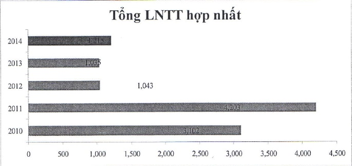

### 1.3 Ngành nghề và địa bàn kinh doanh

#### 1.3.1 Ngành nghề kinh doanh

Xin xem Báo cáo tài chính hợp nhất năm 2014 phần Hoạt động chính.

#### 1.3.2 Địa bàn kinh doanh

Đến ngày 31/12/2014, ACB có 346 chi nhánh và phòng giao dịch đang hoạt động tại 47 tinh thành trong cả nước. Thành phố Hồ Chí Minh, miền Đông Nam bộ và vùng đồng bằng Sông Hồng là các thị trường trọng yếu của Ngân hàng tính theo số lượng chi nhánh, phòng giao dịch và tỷ trọng đóng góp của mỗi khu vực vào tổng lợi nhuận Ngân hàng.

### 1.4 Mô hình quản trị, tổ chức kinh doanh và bộ máy quản lý

#### 1.4.1 Mô hình quản trị và cơ cấu quản lý tổ chức

Cơ cấu tổ chức quản lý của ACB bao gồm Đại hội đồng cổ đông, Hội đồng Quản trị, Ban Kiểm soát, và Tổng Giám độc theo như quy định của Luật Các tổ chức tính dụng năm 2010 tại Điều 32.1 về cơ cấu tổ chức quản lý của tổ chức tính dụng.

Đại hội đồng cổ đông là cơ quan có thảm quyền cao nhất của Ngân hàng (Điều 27.1 Điều lệ ACB 2012). Đại hội đồng cổ đông bầu, bãi nhiệm, miễn nhiệm thành viên Hội đồng Quản trị và Ban Kiểm soát (Điều 29.1.d Điều lệ ACB 2012).

Các ủy ban trực thuộc Hội đồng Quản trị gồm có: Ủy ban Nhân sự, Ủy ban Quản lý rủi ro, Ủy ban Tín dụng, Ủy ban Đầu tư, và Ủy ban Chiến lược.

Tập đoàn ACB gồm có Ngân hàng và các công ty con. Ngân hàng bao gồm các đơn vị Hội sở và kênh phân phối. Các đơn vị Hội sở gồm 10 khối và 9 phòng ban trực thuộc Tổng Giám đốc. Kênh phân phối tính đến cuối năm 2014 có 346 chi nhánh và phòng giao dịch. Ngoài ra còn có một số đơn vị có chức năng chuyên biệt như Trung tâm