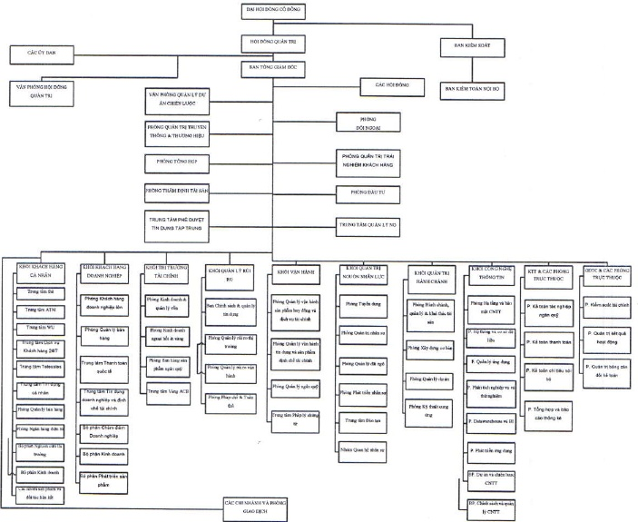

Thè, Trung tâm ATM, Trung tâm Chuyển tiền nhanh ACB-Western Union, Trung tâm Telesales, Trung tâm Dịch vụ khách hàng 247 (Call Center 247), Trung tâm Phê duyệt tín dụng tập trung và Trung tâm Quản lý nợ.

#### 1.4.2 Sơ đồ tổ chức

#### 1.4.3 Các công ty con

<table border=1 style='margin: auto; word-wrap: break-word;'><tr><td style='text-align: center; word-wrap: break-word;'>Tên công ty</td><td style='text-align: center; word-wrap: break-word;'>Địa chỉ</td><td style='text-align: center; word-wrap: break-word;'>Giấy phép hoạt động/Lĩnh vực kinh doanh chính</td><td style='text-align: center; word-wrap: break-word;'>Vốn điều lệ thực góp (tỷ đồng)</td><td style='text-align: center; word-wrap: break-word;'>% đầu tư trực tiếp bồi ACB</td><td style='text-align: center; word-wrap: break-word;'>% đầu tư giản tiếp bởi công ty con</td><td style='text-align: center; word-wrap: break-word;'>Tổng % đầu tư</td></tr><tr><td style='text-align: center; word-wrap: break-word;'>Công ty Chứng khoán ACB (ACBS)</td><td style='text-align: center; word-wrap: break-word;'>41 Mạc Định Chí, Phường Đa Kao, Quận 1, Tp. Hồ Chí Minh.</td><td style='text-align: center; word-wrap: break-word;'>06/GPHDKD Chứng khoán</td><td style='text-align: center; word-wrap: break-word;'>1.500</td><td style='text-align: center; word-wrap: break-word;'>100</td><td style='text-align: center; word-wrap: break-word;'>-</td><td style='text-align: center; word-wrap: break-word;'>100</td></tr><tr><td style='text-align: center; word-wrap: break-word;'>Công ty Quản lý nợ và Khai thác tài sản ACB (ACBA)</td><td style='text-align: center; word-wrap: break-word;'>Lầu 8 Tòa nhà ACB, 444A - 446 Cách Mạng Thắng Tâm, Quận 3, Tp. HCM</td><td style='text-align: center; word-wrap: break-word;'>4104000099 Quản lý nợ và khai thác tài sản</td><td style='text-align: center; word-wrap: break-word;'>340</td><td style='text-align: center; word-wrap: break-word;'>100</td><td style='text-align: center; word-wrap: break-word;'>-</td><td style='text-align: center; word-wrap: break-word;'>100</td></tr><tr><td style='text-align: center; word-wrap: break-word;'>Công ty Cho thuê tài chính ACB (ACBL)</td><td style='text-align: center; word-wrap: break-word;'>131 Châu Văn Liêm, Phường 14, Quận 5, Tp. Hồ Chí Minh.</td><td style='text-align: center; word-wrap: break-word;'>4104001359 Cho thuê tài chính</td><td style='text-align: center; word-wrap: break-word;'>200</td><td style='text-align: center; word-wrap: break-word;'>100</td><td style='text-align: center; word-wrap: break-word;'>-</td><td style='text-align: center; word-wrap: break-word;'>100</td></tr><tr><td style='text-align: center; word-wrap: break-word;'>Công ty Quản lý quỹ ACB (ACBC)</td><td style='text-align: center; word-wrap: break-word;'>Lầu 1 Tòa nhà ACB, 444A-446 Cách Mạng Thắng Tâm, Quận 3, Tp. Hồ Chí Minh.</td><td style='text-align: center; word-wrap: break-word;'>41/UBCK-GP Quản lý quỹ</td><td style='text-align: center; word-wrap: break-word;'>50</td><td style='text-align: center; word-wrap: break-word;'>-</td><td style='text-align: center; word-wrap: break-word;'>100</td><td style='text-align: center; word-wrap: break-word;'>100</td></tr></table>