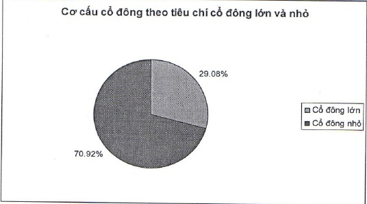

nhận diện thương hiệu mới (giai đoạn đầu) nhưng đánh giá chung, chỉ phí hoạt động trong năm 2014 được quản lý khá chặt chẽ, tốc độ tăng chi phí là 2,8%, thấp hơn tốc độ tăng tổng thu nhập thuần là 7,2%. Tỷ lệ chi phí trên thu nhập được kiểm soát ở mức 63,8%, giảm so với mức 66,5% của năm 2013.

### 2.5 Cơ cấu cổ động, thay đổi vốn đầu tư của chủ sở hữu

#### 2.5.1 Cổ phần

Trong tổng số 937.696.506 cổ phần phổ thông ACB đang lưu hành (tương ứng với số vốn điều lệ của ACB là 9.376.965.060.000 đồng) thì bao gồm:

- Số lượng cổ phần tự do chuyển nhượng: 882.466.052 cổ phần

- Số lượng cổ phần hạn chế chuyển nhượng: 55.230.454 cổ phần

2.5.2 Cơ cấu cổ động

2.5.2.1 Cơ cấu cổ động chia theo tiêu chí tỷ lệ sở hữu (cổ động lớn [*], cổ động nhỏ)

<table border=1 style='margin: auto; word-wrap: break-word;'><tr><td style='text-align: center; word-wrap: break-word;'></td><td style='text-align: center; word-wrap: break-word;'>Số lượng cổ đông</td><td style='text-align: center; word-wrap: break-word;'>Số lượng cổ phần</td><td style='text-align: center; word-wrap: break-word;'>Tỷ lệ cổ phần</td></tr><tr><td style='text-align: center; word-wrap: break-word;'>Cổ đông lớn</td><td style='text-align: center; word-wrap: break-word;'>4</td><td style='text-align: center; word-wrap: break-word;'>272.673.490</td><td style='text-align: center; word-wrap: break-word;'>29,08%</td></tr><tr><td style='text-align: center; word-wrap: break-word;'>Cổ đông nhỏ</td><td style='text-align: center; word-wrap: break-word;'>25.409</td><td style='text-align: center; word-wrap: break-word;'>665.023.016</td><td style='text-align: center; word-wrap: break-word;'>70,92%</td></tr><tr><td style='text-align: center; word-wrap: break-word;'>Tổng cộng</td><td style='text-align: center; word-wrap: break-word;'>25.413</td><td style='text-align: center; word-wrap: break-word;'>937.696.506</td><td style='text-align: center; word-wrap: break-word;'>100%</td></tr></table>

[*] Theo Điều 4.26 của Luật Các tổ chức tín dụng 2010 thì “cổ đông lớn của tổ chức tín dụng cổ phần là cổ đông sở hữu trực tiếp, gián tiếp từ 5% vốn cổ phần có quyền biểu quyết trở lên của tổ chức tín dụng cổ phần đó.”

