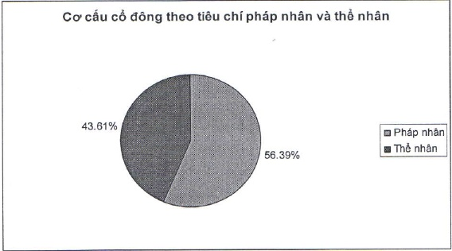

2.5.2.2 Cơ cấu cổ động chia theo tiêu chí pháp nhân và thể nhân

<table border=1 style='margin: auto; word-wrap: break-word;'><tr><td style='text-align: center; word-wrap: break-word;'></td><td style='text-align: center; word-wrap: break-word;'>Số lượng cổ đông</td><td style='text-align: center; word-wrap: break-word;'>Số lượng cổ phần</td><td style='text-align: center; word-wrap: break-word;'>Tỷ lệ cổ phần</td></tr><tr><td style='text-align: center; word-wrap: break-word;'>Pháp nhân</td><td style='text-align: center; word-wrap: break-word;'>207</td><td style='text-align: center; word-wrap: break-word;'>528.809.343</td><td style='text-align: center; word-wrap: break-word;'>56,39%</td></tr><tr><td style='text-align: center; word-wrap: break-word;'>Thể nhân</td><td style='text-align: center; word-wrap: break-word;'>25.206</td><td style='text-align: center; word-wrap: break-word;'>408.887.163</td><td style='text-align: center; word-wrap: break-word;'>43,61%</td></tr><tr><td style='text-align: center; word-wrap: break-word;'>Tổng cộng</td><td style='text-align: center; word-wrap: break-word;'>25.413</td><td style='text-align: center; word-wrap: break-word;'>937.696.506</td><td style='text-align: center; word-wrap: break-word;'>100%</td></tr></table>

2.5.2.3 Cơ cấu cổ động chia theo tiêu chí trong nước và nước ngoài

<table border=1 style='margin: auto; word-wrap: break-word;'><tr><td style='text-align: center; word-wrap: break-word;'></td><td style='text-align: center; word-wrap: break-word;'>Số lượng cổ đông</td><td style='text-align: center; word-wrap: break-word;'>Số lượng cổ phần</td><td style='text-align: center; word-wrap: break-word;'>Tỷ lệ cổ phần</td></tr><tr><td style='text-align: center; word-wrap: break-word;'>Cổ đông trong nước</td><td style='text-align: center; word-wrap: break-word;'>25.365</td><td style='text-align: center; word-wrap: break-word;'>656.748.617</td><td style='text-align: center; word-wrap: break-word;'>70,04%</td></tr><tr><td style='text-align: center; word-wrap: break-word;'>Cổ đông nước ngoài</td><td style='text-align: center; word-wrap: break-word;'>48</td><td style='text-align: center; word-wrap: break-word;'>280.947.889</td><td style='text-align: center; word-wrap: break-word;'>29,96%</td></tr><tr><td style='text-align: center; word-wrap: break-word;'>Tổng cộng</td><td style='text-align: center; word-wrap: break-word;'>25.413</td><td style='text-align: center; word-wrap: break-word;'>937.696.506</td><td style='text-align: center; word-wrap: break-word;'>100%</td></tr></table>