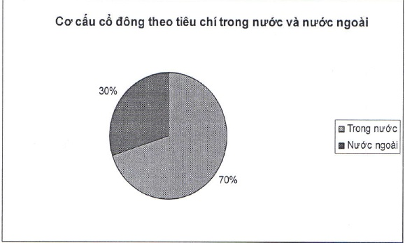

2.5.2.4 Cơ cấu cổ động chia theo tiêu chí trong nước và nước ngoài, pháp nhân và thể nhận

<table border=1 style='margin: auto; word-wrap: break-word;'><tr><td style='text-align: center; word-wrap: break-word;'></td><td style='text-align: center; word-wrap: break-word;'>Số lượng cổ đông</td><td style='text-align: center; word-wrap: break-word;'>Số lượng cổ phần</td><td style='text-align: center; word-wrap: break-word;'>Tỷ lệ cổ phần</td></tr><tr><td colspan="4">Cổ đông trong nước</td></tr><tr><td style='text-align: center; word-wrap: break-word;'>- Pháp nhân</td><td style='text-align: center; word-wrap: break-word;'>190</td><td style='text-align: center; word-wrap: break-word;'>248.054.122</td><td style='text-align: center; word-wrap: break-word;'>26,45%</td></tr><tr><td style='text-align: center; word-wrap: break-word;'>- Thề nhân</td><td style='text-align: center; word-wrap: break-word;'>25.175</td><td style='text-align: center; word-wrap: break-word;'>408.694.495</td><td style='text-align: center; word-wrap: break-word;'>43,59%</td></tr><tr><td style='text-align: center; word-wrap: break-word;'>Cộng (1)</td><td style='text-align: center; word-wrap: break-word;'>25.365</td><td style='text-align: center; word-wrap: break-word;'>656.748.617</td><td style='text-align: center; word-wrap: break-word;'>70,04%</td></tr><tr><td colspan="4">Cổ đông nước ngoài</td></tr><tr><td style='text-align: center; word-wrap: break-word;'>- Pháp nhân</td><td style='text-align: center; word-wrap: break-word;'>17</td><td style='text-align: center; word-wrap: break-word;'>280.755.221</td><td style='text-align: center; word-wrap: break-word;'>29,94%</td></tr><tr><td style='text-align: center; word-wrap: break-word;'>- Thề nhân</td><td style='text-align: center; word-wrap: break-word;'>31</td><td style='text-align: center; word-wrap: break-word;'>192.668</td><td style='text-align: center; word-wrap: break-word;'>0,02%</td></tr><tr><td style='text-align: center; word-wrap: break-word;'>Cộng (2)</td><td style='text-align: center; word-wrap: break-word;'>48</td><td style='text-align: center; word-wrap: break-word;'>280.947.889</td><td style='text-align: center; word-wrap: break-word;'>29,96%</td></tr><tr><td style='text-align: center; word-wrap: break-word;'>Tổng cộng (1) &amp; (2)</td><td style='text-align: center; word-wrap: break-word;'>25.413</td><td style='text-align: center; word-wrap: break-word;'>937.696.506</td><td style='text-align: center; word-wrap: break-word;'>100%</td></tr></table>