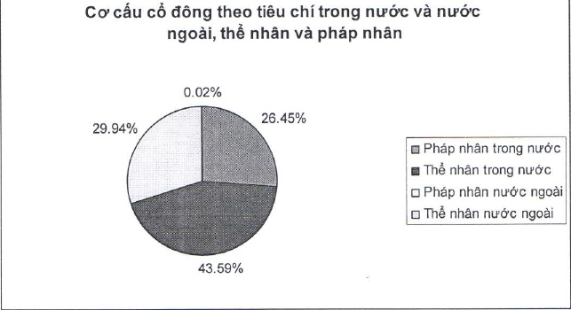

##### 2.5.2.5 Cổ động lớn nước ngoài

Cổ động lớn nước ngoài sở hữu từ 5% vốn cổ phần trở lên gồm có:

<table border=1 style='margin: auto; word-wrap: break-word;'><tr><td style='text-align: center; word-wrap: break-word;'>STT</td><td style='text-align: center; word-wrap: break-word;'>Tên</td><td style='text-align: center; word-wrap: break-word;'>Địa chỉ</td><td style='text-align: center; word-wrap: break-word;'>Ngành nghề</td><td style='text-align: center; word-wrap: break-word;'>Số lượng cổ phiếu</td></tr><tr><td style='text-align: center; word-wrap: break-word;'>1</td><td style='text-align: center; word-wrap: break-word;'>Standard Chartered APR Ltd.</td><td style='text-align: center; word-wrap: break-word;'>01 Basinghall Avenue London, EC2V 5DD, United Kingdom</td><td style='text-align: center; word-wrap: break-word;'>Ngân hàng</td><td style='text-align: center; word-wrap: break-word;'>82.263.883 (8,77%)</td></tr><tr><td style='text-align: center; word-wrap: break-word;'>2</td><td style='text-align: center; word-wrap: break-word;'>Connaught Investors Ltd.</td><td style='text-align: center; word-wrap: break-word;'>Jardine House, 33-35 Reid St., Hamilton, Bermuda, United Kingdom</td><td style='text-align: center; word-wrap: break-word;'>Đầu tư</td><td style='text-align: center; word-wrap: break-word;'>68.114.834 (7,26%)</td></tr><tr><td style='text-align: center; word-wrap: break-word;'>3</td><td style='text-align: center; word-wrap: break-word;'>Dragon Financial Holdings Limited</td><td style='text-align: center; word-wrap: break-word;'>C/O 1901 Mê Linh Point Tower, 02 Ngô Đức Kế, Q.1, Tp. HCM, Việt Nam</td><td style='text-align: center; word-wrap: break-word;'>Đầu tư</td><td style='text-align: center; word-wrap: break-word;'>63.899.631 (6,81%)</td></tr><tr><td style='text-align: center; word-wrap: break-word;'>4</td><td style='text-align: center; word-wrap: break-word;'>Standard Chartered Bank (Hong Kong) Ltd.</td><td style='text-align: center; word-wrap: break-word;'>32 $ ^{nd} $ Floor 4-4A Des Voeux Road, Central, Hong Kong</td><td style='text-align: center; word-wrap: break-word;'>Ngân hàng</td><td style='text-align: center; word-wrap: break-word;'>58.395.142 (6,23%)</td></tr><tr><td style='text-align: center; word-wrap: break-word;'>-</td><td style='text-align: center; word-wrap: break-word;'>Cộng</td><td style='text-align: center; word-wrap: break-word;'>-</td><td style='text-align: center; word-wrap: break-word;'>-</td><td style='text-align: center; word-wrap: break-word;'>29,08%</td></tr></table>

#### 2.5.3 Tình hình thay đổi vốn đầu tư của chủ sở hữu