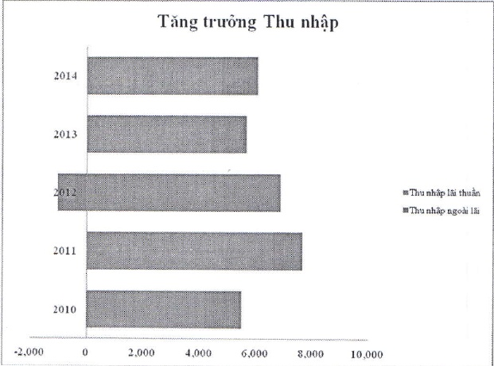

tín dụng đạt 116.324 tỷ đồng, tăng 8,5% so với đầu năm, đạt 97% kế hoạch năm. Nợ xấu phát sinh mới trong năm 2014 giảm đáng kể; tỷ lệ nợ xấu tại thời điểm 31/12/2014 ở mức 2,17%, thấp hơn mức 3,1% tại thời điểm cuối năm 2013.

#### 3.2.2 Tình hình nợ phải trả

Tài sản nợ chú yếu của ngân hàng thương mại là tiền gửi huy động từ khách hàng cá nhân và tổ chức. Năm 2014, ACB đã thành công trong công tác quản lý lãi suất huy động theo mục tiêu giảm chi phí vốn nhưng vẫn đảm bảo tăng trưởng; cải thiện cơ cấu kỳ hạn bình quân của nguồn vốn nhằm duy trì và phát triển nguồn vốn ổn định với chi phí thấp. Đến ngày 31/12/2014, tổng quy mô huy động tiền gửi khách hàng đạt 154.614 tỷ đồng, tăng 12% so với đầu năm và hoàn thành 98% kế hoạch.

#### 3.2.3 Thu nhập, chi phí, suất sinh lời

3.2.3.1 Thu nhập: Sau hai năm sụt giảm nay bước vào giai đoạn phục hồi.

3.2.3.2 Cơ cấu thu nhập: Cơ cấu thu nhập năm 2014 ổn định so với năm 2013. Tỷ lệ thu nhập ngoài lãi/tổng doanh thu của Tập đoàn đạt trên 21%, mức cao nhất kể từ năm 2011.