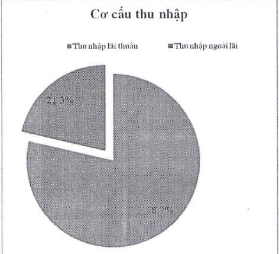
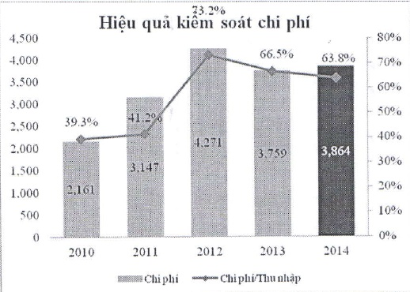

3.2.3.3 Chi phí: Trong năm 2014, chi phí hoạt động, tuy có tăng 3% so với năm 2013, do đầu tư và xử lý những vấn đề tồn động, nhưng thấp hơn mức tăng 7% của thu nhập. Tỷ lệ chi phí/thu nhập giảm so với năm 2013, xuống còn 63.8%.

Theo kế hoạch năm 2015, chi phí hoạt động của ACB sẽ tiếp tục được kiểm soát chặt chẽ, kết hợp đồng bộ với đầy mạnh doanh thu, tỷ lệ chi phí/thu nhập dự kiến sẽ được đưa về dưới mức 60%.

