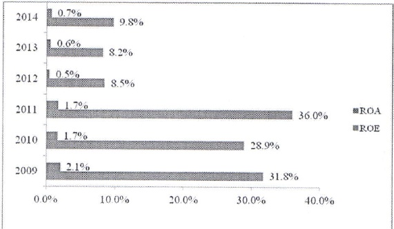
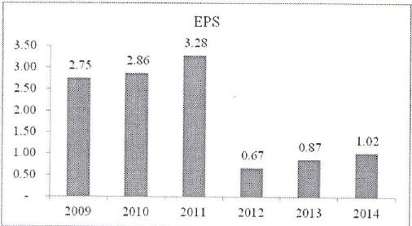

3.2.3.4 Tỷ suất sinh lời: Tỷ suất sinh lời trước thuế trên tổng tài sản có và vốn chủ sở hữu bình quân có cải thiện so với năm 2013.

3.2.3.5 Thu nhập mỗi cổ phần

3.3 Những cải tiến về cơ cấu tổ chức, chính sách và quản lý

Năm 2014, ACB đã đặt được nhiều tiến bộ trong việc cải tiến quy trình nghiệp vụ ngân hàng liên quan đến pháp lý chứng từ, phê duyệt tính dụng, xử lý nợ, v.v.

Dự án Tự động hóa pháp lý chúng từ đã hoàn tất, giúp rút ngắn thời gian, giảm thiểu chỉ phí và hạn chế rủi ro tín dụng. Trung tâm Phê duyệt tín dụng tập trung được thành lập, góp phần chuẩn hóa, nâng cao chất lượng phê duyệt. Tổ xử lý nợ tại các cụm, khu vực cũng được hình thành nhằm nâng cao hiệu quả công tác kiểm soát, xử lý nợ. Hoạt động vận hành, đặc biệt là công tác kiểm soát an toàn kho quỹ cải thiện tốt so với năm trước.