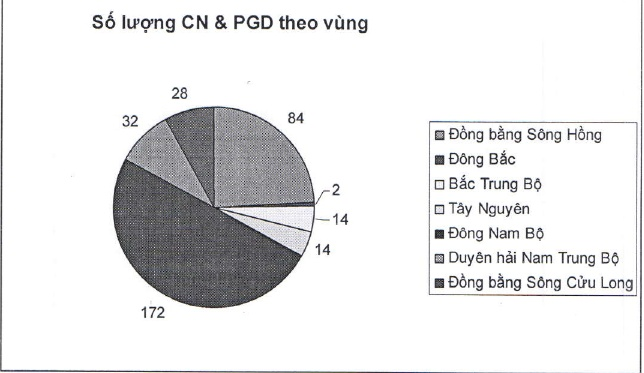

Số lượng chi nhánh và phòng giao dịch chia theo vùng địa lý:

##### Ghi chú:

Đồng bằng sông Hà Nội, Vĩnh Phúc, Bắc Ninh, Hải Dương, Hải Phòng, Hưng Yên, Hồng: Hà Nam, Nam Định, Quảng Ninh;

Động Bắc: Thái Nguyên, Bắc Giang;

Bắc Trung Bộ: Thanh Hóa, Nghệ An, Hà Tĩnh, Quảng Bình

Tây Nguyên: Kon Tum, Gia Lai, Daklak, Lâm Đồng

Đông Nam Bộ: Bình Phước, Tây Ninh, Bình Dương, Đồng Nai, Vũng Tàu, Tp. Hồ Chí Minh;

Duyên hải Nam Huế, Đà Nẵng, Quảng Nam, Quảng Ngãi, Bình Định, Phú Yên, Trung Bộ: Khánh Hòa, Ninh Thuận, Bình Thuận;

Đồng bằng sông Long An, Tiền Giang, Bến Tre, Trà Vinh, Vĩnh Long, Đồng Tháp, Cửu Long: An Giang, Kiên Giang, Cần Thơ, Hậu Giang, Sóc Trăng, Bạc Liêu, Cà Mau.

(Danh sách chi nhánh và phòng giao dịch được liệt kê trong Báo cáo thường niên 2014 bản in chính thức.)