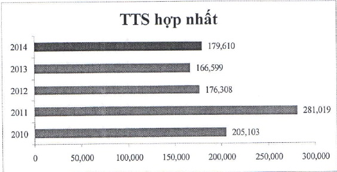

Đưa vào hoạt động Trung tâm Dữ liệu dạng mô-đun (enterprise module data center), xây dựng theo tiêu chuẩn quốc tế đầu tiên tại Việt Nam, với tổng giá trị đầu tư gần 2 triệu USD.

- Trung tâm Vàng ACB là đơn vị đầu tiên trong ngành cùng một lúc được Tổ chức QMS Australia chúng nhận hệ thống quản lý chất lượng đáp ứng yêu cầu tiêu chuẩn ISO 9001:2008 và Tổ chức Công nhận Việt Nam (Accreditation of Vietnam) công nhận năng lực thứ nghiệm và hiệu chuẩn (xác định hàm lượng vàng) đáp ứng yêu cầu tiêu chuẩn ISO/IEC 17025:2005.

- Sự có tháng 8/2012 đã tác động đáng kể đến hoạt động của ACB, đặc biệt là huy động và kinh doanh vàng. ACB đã ứng phó tốt sự cố rút tiền xảy ra trong tuần cuối tháng 8; nhanh chóng khôi phục toàn bộ số dư huy động tiết kiệm VND chỉ trong thời gian ngắn sau đó; và thực thi quyết liệt việc cắt giảm chi phí trong 6 tháng cuối năm.

- Năm 2013, hiệu quả hoạt động không như kỳ vọng nhưng ACB vẫn có mức độ tăng trưởng khả quan về huy động và cho vay, lần lượt là 18% và 15%. Nợ xấu của ACB được kiểm soát dưới mức 3%. Quy mô nhân sự cũng được tính giản. Thực hiện lộ trình tái cơ cấu 2013 - 2015 theo quy định của Ngân hàng Nhà nước.

Năm 2014 ACB nâng cấp hệ nghiệp vụ ngân hàng lỗi (core banking) từ TCBS lên DNA, thay thế hệ cũ đã sử dụng 14 năm. Hoàn tất việc thay đổi logo, bảng hiệu mặt tiền trụ sở cho toàn bộ các chi nhánh và phòng giao dịch và ATM theo nhận diện thương hiệu mới (công bố ngày 05/01/2015). Hoàn tất việc xây dựng khung quản lý rủi ro nhằm đáp ứng đầy đủ các quy định mới về tỷ lệ đảm bảo an toàn. Quy mô và hiệu quả hoạt động kinh doanh của kênh phân phối được nâng cao.

#### 1.2.4 Các biểu đồ tăng trưởng

Tổng tài sản (tỷ đồng)

Tổng vốn huy động (tỷ đồng)

