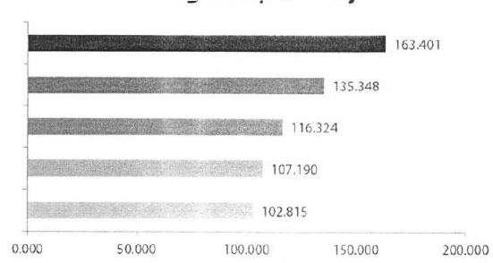
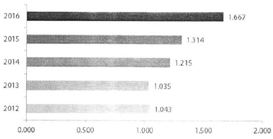

Tổng dư nợ cho vay

Tổng lợi nhuận trước thuế (tỷ đồng)

Tổng lợi nhuận trước thuế

## 1.3 Ngành nghề và địa bàn kinh doanh

### 1.3.1 Ngành nghề kinh doanh

Xem Báo cáo tài chính hợp nhất năm 2016, phần 1.(a) Thành lập và hoạt động.

### 1.3.2 Địa bàn kinh doanh

Đến ngày 31/12/2016, ACB có 350 chi nhánh và phòng giao dịch đang hoạt động tại 47 tinh thành trong cả nước. Thành phố Hồ Chí Minh, miền Đông Nam Bộ và vùng đồng bằng Sông Hồng là các thị trường trọng yếu của Ngân hàng tính theo số lượng chi nhánh, phòng giao dịch và tỷ trọng đóng góp của mỗi khu vực vào tổng lợi nhuận Ngân hàng.