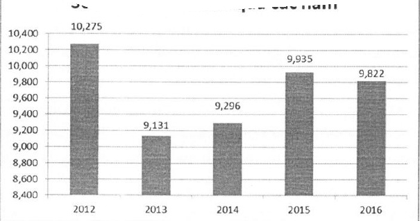

### 4.2.3 Những thay đổi trong Ban điều hành

Ngày 12/01/2017, Hội đồng quản trị ACB có quyết định bộ nhiệm ông Nguyễn Văn Hòa, Giám đốc Tài chính kiêm Kế toán trường giữ chức vụ Phó Tổng giám đốc ACB.

### 4.2.4 Số lượng cán bộ, nhân viên

<table border=1 style='margin: auto; word-wrap: break-word;'><tr><td style='text-align: center; word-wrap: break-word;'>Năm</td><td style='text-align: center; word-wrap: break-word;'>Tổng số nhân viên (theo BCTC hợp nhất)</td></tr><tr><td style='text-align: center; word-wrap: break-word;'>2012</td><td style='text-align: center; word-wrap: break-word;'>10.275</td></tr><tr><td style='text-align: center; word-wrap: break-word;'>2013</td><td style='text-align: center; word-wrap: break-word;'>9.131</td></tr><tr><td style='text-align: center; word-wrap: break-word;'>2014</td><td style='text-align: center; word-wrap: break-word;'>9.296</td></tr><tr><td style='text-align: center; word-wrap: break-word;'>2015</td><td style='text-align: center; word-wrap: break-word;'>9.935</td></tr><tr><td style='text-align: center; word-wrap: break-word;'>2016</td><td style='text-align: center; word-wrap: break-word;'>9.822</td></tr></table>

Số lượng nhân viên qua các năm

### 4.2.5 Mức thu nhập bình quân năm 2015 – 2016

Xem Báo cáo tài chính hợp nhất năm 2016, phần Thuyết minh, mục 40 “Tình hình thu nhập của nhân viên.”

### 4.2.6 Chính sách và thay đổi trong chính sách đối với người lao động

##### 4.2.6.1 Tuyên dụng