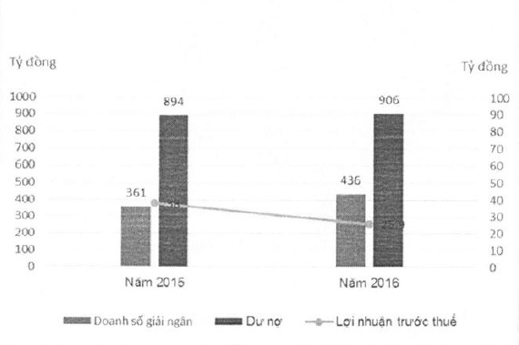

hướng âm lên. Tuy nhiên, việc thực thi pháp luật trong lĩnh vực xử lý tài sản đảm bảo chưa đem lại hiệu quả cho công tác xử lý nợ.

Trong năm, hoạt động của ACBA có một số điểm nổi bật như sau:

- Doanh thu từ hoạt động kinh doanh tài sản xử lý nợ đạt 60.204 tỷ đồng, lợi nhuận trước thuế đạt 1.165 tỷ đồng;

- Kết quả thu nợ đặt 1.630 tỷ đồng;

- Số hồ sơ xử lý nợ được thanh lý là 841 hồ sơ.

Định hướng chiến lược mới của ACBA là tập trung vào kinh doanh bất động sản từ xử lý nợ. Các hoạt động thu nợ của ACBA đã chuyển sang Phòng Quản lý nợ thuộc ACB để tập trung và cùng cố quy trình xử lý nợ. Kế hoạch hoạt động năm 2017 là triển khai chiến lược này.

#### 4.3.2.3 Tóm tắt về hoạt động và tình hình tài chính của Công ty Cho thuê tài chính ACB (ACBL)

Trong năm 2016, ACBL luôn nỗ lực duy trì hoạt động ổn định và bền vững, tổng số tiền đã giải ngân đạt 436 tỷ đồng, lợi nhuận trước thuế đạt 26 tỷ đồng. Mặt khác, ACBL đã thường xuyên rà soát và thực hiện quyết liệt công tác đôn đốc, thu hồi nợ đúng hạn.

Bảng 1: Doanh số giải ngân, dự nợ và lợi nhuận trước thuế

