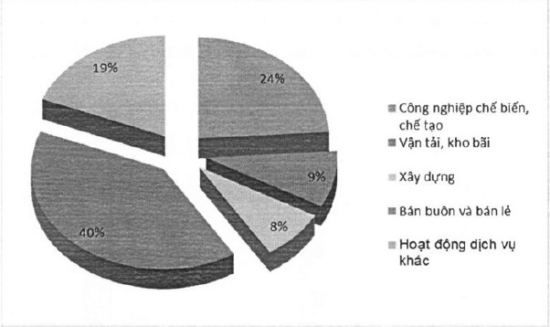

Trong chiến lược nâng cao chất lượng sản phẩm dịch vụ, ACBL đầy mạnh mở rộng hợp tác với các nhà cung cấp máy móc thiết bị, phương tiện vận tải lớn và uy tín đề tư vấn các giải pháp đối mới công nghệ toàn diện cho khách hàng, đạt mục tiêu sử dụng nguồn vốn hiệu quả. Đồng thời với việc đối mới và triển khai hệ thống công nghệ mới, tận dụng mạng lưới giao dịch rộng lớn, khách hàng tiềm năng tốt của Tập đoàn ACB, ACBL tiếp tục xây dựng một quy chuẩn chăm sóc khách hàng nhất quán, hiệu quả.

Loại tài sản cho thuê tài chính được ACBL tập trung phát triển là phương tiện vận chuyển phục vụ nhu cầu đi lại, vận tải hàng hóa, kinh doanh vận tải hành khách, cũng như đầu tư các tài sản cố định có tính thanh khoản cao nhằm mở rộng quy mô sản xuất kinh doanh.

Danh mục ngành, lĩnh vực kinh doanh ACBL thực hiện cho thuê tài chính tính đến năm 2016.

Bảng 2: Cơ cấu dự nợ cho thuê tài chính theo ngành năm 2016

Danh mục ngành nghề và tài sản cho thuê tài chính cũng được rà soát định kỳ để đánh giá tác động và mức độ biến động thị trường của tài sản, từ đó điều chỉnh cơ cấu tài sản cho thuê tài chính phù hợp.

##### Kế hoạch hoạt động năm 2017

Năm 2017, ACBL sẽ tăng cường hiệu quả công tác tiếp thị và bán hàng cho thuê tài chính thông qua các khách hàng hiện hữu, ACBL còn đầy mạnh hiệu quả việc bán