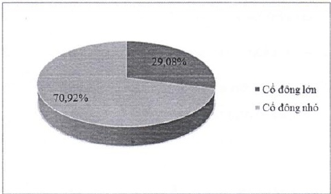

### 4.5.2 Cơ cấu cổ động

4.5.2.1 Theo tiêu chí tỷ lệ sở hữu (cổ động lớn [*], cổ động nhỏ)

<table border=1 style='margin: auto; word-wrap: break-word;'><tr><td style='text-align: center; word-wrap: break-word;'></td><td style='text-align: center; word-wrap: break-word;'>Số lượng cỗ đông</td><td style='text-align: center; word-wrap: break-word;'>Số lượng cỗ phần</td><td style='text-align: center; word-wrap: break-word;'>Tỷ lệ cỗ phần</td></tr><tr><td style='text-align: center; word-wrap: break-word;'>Cổ đông lớn</td><td style='text-align: center; word-wrap: break-word;'>4</td><td style='text-align: center; word-wrap: break-word;'>272.673.490</td><td style='text-align: center; word-wrap: break-word;'>29,08%</td></tr><tr><td style='text-align: center; word-wrap: break-word;'>Cổ đông nhỏ</td><td style='text-align: center; word-wrap: break-word;'>23.019</td><td style='text-align: center; word-wrap: break-word;'>665.023.016</td><td style='text-align: center; word-wrap: break-word;'>70,92%</td></tr><tr><td style='text-align: center; word-wrap: break-word;'>Tổng cộng</td><td style='text-align: center; word-wrap: break-word;'>23.023</td><td style='text-align: center; word-wrap: break-word;'>937.696.506</td><td style='text-align: center; word-wrap: break-word;'>100%</td></tr></table>

[*] Theo Điều 4.26 của Luật Các tổ chức tính dụng năm 2010 thì “cổ động lớn của tổ chức tính dụng cổ phần là cổ động sở hữu trực tiếp, gián tiếp từ 5% vốn cổ phần có quyền biểu quyết trở lên của tổ chức tính dụng cổ phần đó.”

4.5.2.2 Theo tiêu chí cổ động pháp nhân và cổ động thể nhân

<table border=1 style='margin: auto; word-wrap: break-word;'><tr><td style='text-align: center; word-wrap: break-word;'></td><td style='text-align: center; word-wrap: break-word;'>Số lượng cổ đông</td><td style='text-align: center; word-wrap: break-word;'>Số lượng cổ phần</td><td style='text-align: center; word-wrap: break-word;'>Tỷ lệ cổ phần</td></tr><tr><td style='text-align: center; word-wrap: break-word;'>Pháp nhân</td><td style='text-align: center; word-wrap: break-word;'>196</td><td style='text-align: center; word-wrap: break-word;'>479.181.091</td><td style='text-align: center; word-wrap: break-word;'>51,10%</td></tr><tr><td style='text-align: center; word-wrap: break-word;'>Thể nhân</td><td style='text-align: center; word-wrap: break-word;'>22.827</td><td style='text-align: center; word-wrap: break-word;'>458.515.415</td><td style='text-align: center; word-wrap: break-word;'>48,90%</td></tr><tr><td style='text-align: center; word-wrap: break-word;'>Tổng cộng</td><td style='text-align: center; word-wrap: break-word;'>23.023</td><td style='text-align: center; word-wrap: break-word;'>937.696.506</td><td style='text-align: center; word-wrap: break-word;'>100%</td></tr></table>