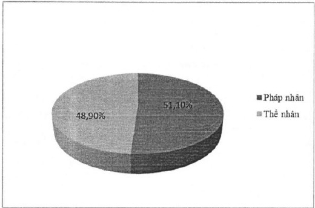
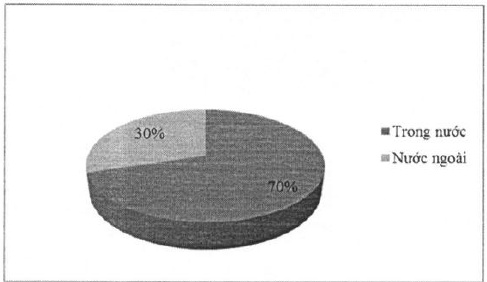

4.5.2.3 Theo tiêu chí cổ động trong nước và cổ động nước ngoài

<table border=1 style='margin: auto; word-wrap: break-word;'><tr><td style='text-align: center; word-wrap: break-word;'></td><td style='text-align: center; word-wrap: break-word;'>Số lượng cỗ đông</td><td style='text-align: center; word-wrap: break-word;'>Số lượng cỗ phần</td><td style='text-align: center; word-wrap: break-word;'>Tỷ lệ cỗ phần</td></tr><tr><td style='text-align: center; word-wrap: break-word;'>Cổ đông trong nước</td><td style='text-align: center; word-wrap: break-word;'>22.979</td><td style='text-align: center; word-wrap: break-word;'>656.387.557</td><td style='text-align: center; word-wrap: break-word;'>70,00%</td></tr><tr><td style='text-align: center; word-wrap: break-word;'>Cổ đông nước ngoài</td><td style='text-align: center; word-wrap: break-word;'>44</td><td style='text-align: center; word-wrap: break-word;'>281.308.949</td><td style='text-align: center; word-wrap: break-word;'>30,00%</td></tr><tr><td style='text-align: center; word-wrap: break-word;'>Tổng cộng</td><td style='text-align: center; word-wrap: break-word;'>23.023</td><td style='text-align: center; word-wrap: break-word;'>937.696.506</td><td style='text-align: center; word-wrap: break-word;'>100%</td></tr></table>

4.5.2.4 Theo tiêu chí cổ động trong nước và cổ động nước ngoài, cổ động pháp nhân và cổ động thể nhân

