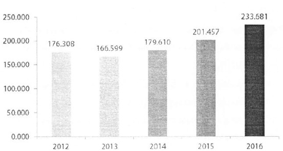
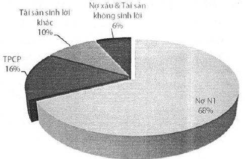

Tổng tài sản

<table border=1 style='margin: auto; word-wrap: break-word;'><tr><td style='text-align: center; word-wrap: break-word;'></td><td style='text-align: center; word-wrap: break-word;'>2012</td><td style='text-align: center; word-wrap: break-word;'>2013</td><td style='text-align: center; word-wrap: break-word;'>2014</td><td style='text-align: center; word-wrap: break-word;'>2015</td><td style='text-align: center; word-wrap: break-word;'>2016</td></tr><tr><td style='text-align: center; word-wrap: break-word;'>An toàn vốn</td><td style='text-align: center; word-wrap: break-word;'>14,16%</td><td style='text-align: center; word-wrap: break-word;'>14,66%</td><td style='text-align: center; word-wrap: break-word;'>14,08%</td><td style='text-align: center; word-wrap: break-word;'>12,80%</td><td style='text-align: center; word-wrap: break-word;'>13,19%</td></tr><tr><td style='text-align: center; word-wrap: break-word;'>An toàn vốn cấp 1</td><td style='text-align: center; word-wrap: break-word;'>9,59%</td><td style='text-align: center; word-wrap: break-word;'>10,23%</td><td style='text-align: center; word-wrap: break-word;'>9,76%</td><td style='text-align: center; word-wrap: break-word;'>9,27%</td><td style='text-align: center; word-wrap: break-word;'>8,26%</td></tr></table>

Chất lượng tài sản được cải thiện với cơ cấu bảng tổng kết tài sản liên tục có sự dịch chuyển theo hướng lành mạnh hơn. Cuối năm 2016, tỷ trọng cho vay khách hàng trên TTS đạt 70%, tăng hơn 3% so với năm 2015. Tài sản sinh lời chiếm đến 94% trên TTS, đảm bảo khả năng thanh khoản và tối đa hoá hiệu quả sử dụng vốn cho toàn ngân hàng.

CẤU TRỪC TÀI SẢN

