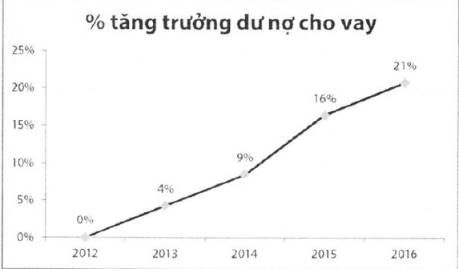
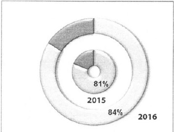

##### Hoạt động tín dụng

Trong năm qua, ACB đã tiếp tục chiến lược tập trung vào mảng bán lẻ, đầy mạng tín dụng cá nhân, cơ cấu khối Khách hàng doanh nghiệp thành 2 mảng SME và MMLC. Song song với quá trình cơ cấu, ACB cũng đã đưa ra hàng loạt chương trình cho vay hấp dẫn nhằm thu hút các đối tượng khách hàng cá nhân và doanh nghiệp vừa và nhỏ.

Kết quả đến hết năm 2016, tổng dư nợ cho vay khách hàng đạt 163 nghìn tỷ đồng, đạt 103% kế hoạch, tăng 28 nghìn tỷ đồng (+21%) so với cuối năm 2015 cao hơn mức trung bình ngành (18%) nhưng vẫn đảm bảo tuân thủ mức trần tăng trưởng tin dụng do NHNN đề ra.

Cho vay khách hàng cá nhân (KHCN) đạt 85 nghìn tỷ đồng vào cuối năm 2016, tăng 30%, tiếp tục đóng vai trò đầu tàu cho động lực tăng trưởng tín dụng toàn ngân hàng. Trong khi đó cho vay của nhóm khách hàng SME cũng đạt mức tăng trưởng ấn tượng 19%. Tổng danh mục cho vay từ KHCN và SME chiếm gần 85% trên tổng số dư nợ cho vay toàn ngân hàng.

Tỷ trọng cho vay mảng bán lẻ