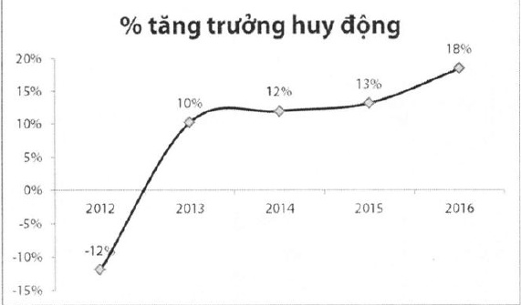

##### Hoạt động huy động

Huy động tăng trưởng mạnh liên tục từ năm 2013 sau khi ACB thực hiện tất toán trạng thái và chấm dứt huy động vàng theo chính sách chung của Ngân hàng Nhà nước, bám sát nhu cầu vốn cho vay của Ngân hàng.

Quy mô huy động tại thời điểm cuối năm 2016 đạt 207 nghìn tỷ đồng, tăng 32 nghìn tỷ đồng (+18%), chiếm 89% tổng nguồn vốn của ngân hàng, đạt 100% kế hoạch năm. ACB tiếp tục tận dụng lợi thế ngân hàng bán lẻ, tập trung vào các đối tượng khách hàng cá nhân, doanh nghiệp vừa và nhỏ, với tỷ trọng huy động từ khách hàng cá nhân lên đến 85% tổng huy động của Ngân hàng.

Để đạt được kết quả này, ngoài việc liên tục đưa ra các sản phẩm đặc thù với lãi suất cạnh tranh, xây dựng và mở rộng thương hiệu, nâng cao kỹ năng chăm sóc khách hàng, trong năm 2016, ACB đã thành lập Phòng Ngân hàng Uu tiên, đầy mạnh huy động từ thế và huy động payroll. Những chính sách được xây dựng còn chú trọng đến việc tạo nền tảng cho các chiến lược tăng trưởng huy động không kỳ hạn trong tương lai. Trong năm qua, ACB đạt mức tăng trưởng huy động không kỳ hạn 18% chiếm 16% trên tổng huy động. Tỷ lệ này được kỳ vọng sẽ tiếp tục cải thiện mạnh mẽ trong những năm tối.

##### Hoạt động đấu tư.

Danh mục đầu tư tiếp tục được tái cơ cấu bằng việc thoái vốn khỏi một số khoản đầu tư không thuộc hoạt động lỗi, tiếp tục giải phóng và sử dụng vốn hiệu quả hơn. Hành