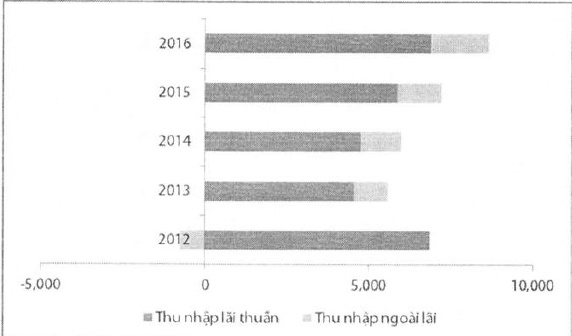

động này thực hiện theo đúng kế hoạch đề ra, góp phần gia tăng phần vốn chủ sở hữu có thể sử dụng cho hoạt động kinh doanh cốt lỗi của Ngân hàng, mà kết quả có thể thấy là hệ số an toàn vốn tiếp tục ổn định ở mức cao trong khi quy mô TTS tăng mạnh. Trong đó trái phiếu chính phù (TPCP) chiếm trên 80% danh mục đầu tư của ACB, tương đương 15% TTS.

<table border=1 style='margin: auto; word-wrap: break-word;'><tr><td style='text-align: center; word-wrap: break-word;'></td><td style='text-align: center; word-wrap: break-word;'>2012</td><td style='text-align: center; word-wrap: break-word;'>2013</td><td style='text-align: center; word-wrap: break-word;'>2014</td><td style='text-align: center; word-wrap: break-word;'>2015</td><td style='text-align: center; word-wrap: break-word;'>2016</td></tr><tr><td style='text-align: center; word-wrap: break-word;'>Danh mục dàu tư</td><td style='text-align: center; word-wrap: break-word;'>26.722</td><td style='text-align: center; word-wrap: break-word;'>35.257</td><td style='text-align: center; word-wrap: break-word;'>41.669</td><td style='text-align: center; word-wrap: break-word;'>38.988</td><td style='text-align: center; word-wrap: break-word;'>44.175</td></tr><tr><td style='text-align: center; word-wrap: break-word;'>TPCP</td><td style='text-align: center; word-wrap: break-word;'>14.531</td><td style='text-align: center; word-wrap: break-word;'>24.583</td><td style='text-align: center; word-wrap: break-word;'>28.495</td><td style='text-align: center; word-wrap: break-word;'>28.270</td><td style='text-align: center; word-wrap: break-word;'>36.456</td></tr></table>

##### Thu nhập

Năm 2016 ghi nhận mức tăng trưởng thu nhập khá án tượng của ACB với toàn bộ các chi tiêu doanh thu và chi phí đều được cải thiện khả quan so với các năm trước.

Tổng thu nhập trong năm của ngân hàng tăng 20%, trong đó thu nhập lãi thuần tăng 17%, đạt 6.892 tỷ đồng. Biên sinh lời (NIM) tăng 8 điểm so với năm 2015 đạt 3,17% nhờ vào môi trường kinh doanh được cải thiện hơn so với năm trước cộng với chất lượng và cấu trúc tài sản ngày càng tốt hơn.

Thu nhập ngoài lãi (đặc biệt là mảng thu nhập từ dịch vụ) trong năm 2016 tiếp tục được tập trung đầy mạnh nhằm nâng cao cơ cấu của mảng thu nhập này trên tổng doanh thu. Đến hết năm 2016, thu ngoài lãi đạt 1.772 tỷ đồng, tăng 32%, đạt mức cao nhất từ trước tới nay, đóng góp đến hơn 20% trên tổng doanh thu. Đặc biệt, thu từ phí dịch vụ tăng đến 27% đạt 944 tỷ đồng.