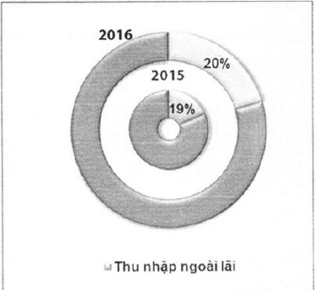
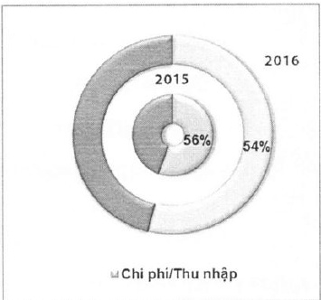

Năm 2016, ACB tiếp tục thực hiện hàng loạt các kế hoạch dầu tư liên quan đến phát triển nhân sự, xây dựng hệ thống nhận diện thương hiệu mới đã được triển khai từ năm 2015 và nâng cấp hạ tầng công nghệ thông tin trên toàn hệ thống. Tuy nhiên, nhờ vào nỗ lực kiểm soát chặt chẽ và khoa học, chi phí thực tế tăng thấp hơn so với kế hoạch (16%). Tỷ lệ chi phí trên thu nhập được cải thiện còn 54% so với 56% vào cuối năm 2015.

