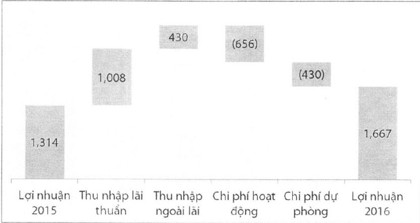
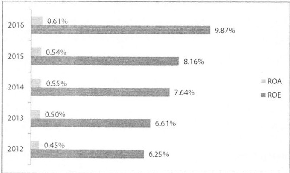

Chi phí dự phòng rủi ro tín dụng tăng 23% so với năm 2015 lên tới 2.319 tỷ đồng, bám sát theo kế hoạch đã đề ra, phù hợp với chính sách quân lý rủi ro đang liên tục được đấy mạnh và quyết liệt xử lý các vấn đề tồn động của Ngân hàng. Cụ thể ACB đã trích lập đầy đủ đối với Nhóm 6 công ty theo lộ trình xử lý các tài sản tồn động đã được NHNN phê duyệt, đồng thời tuân thù Thông tư 02/2013/TT-NHNN.

Tỷ suất sinh lời, thu nhập mỗi cỗ phần - cỗ tức

