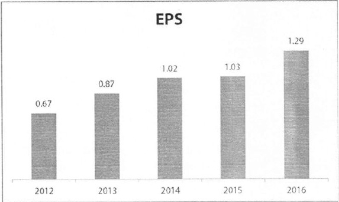

##### Chất lượng tài sản

Năm 2016, ACB tiếp tục kiên định và quyết liệt trong việc xử lý nợ xấu cũng như trích lập dự phòng nhằm nâng cao chất lượng tài sản. Đến cuối năm, tổng số nợ xấu của ACB giảm còn 1.421 tỷ đồng, tương đương 0,88% tổng dư nợ, giảm mạnh 20% nợ xấu về giá trị tuyệt đối, giảm 0,43% về tỷ lệ, thấp hơn rất nhiều so với mức tiêu chuẩn dưới 3% của toàn ngành. Tỷ lệ dự phòng/tổng nợ xấu cũng liên tục được cải thiện và đạt mức kỹ lực 126%. Để đạt được kết quả này, Ban điều hành, Ủy ban Tín dụng và Ủy ban Quản lý rủi ro của ACB đã liên tục điều chỉnh, cấp nhất kịp thời các định hướng chính sách trong việc thẩm định và phê duyệt cấp tín dụng, đảm bảo ACB luôn ứng xử đúng đắn, kịp thời đối với những rủi ro phát sinh trên thị trường, đồng thời cũng đáp ứng kịp thời và phục vụ tốt những nhu cầu của khách hàng.

<table border=1 style='margin: auto; word-wrap: break-word;'><tr><td style='text-align: center; word-wrap: break-word;'></td><td style='text-align: center; word-wrap: break-word;'>2012</td><td style='text-align: center; word-wrap: break-word;'>2013</td><td style='text-align: center; word-wrap: break-word;'>2014</td><td style='text-align: center; word-wrap: break-word;'>2015</td><td style='text-align: center; word-wrap: break-word;'>2016</td></tr><tr><td style='text-align: center; word-wrap: break-word;'>Nọ nhóm 3-5</td><td style='text-align: center; word-wrap: break-word;'>2.571</td><td style='text-align: center; word-wrap: break-word;'>3.243</td><td style='text-align: center; word-wrap: break-word;'>2.533</td><td style='text-align: center; word-wrap: break-word;'>1.771</td><td style='text-align: center; word-wrap: break-word;'>1.421</td></tr><tr><td style='text-align: center; word-wrap: break-word;'>Tỷ lệ Nọ nhóm 3-5/Tổng dư nọ</td><td style='text-align: center; word-wrap: break-word;'>2,5%</td><td style='text-align: center; word-wrap: break-word;'>3,0%</td><td style='text-align: center; word-wrap: break-word;'>2,2%</td><td style='text-align: center; word-wrap: break-word;'>1,3%</td><td style='text-align: center; word-wrap: break-word;'>0,88%</td></tr><tr><td style='text-align: center; word-wrap: break-word;'>Dụ phòng/Tổng nọ xấu</td><td style='text-align: center; word-wrap: break-word;'>58%</td><td style='text-align: center; word-wrap: break-word;'>48%</td><td style='text-align: center; word-wrap: break-word;'>62%</td><td style='text-align: center; word-wrap: break-word;'>87%</td><td style='text-align: center; word-wrap: break-word;'>126%</td></tr></table>