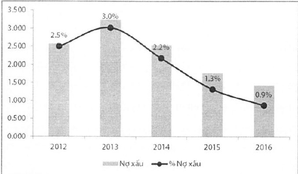

### 5.3 Những cải tiến về cơ cấu tổ chức, chính sách và quản lý Về cơ cấu tổ chức và quản lý

Năm 2016, ACB tiếp tục cơ cấu, kiện toàn đội ngũ nhân sự quản lý tại các chi nhánh và phòng giao dịch, nâng cao vai trò và trách nhiệm quản lý của giám đốc vùng, giám đốc chi nhánh nhằm gia tăng hiệu quả hoạt động kinh doanh của mạng lưới kênh phân phối.

Trong năm, được sự chấp thuận của NHNN, ACB đã khai trương và đưa vào hoạt động bốn phòng giao dịch mới tại tỉnh Hà Tĩnh, Gia Lai, Kiên Giang và Hậu Giang, nhằm mở rộng mạng lưới, tạo thuận lợi cho khách hàng khu vực nông thôn tiếp cận tốt hơn các sản phẩm dịch vụ ngân hàng của ACB.

##### Những cải tiến trong chính sách hoạt động

ACB tiếp tục cải tiến các quy trình nghiệp vụ nhằm kiểm soát rủi ro hoạt động, rút ngắn thời gian vận hành, nâng cao chất lượng phục vụ khách hàng. Các chương trình đã triển khai như: Hệ thống thẩm định tài sản chuyên nghiệp "Pass", thanh toán nội địa tập trung nhằm giảm thiểu rủi ro, cải tiến mạnh mẽ công tác phê duyệt tín dụng qua hệ thống chữ ký số phê duyệt; hệ thống kiểm soát, cảnh báo sớm hoạt động quản lý nợ tại đơn vị dành cho nhân viên và trưởng đơn vị kênh phân phối.