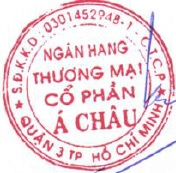

# 11. BÁO CÁO TÀI CHÍNH

## 11.1 Ý kiến kiểm toán

Xem Báo cáo Kiểm toán độc lập của Công ty Kiểm toán KPMG gửi cổ đông Ngân hàng TMCP Á Châu trong Báo cáo tài chính hợp nhất năm 2016 được ký ngày 28/02/2017.

## 11.2 Báo cáo tài chính được kiểm toán

Xem Báo cáo tài chính định kèm.

Nơi nhận:

Ngân hàng Nhà nước - CN Tp. HCM;

- Cục Thanh tra Giám sát Ngân hàng;

- Ủy ban Chứng khoán Nhà nước;

Sở GDCK Hà Nội;

- Trung tâm Lưu ký Chứng khoán Việt Nam.

Định kèm:

Báo cáo tài chính kiểm toán ACB năm

2016 (hợp nhất và riêng)

Tp. Hồ Chí Minh, ngày 29 tháng 3 năm 2017

NGƯỜI ĐẠI DIỆN THEO PHÁP LUẬT

Đỗ Minh Toàn