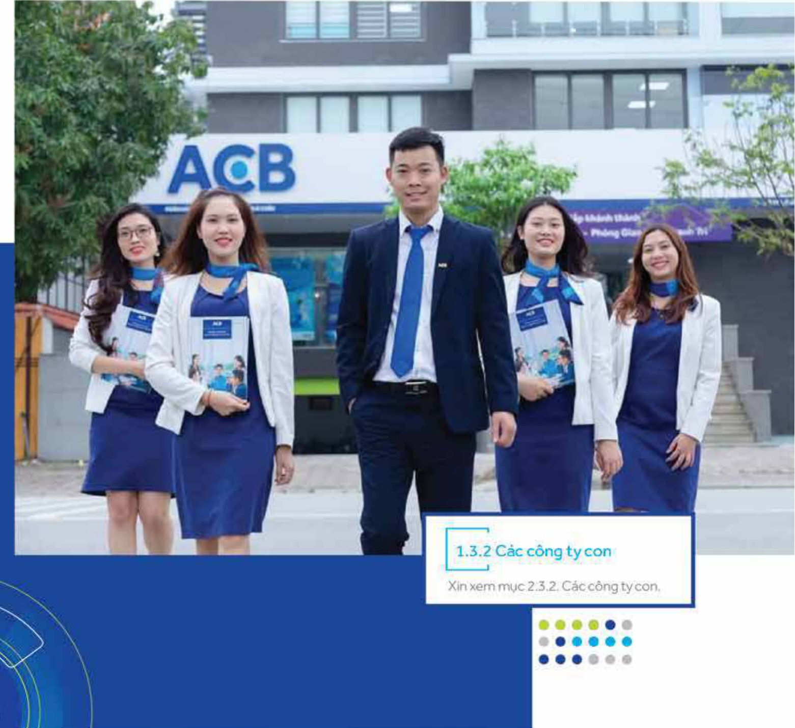
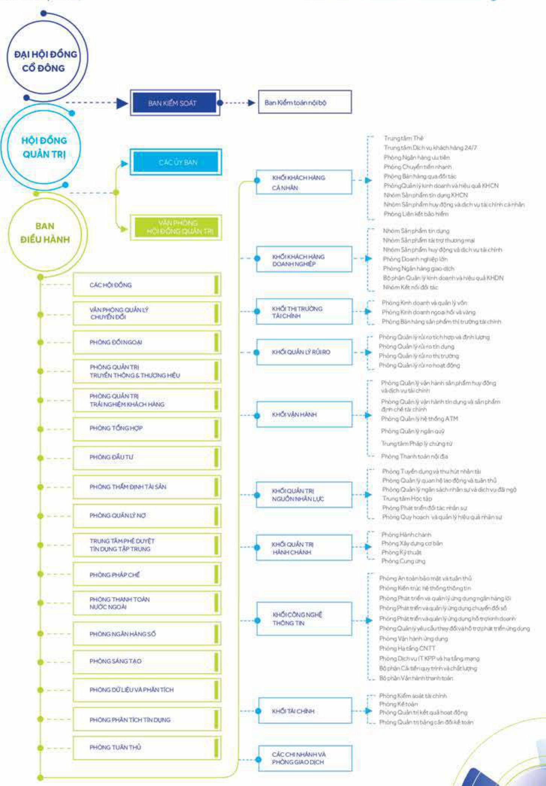

## 1.3 Mô hình quản trị, tổ chức kinh doanh và bộ máy quản lý

### 1.3.1 Có cấu bộ máy quản lý

Cơ cấu bộ máy quản lý của ACB bao gồm Đại hội đồng cổ đồng. Hội đồng quản trị, Ban kiếm soát, và Tổng giảm đốc theo như quy định của Luật Các tổ chức tín dụng năm 2010 và Luật sửa đổi, bổ sung một số điều Luật Các tổ chức tín dụng năm 2017 tại Điều 32.1 về cơ cấu bộ máy quản lý của tổ chức tín dụng.

Đại hội đồng cổ đồng là cơ quan có thẩm quyền cao nhất của Ngân hàng (Điều 27.1 Điều lệ ACB 2020). Đại hội đồng cổ đồng bầu, bài nhiệm và miễn nhiệm thành viên Hội đồng quản trị và Ban kiểm soát (Điều 29.1.d Điều lệ ACB 2020). Các ủy ban trực thuộc Hội đồng quản trị gồm có: Ủy ban Quản lý rủi ro, Ủy ban Nhân sự, Ủy ban Chiến lược, và Ủy ban Đấu tư.

Tập đoàn ACB gồm có Ngân hàng và các công ty con. Ngân hàng bao gồm các đơn vị Hội sở, và các chi nhánh và phòng giao dịch. Các đơn vị Hội sở gồm 9 khối và 18 phòng, ban, trung tâm và văn phòng.

