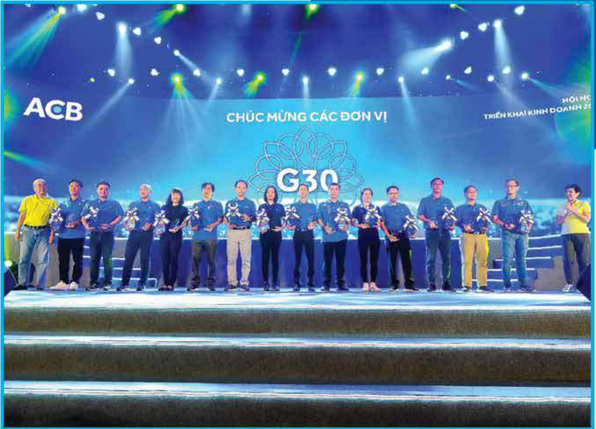

#### TÌNH HÌNH HOẠT ĐỘNG TRONG NĂM 2020

2.1 Tinh hình hoạt động kinh doanh

2.2 Tổ chức và nhân sự

2.3 Tinh hình đấu tư, tinh hình thực hiện các dự án (đầu tư)

2.4 Tinh hình tài chính tín dụng

2.5 Co cấu cổ động, thay đổi vốn đấu tư của chủ sở hữu

2.6 Báo cáo tác động liên quan đến môi trường và xã hội

## 2.1. Tình hình hoạt động kinh doanh

#### 2.1.1 Kết quả hoạt động kinh doanh trong năm

Tổng tài sản của ACB tiếp tục tăng trưởng tốt.

- Mặc dù tăng trưởng cao và liên tục trong nhiều năm nhưng ACB vẫn tiếp tục duy trì được khả năng thanh khoản cao với tỷ lệ dưỡng/huy động tiến gửi khách hàng đạt 79% ở mức thấp hơn quy định của Ngân hàng Nhà nước Việt Nam (85%), tỷ lệ đầu tư trái phiếu chính phủ luôn chiếm tỷ trọng xấp xỉ 14% trong tổng tài sản.

Kết quả kinh doanh khả quan trong năm 2020 đã tạo ra một bước đệm vững chắc cho giai đoạn phát triển tiếp theo

Lợi nhuận trước thuế của toàn Tập đoàn trong năm 2020 đạt 9.596 tỷ đồng, tăng 28% so với năm 2019 và vượt 26% kế hoạch (7.636 tỷ đồng). Về doanh thu, thu nhập lãi thuần của ACB tăng 20% nhờ vào cải thiện biên sinh lợi từ tăng trưởng tốt tiến gửi không ký han, biên sinh lợi tăng 12 điểm so với cùng ký năm 2019, đạt 3,52%. Thu nhập ngoài lãi chiếm 20% trên tổng thu nhập, giúp cải thiện cơ cấu doanh thu, giảm rủi ro tập trung vào hoạt động tin dụng và đa dạng hóa nguồn thu nhập.

- Chi phí hoạt động được kiểm soát chặt chẽ với mức giảm 8% so với cùng kỳ năm 2019. Mặc dù bị ảnh hưởng bởi dịch COVID-19, nhưng chỉ phí dự phòng rủi ro văn bám sát theo kế hoạch.

- ACB luôn theo dõi, quản lý danh mục cho vay chặt chẽ tủ kỳ han, ngành nghề, tài sản đảm bảo, mục đích vay, v.v. với mục tiêu cải thiện hệ số tài sản có rủi ro. Do đó, đến hết năm 2020, tỷ lệ an toàn vốn hợp nhất và an toàn vốn cấp 1 đạt lấn lượt. ở mức 11.06% và 10.37%.

