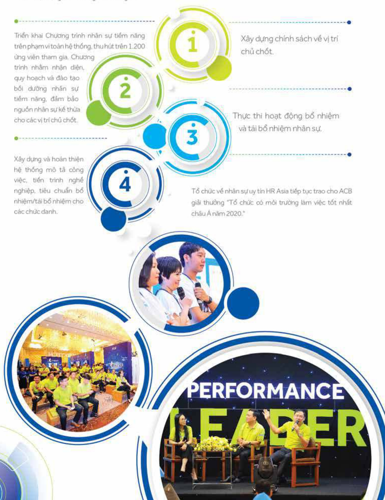

# 30

##### 2.2.4.7 Chính sách và hoạt động phát triển người lao động

Chính sách phát triển người lao động của ACB tập trung vào chất lượng và khả năng thích ứng và đối mối của nguồn nhân lực, đảm bảo nguồn nhân lực có năng lực thực hiện tốt nhiệm vụ trong tiến trình nghề nghiệp.

- Các hoạt động chính trong năm bao gồm:

Triển khai Chương trình nhân sự tiểm năng trên phạm vi toàn hệ thống, thu hút trên 1.200 ứng viên tham gia. Chương trình nhằm nhận diện, quy hoạch và đào tạo bối dưỡng nhân sự tiểm năng, đảm bảo nguồn nhân sự kế thừa cho các vị trí chủ chốt. Xây dựng và hoàn thiện hệ thống mô tả công việc, tiến trình nghề nghiệp, tiêu chuẩn bộ nhiệm/tải bổ nhiệm cho các chức danh.

Xây dựng chính sách về vị trí chủ chốt.

Thực thi hoạt động bổ nhiệm và tái bổ nhiệm nhân sự.

Tổ chức về nhân sự uy tin HR Asia tiếp tục trao cho ACB giải thưởng "Tổ chức có mỗi trường làm việc tốt nhất châu Ân mềm 2020."

