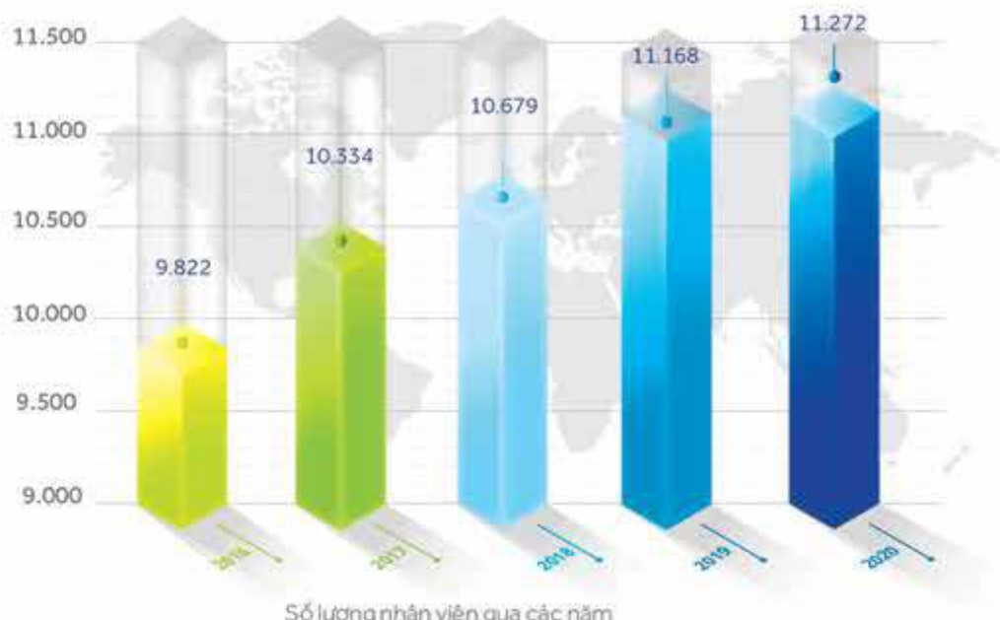
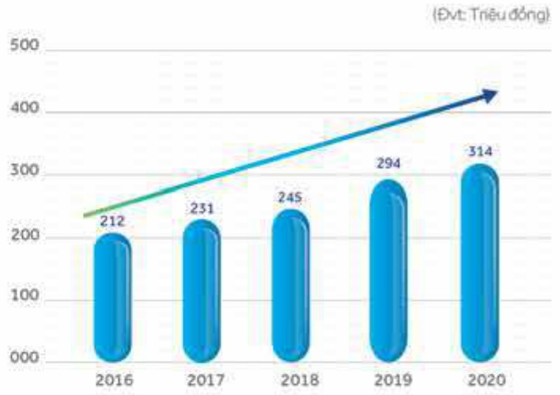

2.2.3 Những thay đổi trong Ban điều hành

Không có.

2.2.4 Chính sách đối với người lao động và các thay đổi trong chính sách

2.2.4.1 Số lượng người lao động 2016 - 2020 (theo BCTC hợp nhất)

Tình đến ngày 31 tháng 12 năm 2020, ACB có 11.272 nhân viên.

Số lượng nhân viên qua các năm

#### 2.2.4.2 Mức thu nhập bình quân của người lao động (2016 - 2020)

Thu nhập bình quân của nhân viên trong năm 2020 là 314 triệu đồng.

Thu nhập bình quản của nhân viên qua các năm

#### 2.2.4.3 Chính sách và hoạt động đãi ngộ người lao động

- ACB xây dựng, triển khai và điều chỉnh kịp thời các chính sách lương, thường, phúc lợi để thu hút, gìn giữ, động viên và tưởng thường nhân tài. Cụ thể:

Chính sách lương thưởng có tính cạnh tranh trên cơ sở khảo sát lương của thị trường lao động, đảm bảo tính công bằng và minh bạch.

- Thu nhập của nhân viên được xác định theo kết quả hoàn thành công việc của Ngân hàng, đơn vị và cả nhân. ACB đã xây dựng hệ thống quản lý thành tích công việc nhân viên (BSC) nhằm đảm bảo quy trình quản trị lượng thưởng được khách quan, chính xác và nhanh chóng.

- ACB tuần thủ quy định của pháp luật về bảo hiểm đối với người lao động. Tất cả nhân viên chính thức của ACB đều được hưởng các chế độ bảo hiểm xã hội, bảo hiểm y tế và bảo hiểm thất nghiệp.

- ACB cũng chăm lo nhăn viên qua các chế độ trợ cấp như tiến ăn giữa ca, chương trình chăm sóc sức khỏe toàn diện (ACB care), chương trình hỗ trợ bảo hiểm sức khỏe cho người thân, chương trình cho vay lãi suất đấu đài, chương trình trợ cấp nhăn viên gặp khó khăn hoặc bệnh tật hiểm nghèo, v.v.

- ACB còn nâng cao tính thần làm việc nhân viên thông qua các chương trình xây dựng đội nhóm (team building), sinh nhất Ngân hàng, tiệc tất niên vinh danh nhân viên xuất sắc, v.v.

Đối với cấp quản lý, ACB từ lâu đã thiết kế một số chính sách đãi ngộ khác biệt như: trợ cấp chỉ phí di chuyển xa, thường cổ phiếu (ESOP), khám sức khỏe định kỳ tại bệnh viện cao cấp, khen thưởng bằng chuyển du lịch nước ngoài, v.v.

#### 2.2.4.4 Chính sách lao động nhằm đảm bảo sức khỏe, an toàn và phúc lợi của người lao động

Xin xem mục 2.2.4.3 Chính sách và các hoạt động đãi ngộ.

2.2.4.5 Chính sách và hoạt động tuyển dụng người lao động

- Chính sách tuyển dụng tập trung vào việc thu hút và xây dựng lực lượng nhân tài có tấm nhìn và tính thần làm chủ sự phát triển của Ngân hàng. Mối quan hệ giữa ACB với nhân viên được đặt trên nguyên tắc hợp tác vì mục tiêu chung của tổ chức, là quan hệ "đối tác sự nghiệp" của nhau.

- Trong năm 2020, ACB đã kết nối hơn 1.700 đối tác sự nghiệp trên cả nước, trong đó nhóm lực lượng nhân sự trê dưới 25 tuổi chiếm hơn 60%, đặc biệt tại các đơn vị kênh phân phối đáp ứng kịp thời như cấu phát triển kinh doanh của ACB trong giai đoạn 2019 - 2024.

Năm 2020, ACB tiếp tục triển khai các hoạt động tạo nguồn nhân sự và trải nghiệm thực tế hoạt động ngân hàng. Chương trình The Next Banker và ACB Experience dành cho sinh viên các trường đại học trọng điểm trên cả nước đã thu hút được hơn 5.000 sinh viên tham gia.

#### 2.2.4.6 Chính sách và hoạt động đào tạo người lao động

- Chính sách và hoạt động đảo tạo thiết lập và triển khai theo nguyên tắc lấy người học làm trọng tâm, thực đẩy tính thần học tập chủ động, lâu dài và lan tỏa sự tiến bộ trong tổ chức, đến cộng đồng, và khách hàng của ACB.

• Hoạt động học tập được gần liền với tiến trình phát triển nghề nghiệp của nhân viên. Mỗi nhóm chức danh được xảy dụng lỗ trình học tập riêng biệt để giúp nhận viên hoàn thiện năng lực cho công việc hiện tại và phát triển sự nghiệp trong tương lai.

- Trong năm 2020, 80% khóa học được tổ chức dưới hình thức trực tuyến, đã tạo điều kiện thuận lợi giúp cho 92% nhân viên toàn hệ thống tham gia, với số ngày học trung bình 7 ngày/năm.

