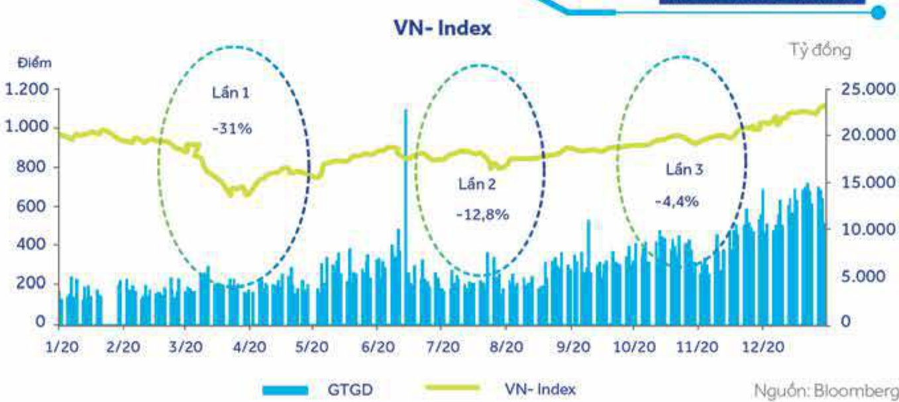

## 2.3 Tình hình đầu tư, tình hình thực hiện các dự án đầu tư

### 2.3.1 Các khoản đấu tư lớn, tinh hình thực hiện các dự án đấu tư

Chủ trương hiện nay của ACB là sẽ xem xét đấu tư chiến lược khi có cơ hội thích hợp. Các hoạt động đấu tư tài chính được thực hiện ở các công ty con.

<table border=1 style='margin: auto; word-wrap: break-word;'><tr><td style='text-align: center; word-wrap: break-word;'>Tên công ty</td><td style='text-align: center; word-wrap: break-word;'>Địa chỉ</td><td style='text-align: center; word-wrap: break-word;'>Giấy phép hoạt động/ Lĩnh vực kinh doanh chính</td><td style='text-align: center; word-wrap: break-word;'>Vốn điều lệ thực góp (tỷ đồng)</td><td style='text-align: center; word-wrap: break-word;'>% đầu tư trực tiếp bởi ACB</td><td style='text-align: center; word-wrap: break-word;'>% đầu tư giản tiếp bởi công ty con</td><td style='text-align: center; word-wrap: break-word;'>Tổng % đầu tư</td></tr><tr><td style='text-align: center; word-wrap: break-word;'>Công ty TNHH Chúng khoản ACB (ACBS)</td><td style='text-align: center; word-wrap: break-word;'>41 Mạc Định Chỉ, Phường Đa Kao, Quận 1, TP. Hồ Chí Minh.</td><td style='text-align: center; word-wrap: break-word;'>06/GPHDKD Chứng khoản</td><td style='text-align: center; word-wrap: break-word;'>1.500</td><td style='text-align: center; word-wrap: break-word;'>100</td><td style='text-align: center; word-wrap: break-word;'>-</td><td style='text-align: center; word-wrap: break-word;'>100</td></tr><tr><td style='text-align: center; word-wrap: break-word;'>Công ty TNHH Quản lý ngưỡi khai thác tài sản Ngăn hàng Á Châu (ACBA)</td><td style='text-align: center; word-wrap: break-word;'>Lấu 8 Tòa nhà ACB, 444A - 446 Cách Mạng Thắng Tâm, Quận 3, TP. Hồ Chí Minh.</td><td style='text-align: center; word-wrap: break-word;'>0303539425 Quản lý nợ và khai thác tài sản</td><td style='text-align: center; word-wrap: break-word;'>5</td><td style='text-align: center; word-wrap: break-word;'>100</td><td style='text-align: center; word-wrap: break-word;'>-</td><td style='text-align: center; word-wrap: break-word;'>100</td></tr><tr><td style='text-align: center; word-wrap: break-word;'>Công ty TNHH MTV Cho thuê tài chính Ngân hàng Á Châu (ACBL)</td><td style='text-align: center; word-wrap: break-word;'>Lấu 9. Tòa nhà ACB, 444A - 446 Cách Mạng Thắng Tâm, Quận 3, TP. Hồ Chí Minh.</td><td style='text-align: center; word-wrap: break-word;'>4104001359 Cho thuê tài chính</td><td style='text-align: center; word-wrap: break-word;'>300</td><td style='text-align: center; word-wrap: break-word;'>100</td><td style='text-align: center; word-wrap: break-word;'>-</td><td style='text-align: center; word-wrap: break-word;'>100</td></tr><tr><td style='text-align: center; word-wrap: break-word;'>Công ty TNHH MTV Quản lý quỹ ACB (ACBC)</td><td style='text-align: center; word-wrap: break-word;'>Lấu 12 Tòa nhà ACB, 480 Nguyễn Thị Minh Khai, Phường 2, Quận 3, TP. Hồ Chí Minh.</td><td style='text-align: center; word-wrap: break-word;'>41/UBCK-GP Quản lý quỹ</td><td style='text-align: center; word-wrap: break-word;'>50</td><td style='text-align: center; word-wrap: break-word;'>-</td><td style='text-align: center; word-wrap: break-word;'>100</td><td style='text-align: center; word-wrap: break-word;'>100</td></tr></table>

##### 2.3.2.1 Tóm tắt về hoạt động và tình hình tài chính của ACBS

#### ACBS

##### TỔNG QUAN VỀ TẤNG TRƯỜNG KINH TẾ NĂM 2020

Năm 2020 là một năm bất thường không chỉ đối với Việt Nam mà cả toàn thể giới. Việt Nam đã thành công trong việc ứng phó với đại dịch COVID-19, và là một trong số ít quốc gia có tổc độ tăng trưởng GDP dương. Kết thúc năm 2020, GDP Việt Nam tăng trưởng 2,9%, đạt 6,293 tỷ đồng (272 tỷ USD), và trở thành nền kinh tế lớn thứ năm trong khu vực Đồng Nam Á, sau Thái Lan (1,294 tỷ USD), Indonesia (1,119 tỷ USD), Philippines (360 tỷ USD) và Singapore (359 tỷ USD). IMF dự báo nền kinh tế Việt Nam sẽ phục hồi theo hình chữ V, đạt 6,7% trong năm 2021.

##### THI TRƯỜNG CHỮNG KHOẠN NĂM 2020

Năm 2020 là một năm đầy biến động đối với chỉ số VN-Index. Trong đợt sóng đầu tiên, chỉ số VN-Index giảm 31% xuống đầy 659.21 điểm vào ngày 24/3. Sau khi dịch bệnh trong nước được kiểm soát, chỉ số VN-Index đã phục hồi mạnh mẽ, vượt mốc 900 điểm trong tháng 6 (+36% so với đầy tháng 3). Trong tháng 7, với lần sóng COVID-19 lần 2 xảy ra tại thành phố Đà Nẵng, chỉ số VN-Index một lần nữa giảm sâu 12.8% nhưng nhanh chóng phục hồi 22.4%. Làn sóng COVID-19 lần 3 xuất hiện tại Việt Nam vào đầu tháng 11, khiến chỉ số VN-Index giảm 4.4% nhưng leo đốc trở lại và vượt mốc 1.000 điểm, đạt 1.103.87 điểm vào ngày 31 tháng 12 năm 2020.

Năm 2020 có 393.000 tài khoản chứng khoản được mở mới tại Việt Nam, phần lớn là tài khoản của nhà đấu tư cá nhân.

KẾT QUẢ HOẠT ĐỘNG CỦA ACBS TRONG NĂM 2020

- Dòng tiến vào thị trường chủng khoản tăng mạnh đã tạo điều kiện thuận lợi cho thị trường chủng khoản Việt Nam nói chung và cho hoạt động kinh doanh của ACBS nội riêng.

Doanh thu thuần tử hoạt động mỗi giới chủng khoản của ACBS tăng 69,8% so với cùng kỳ năm ngoài.

Số lượng tài khoản mới mở tại ACBS tăng 85.1% so với cùng kỳ năm trước.

Khối Khách hàng định chế có 54 tài khoản mở mới trong năm 2020: trong đó, tài khoản có thực hiện giao dịch chiếm 38%.

ACBS ghi nhận lợi nhuận sau thuế tăng 31,8% so với cùng kỳ năm trước.

• Hoạt động đấu tư cũng đạt kết quả khả quan với tỷ suất lợi nhuận đạt 16,3%, cao hơn mức tăng 14,9% của chỉ số VN-Index.

- Trong năm 2020, ACBS lần đầu tiên phát hành chúng quyền và thành công lớn với lượng đăng ký đặt mua đạt hơn 50% trong đợt IPO. Cùng với sự tăng trưởng của thị trường chủng khoản, thì giá chủng quyền đầu tiên của ACBS tăng hơn bảy lần vào ngày đảo hạn. Nhờ vào thành công này, hai lần phát hành chủng quyền tiếp theo của ACBS vào đầu năm 2021 đều đạt tỷ lệ đăng ký mua trên 100%.

PHƯỜNG HƯỚNG HOẠT ĐỘNG NĂM 2021

ACBS dưới kiến sẽ đẩy mạnh đầu tư vào hệ thống giao dịch, hoàn thiện cơ sở hạ tầng công nghệ trong năm 2021.

Tuyển dụng và đào tạo nhân tài mới, đồng thời cũng có và giữ chân đội ngũ nhân lực hiện có, từng bước năng cao năng lực đội ngũ ACBS.

Phát huy thế mạnh với việc phát hành nhiều chủng quyền mới, và tạo ra nhiều sản phẩm đa dạng cho nhà đầu tư tham gia thị trường.

- Tiếp tục tìm kiếm và giúp khách hàng tiếp cận các nguồn vốn lãi suất thấp.

Phần đấu nàng cao thị phấn, khẳng định vị thế của một công ty ra đời cùng với sự ra đời của thị trường chúng khoản Việt Nam.

