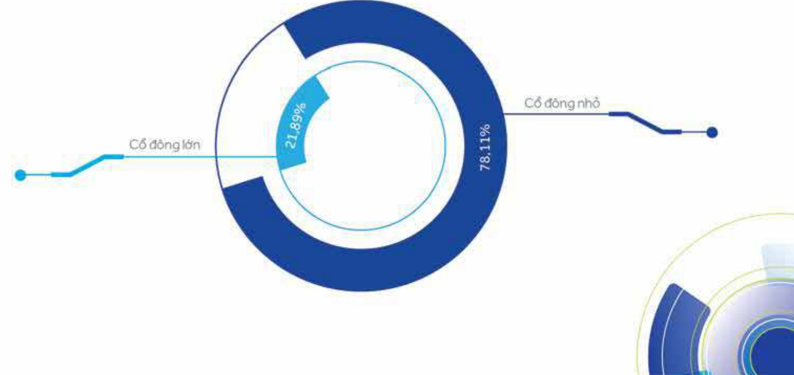

## 2.4 Tình hình tài chính tín dụng

### 2.4.1 Tinh hình tài chính

<table border=1 style='margin: auto; word-wrap: break-word;'><tr><td style='text-align: center; word-wrap: break-word;'>Quy mô (tỷ đồng)</td><td style='text-align: center; word-wrap: break-word;'>2020</td><td style='text-align: center; word-wrap: break-word;'>2019</td><td style='text-align: center; word-wrap: break-word;'>+/- (%)</td></tr><tr><td style='text-align: center; word-wrap: break-word;'>Tống tài sản (TTS)</td><td style='text-align: center; word-wrap: break-word;'>444.530</td><td style='text-align: center; word-wrap: break-word;'>383.514</td><td style='text-align: center; word-wrap: break-word;'>16</td></tr><tr><td style='text-align: center; word-wrap: break-word;'>Tiến, vàng gửi và cho các TCTD khác vay</td><td style='text-align: center; word-wrap: break-word;'>31.671</td><td style='text-align: center; word-wrap: break-word;'>30.442</td><td style='text-align: center; word-wrap: break-word;'>4</td></tr><tr><td style='text-align: center; word-wrap: break-word;'>Cho vay khách hàng</td><td style='text-align: center; word-wrap: break-word;'>311.479</td><td style='text-align: center; word-wrap: break-word;'>268.701</td><td style='text-align: center; word-wrap: break-word;'>16</td></tr><tr><td style='text-align: center; word-wrap: break-word;'>Dấu tư tài chính</td><td style='text-align: center; word-wrap: break-word;'>70.229</td><td style='text-align: center; word-wrap: break-word;'>59.672</td><td style='text-align: center; word-wrap: break-word;'>18</td></tr><tr><td style='text-align: center; word-wrap: break-word;'>Tiến gửi của khách hàng</td><td style='text-align: center; word-wrap: break-word;'>353.196</td><td style='text-align: center; word-wrap: break-word;'>308.129</td><td style='text-align: center; word-wrap: break-word;'>15</td></tr><tr><td style='text-align: center; word-wrap: break-word;'>Tiến gửi và vay TCTD khác</td><td style='text-align: center; word-wrap: break-word;'>23.875</td><td style='text-align: center; word-wrap: break-word;'>19.249</td><td style='text-align: center; word-wrap: break-word;'>24</td></tr><tr><td style='text-align: center; word-wrap: break-word;'>VCSH</td><td style='text-align: center; word-wrap: break-word;'>35.448</td><td style='text-align: center; word-wrap: break-word;'>27.765</td><td style='text-align: center; word-wrap: break-word;'>28</td></tr><tr><td style='text-align: center; word-wrap: break-word;'>Vốn điều lệ</td><td style='text-align: center; word-wrap: break-word;'>21.616</td><td style='text-align: center; word-wrap: break-word;'>16.627</td><td style='text-align: center; word-wrap: break-word;'>30</td></tr></table>

Kết quả kinh doanh (tỷ đồng)

<table border=1 style='margin: auto; word-wrap: break-word;'><tr><td style='text-align: center; word-wrap: break-word;'>Thu nhập lãi thuần</td><td style='text-align: center; word-wrap: break-word;'>14.582</td><td style='text-align: center; word-wrap: break-word;'>12.112</td><td style='text-align: center; word-wrap: break-word;'>20</td></tr><tr><td style='text-align: center; word-wrap: break-word;'>Thu nhập ngoài lãi</td><td style='text-align: center; word-wrap: break-word;'>3.579</td><td style='text-align: center; word-wrap: break-word;'>3.985</td><td style='text-align: center; word-wrap: break-word;'>-10</td></tr><tr><td style='text-align: center; word-wrap: break-word;'>Chi phi hoat động</td><td style='text-align: center; word-wrap: break-word;'>7.624</td><td style='text-align: center; word-wrap: break-word;'>8.308</td><td style='text-align: center; word-wrap: break-word;'>-8</td></tr><tr><td style='text-align: center; word-wrap: break-word;'>Chi phi dự phòng</td><td style='text-align: center; word-wrap: break-word;'>941</td><td style='text-align: center; word-wrap: break-word;'>274</td><td style='text-align: center; word-wrap: break-word;'>244</td></tr><tr><td style='text-align: center; word-wrap: break-word;'>Lợi nhuận trước thuế</td><td style='text-align: center; word-wrap: break-word;'>9.596</td><td style='text-align: center; word-wrap: break-word;'>7.516</td><td style='text-align: center; word-wrap: break-word;'>28</td></tr><tr><td style='text-align: center; word-wrap: break-word;'>Lợi nhuận sau thuế</td><td style='text-align: center; word-wrap: break-word;'>7.683</td><td style='text-align: center; word-wrap: break-word;'>6.010</td><td style='text-align: center; word-wrap: break-word;'>28</td></tr></table>

<table border=1 style='margin: auto; word-wrap: break-word;'><tr><td style='text-align: center; word-wrap: break-word;'>Các chỉ số hoạt động</td><td style='text-align: center; word-wrap: break-word;'>2020</td><td style='text-align: center; word-wrap: break-word;'>2019</td><td style='text-align: center; word-wrap: break-word;'>+/- (%)</td></tr><tr><td style='text-align: center; word-wrap: break-word;'>Hệ số an toàn vốn</td><td style='text-align: center; word-wrap: break-word;'></td><td style='text-align: center; word-wrap: break-word;'></td><td style='text-align: center; word-wrap: break-word;'></td></tr><tr><td style='text-align: center; word-wrap: break-word;'>CAR (%)</td><td style='text-align: center; word-wrap: break-word;'>11.06</td><td style='text-align: center; word-wrap: break-word;'>10.91</td><td style='text-align: center; word-wrap: break-word;'>0.15</td></tr><tr><td style='text-align: center; word-wrap: break-word;'>CAR cấp 1 (%)</td><td style='text-align: center; word-wrap: break-word;'>10.37</td><td style='text-align: center; word-wrap: break-word;'>9.66</td><td style='text-align: center; word-wrap: break-word;'>0.71</td></tr><tr><td style='text-align: center; word-wrap: break-word;'>Vốn chủ sở hữu/Tổng tài sản (%)</td><td style='text-align: center; word-wrap: break-word;'>7.97</td><td style='text-align: center; word-wrap: break-word;'>7.24</td><td style='text-align: center; word-wrap: break-word;'>0.73</td></tr><tr><td style='text-align: center; word-wrap: break-word;'>Vốn chủ sở hữu/Tổng cho vay khách hàng (%)</td><td style='text-align: center; word-wrap: break-word;'>11.38</td><td style='text-align: center; word-wrap: break-word;'>10.33</td><td style='text-align: center; word-wrap: break-word;'>1.05</td></tr><tr><td style='text-align: center; word-wrap: break-word;'>Khả năng thanh khoản</td><td style='text-align: center; word-wrap: break-word;'></td><td style='text-align: center; word-wrap: break-word;'></td><td style='text-align: center; word-wrap: break-word;'></td></tr><tr><td style='text-align: center; word-wrap: break-word;'>Dự ngữ cho vay/Tổng tài sản (%)</td><td style='text-align: center; word-wrap: break-word;'>70.07</td><td style='text-align: center; word-wrap: break-word;'>70.06</td><td style='text-align: center; word-wrap: break-word;'>0.01</td></tr><tr><td style='text-align: center; word-wrap: break-word;'>Tổng dưới/Tổng tiến gửi khách hàng (%)</td><td style='text-align: center; word-wrap: break-word;'>79.30</td><td style='text-align: center; word-wrap: break-word;'>77.55</td><td style='text-align: center; word-wrap: break-word;'>1.75</td></tr><tr><td style='text-align: center; word-wrap: break-word;'>Chất lượng tài sản</td><td style='text-align: center; word-wrap: break-word;'></td><td style='text-align: center; word-wrap: break-word;'></td><td style='text-align: center; word-wrap: break-word;'></td></tr><tr><td style='text-align: center; word-wrap: break-word;'>Nợ xấu N3-5 (tỷ đồng)</td><td style='text-align: center; word-wrap: break-word;'>1.840</td><td style='text-align: center; word-wrap: break-word;'>1.449</td><td style='text-align: center; word-wrap: break-word;'>27</td></tr><tr><td style='text-align: center; word-wrap: break-word;'>Nợ quà hạn N2-5 (tỷ đồng)</td><td style='text-align: center; word-wrap: break-word;'>2.416</td><td style='text-align: center; word-wrap: break-word;'>2.080</td><td style='text-align: center; word-wrap: break-word;'>16</td></tr><tr><td style='text-align: center; word-wrap: break-word;'>Nợ xấu/Tổng dưới nợ (%)</td><td style='text-align: center; word-wrap: break-word;'>0.59</td><td style='text-align: center; word-wrap: break-word;'>0.54</td><td style='text-align: center; word-wrap: break-word;'>0.05</td></tr><tr><td style='text-align: center; word-wrap: break-word;'>Nhòm 5/Tổng nợ xấu (%)</td><td style='text-align: center; word-wrap: break-word;'>66.11</td><td style='text-align: center; word-wrap: break-word;'>62.31</td><td style='text-align: center; word-wrap: break-word;'>3.79</td></tr><tr><td style='text-align: center; word-wrap: break-word;'>Nợ quà hạn/Tổng dưới nợ (%)</td><td style='text-align: center; word-wrap: break-word;'>0.78</td><td style='text-align: center; word-wrap: break-word;'>0.77</td><td style='text-align: center; word-wrap: break-word;'>0.00</td></tr><tr><td style='text-align: center; word-wrap: break-word;'>Quỹ dự phòng nồi rơ tin dung/Tổng nợ xấu (%)</td><td style='text-align: center; word-wrap: break-word;'>160.31</td><td style='text-align: center; word-wrap: break-word;'>174.95</td><td style='text-align: center; word-wrap: break-word;'>-14.64</td></tr><tr><td style='text-align: center; word-wrap: break-word;'>(Vốn chủ sở hữu + Dự phòng)/Tổng nợ xấu (số lấn)</td><td style='text-align: center; word-wrap: break-word;'>19.26</td><td style='text-align: center; word-wrap: break-word;'>19.16</td><td style='text-align: center; word-wrap: break-word;'>10</td></tr><tr><td style='text-align: center; word-wrap: break-word;'>CASA (%)</td><td style='text-align: center; word-wrap: break-word;'>22</td><td style='text-align: center; word-wrap: break-word;'>19</td><td style='text-align: center; word-wrap: break-word;'>3</td></tr></table>

Khả năng sinh lợi

2.5 Cơ cấu cổ đông, thay đổi vốn đầu tư của chủ sở hữu (Tính đến ngày 31 tháng 12 năm 2020.)

<table border=1 style='margin: auto; word-wrap: break-word;'><tr><td style='text-align: center; word-wrap: break-word;'>Lợi nhuận thuần sau thuế/VCSH (ROE) (%)</td><td style='text-align: center; word-wrap: break-word;'>24.31</td><td style='text-align: center; word-wrap: break-word;'>24.64</td><td style='text-align: center; word-wrap: break-word;'>-0.33</td></tr><tr><td style='text-align: center; word-wrap: break-word;'>Lợi nhuận thuần sau thuế/TTS (ROA) (%)</td><td style='text-align: center; word-wrap: break-word;'>1.86</td><td style='text-align: center; word-wrap: break-word;'>1.69</td><td style='text-align: center; word-wrap: break-word;'>0.17</td></tr><tr><td style='text-align: center; word-wrap: break-word;'>Thu nhập lải cận biên lũy kế (NIM) (%)</td><td style='text-align: center; word-wrap: break-word;'>3.52</td><td style='text-align: center; word-wrap: break-word;'>3.40</td><td style='text-align: center; word-wrap: break-word;'>0.12</td></tr><tr><td style='text-align: center; word-wrap: break-word;'>Thu nhập ngoài lải/Tổng thu nhập (%)</td><td style='text-align: center; word-wrap: break-word;'>19.71</td><td style='text-align: center; word-wrap: break-word;'>24.76</td><td style='text-align: center; word-wrap: break-word;'>-5.05</td></tr><tr><td style='text-align: center; word-wrap: break-word;'>Chi phí hoạt động/Tổng thu nhập (%)</td><td style='text-align: center; word-wrap: break-word;'>41.98</td><td style='text-align: center; word-wrap: break-word;'>51.61</td><td style='text-align: center; word-wrap: break-word;'>-9.63</td></tr><tr><td style='text-align: center; word-wrap: break-word;'>Chi phí dự phòng ngữ xấu/LN trước dự phòng (%)</td><td style='text-align: center; word-wrap: break-word;'>8.9</td><td style='text-align: center; word-wrap: break-word;'>3.52</td><td style='text-align: center; word-wrap: break-word;'>2.29</td></tr></table>

2.5.1 Cổ phần

Tổng số 2.161.558.460 cổ phần phổ thông ACB (tương ứng với vốn điều lệ của ACB là 21.615.584.600.000 đồng) bao gồm:

- Số lượng cổ phần lưu hành : 2.161.558.460 cổ phần.

- Số lượng cổ phần tự do chuyển nhượng: 1.907.074.240 cổ phần.

- Số lượng cổ phiếu quỹ : 0 cổ phiếu.

- Số lượng cổ phần hạn chế chuyển nhượng : 254.484.220 cổ phần.

2.5.2 Cơ cấu cổ động

2.5.2.1 Theo tiêu chí tỷ lệ sở hữu (cổ động lớn [*], cổ động nhỏ)

<table border=1 style='margin: auto; word-wrap: break-word;'><tr><td style='text-align: center; word-wrap: break-word;'></td><td style='text-align: center; word-wrap: break-word;'>Số lượng cổ đông</td><td style='text-align: center; word-wrap: break-word;'>Số lượng cổ phân</td><td style='text-align: center; word-wrap: break-word;'>Tỷ lệ cổ phân (%)</td></tr><tr><td style='text-align: center; word-wrap: break-word;'>Cổ đông lớn</td><td style='text-align: center; word-wrap: break-word;'>5</td><td style='text-align: center; word-wrap: break-word;'>473.240.854</td><td style='text-align: center; word-wrap: break-word;'>21.89</td></tr><tr><td style='text-align: center; word-wrap: break-word;'>Cổ đông nhỏ</td><td style='text-align: center; word-wrap: break-word;'>44.006</td><td style='text-align: center; word-wrap: break-word;'>1.688.317.605</td><td style='text-align: center; word-wrap: break-word;'>78.11</td></tr><tr><td style='text-align: center; word-wrap: break-word;'>Tổng cộng</td><td style='text-align: center; word-wrap: break-word;'>44.011</td><td style='text-align: center; word-wrap: break-word;'>2.161.558.460</td><td style='text-align: center; word-wrap: break-word;'>100.00</td></tr></table>

[*] Theo khoản 26 Điều 4 của Luật Các tổ chức tin dung năm 2010 thì "cổ đông lớn của tổ chức tin dung cổ phấn là cổ đông sở hữu trực tiếp, gián tiếp từ 5% vốn cổ phấn có quyền biểu quyết trở lên của tổ chức tin dung cổ phấn đó."

