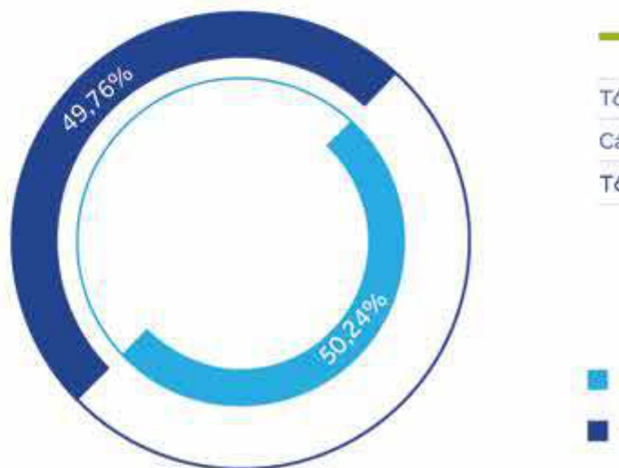
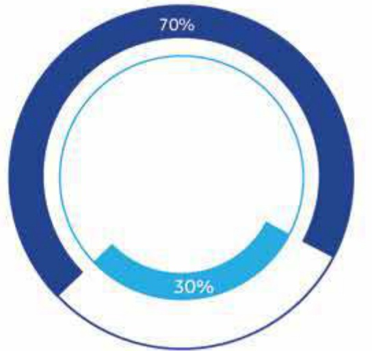
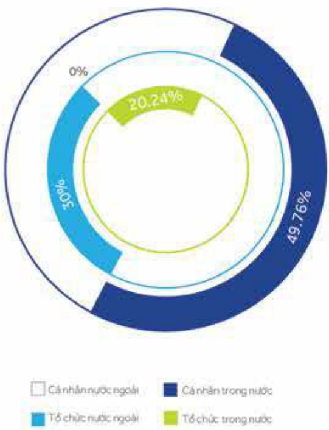

38

2.5.2.2 Theo tiêu chí cổ động tổ chức và cổ động cá nhân

<table border=1 style='margin: auto; word-wrap: break-word;'><tr><td style='text-align: center; word-wrap: break-word;'></td><td style='text-align: center; word-wrap: break-word;'>SL cổ đông</td><td style='text-align: center; word-wrap: break-word;'>SL cổ phản</td><td style='text-align: center; word-wrap: break-word;'>Tỷ lệ cổ phản (%)</td></tr><tr><td style='text-align: center; word-wrap: break-word;'>Tổ chức</td><td style='text-align: center; word-wrap: break-word;'>260</td><td style='text-align: center; word-wrap: break-word;'>1.085.876.238</td><td style='text-align: center; word-wrap: break-word;'>50,24</td></tr><tr><td style='text-align: center; word-wrap: break-word;'>Cá nhân</td><td style='text-align: center; word-wrap: break-word;'>43.751</td><td style='text-align: center; word-wrap: break-word;'>1.075.682.222</td><td style='text-align: center; word-wrap: break-word;'>49,76</td></tr><tr><td style='text-align: center; word-wrap: break-word;'>Tổng cộng</td><td style='text-align: center; word-wrap: break-word;'>44.011</td><td style='text-align: center; word-wrap: break-word;'>2.161.558.460</td><td style='text-align: center; word-wrap: break-word;'>100%</td></tr></table>

2.5.2.3 Theo tiêu chí cổ động trong nước và cổ động nước ngoài

<table border=1 style='margin: auto; word-wrap: break-word;'><tr><td style='text-align: center; word-wrap: break-word;'>SL cổ đông</td><td style='text-align: center; word-wrap: break-word;'>SL cổ phản</td><td style='text-align: center; word-wrap: break-word;'>Tỷ lệ cổ phản (%)</td></tr><tr><td style='text-align: center; word-wrap: break-word;'>Cổ đông trong nước</td><td style='text-align: center; word-wrap: break-word;'>43.936</td><td style='text-align: center; word-wrap: break-word;'>1.513.090.930</td></tr><tr><td style='text-align: center; word-wrap: break-word;'>Cổ đông nước ngoài</td><td style='text-align: center; word-wrap: break-word;'>75</td><td style='text-align: center; word-wrap: break-word;'>648.467.530</td></tr><tr><td style='text-align: center; word-wrap: break-word;'>Tổng cộng</td><td style='text-align: center; word-wrap: break-word;'>44.011</td><td style='text-align: center; word-wrap: break-word;'>2.161.558.460</td></tr></table>

2.5.2.4 Theo tiêu chí cổ động trong nước và cổ động nước ngoài, cổ động tổ chức và cổ động cá nhân

<table border=1 style='margin: auto; word-wrap: break-word;'><tr><td style='text-align: center; word-wrap: break-word;'>Cổ đông trong nước</td><td style='text-align: center; word-wrap: break-word;'>43.936</td><td style='text-align: center; word-wrap: break-word;'>1.513.090.930</td><td style='text-align: center; word-wrap: break-word;'>70,00</td></tr><tr><td style='text-align: center; word-wrap: break-word;'>- Tổ chức</td><td style='text-align: center; word-wrap: break-word;'>217</td><td style='text-align: center; word-wrap: break-word;'>437.468.901</td><td style='text-align: center; word-wrap: break-word;'>20,24</td></tr><tr><td style='text-align: center; word-wrap: break-word;'>- Cả nhân</td><td style='text-align: center; word-wrap: break-word;'>43.719</td><td style='text-align: center; word-wrap: break-word;'>1.075.622.029</td><td style='text-align: center; word-wrap: break-word;'>49,76</td></tr><tr><td style='text-align: center; word-wrap: break-word;'>Cổ đông nước ngoài</td><td style='text-align: center; word-wrap: break-word;'>75</td><td style='text-align: center; word-wrap: break-word;'>648.467.530</td><td style='text-align: center; word-wrap: break-word;'>30,00</td></tr><tr><td style='text-align: center; word-wrap: break-word;'>- Tổ chức</td><td style='text-align: center; word-wrap: break-word;'>43</td><td style='text-align: center; word-wrap: break-word;'>648.407.337</td><td style='text-align: center; word-wrap: break-word;'>30,00</td></tr><tr><td style='text-align: center; word-wrap: break-word;'>- Cả nhân</td><td style='text-align: center; word-wrap: break-word;'>32</td><td style='text-align: center; word-wrap: break-word;'>60.193</td><td style='text-align: center; word-wrap: break-word;'>0,00</td></tr><tr><td style='text-align: center; word-wrap: break-word;'>Tổng cộng(1)&amp;(2)</td><td style='text-align: center; word-wrap: break-word;'>44.011</td><td style='text-align: center; word-wrap: break-word;'>2.161.558.460</td><td style='text-align: center; word-wrap: break-word;'>100,00</td></tr></table>

##### 2.5.2.5 Cổ đồng lớn nước ngoài

Cổ đồng lớn nước ngoài sở hữu từ 5% vốn cổ phần trờ lên gồm có:

<table border=1 style='margin: auto; word-wrap: break-word;'><tr><td style='text-align: center; word-wrap: break-word;'>STT</td><td style='text-align: center; word-wrap: break-word;'>Tên</td><td style='text-align: center; word-wrap: break-word;'>Địa chỉ</td><td style='text-align: center; word-wrap: break-word;'>Ngành nghề</td><td style='text-align: center; word-wrap: break-word;'>Số lượng cổ phấn</td></tr></table>

Nhóm cổ đông có liên quan là cổ đông lớn - Cùng ủy quyền một người thực hiện nghĩa vụ bảo cáo sở hữu và công bố thông tin.

<table border=1 style='margin: auto; word-wrap: break-word;'><tr><td style='text-align: center; word-wrap: break-word;'>Dragon Financial Holdings Limited</td><td style='text-align: center; word-wrap: break-word;'>P.O Box 71, Craigmuir Chambers, Road Town, British Virgin Islands</td><td style='text-align: center; word-wrap: break-word;'>Đầu tư</td><td style='text-align: center; word-wrap: break-word;'>149.565.600 (6.92%)</td></tr><tr><td style='text-align: center; word-wrap: break-word;'>Asia Reach Investments Limited</td><td style='text-align: center; word-wrap: break-word;'>Vistra Corporate Services Centre Wickhams Cay II Road Town, Tortola VG1110, British Virgin Islands</td><td style='text-align: center; word-wrap: break-word;'>Đầu tư</td><td style='text-align: center; word-wrap: break-word;'>54.342.844 (2.51%)</td></tr><tr><td style='text-align: center; word-wrap: break-word;'>First Burns Investments Limited</td><td style='text-align: center; word-wrap: break-word;'>Vistra Corporate Services Centre Wickhams Cay II Road Town, Tortola VG1110, British Virgin Islands</td><td style='text-align: center; word-wrap: break-word;'>Đầu tư</td><td style='text-align: center; word-wrap: break-word;'>53.505.280 (2.48%)</td></tr></table>

2 Alp Asia Finance (Vietnam) Limited - Cổ đồng lớn sở hữu cổ phần gián tiếp thông qua 02 công ty con sau đây:

<table border=1 style='margin: auto; word-wrap: break-word;'><tr><td style='text-align: center; word-wrap: break-word;'>Sather Gate Investments Limited</td><td style='text-align: center; word-wrap: break-word;'>Kingston Chambers, Po Box 173, Road Town, Tortola, British Virgin Islands</td><td style='text-align: center; word-wrap: break-word;'>Đầu tư</td><td style='text-align: center; word-wrap: break-word;'>107.913.565 (4.99%)</td></tr><tr><td style='text-align: center; word-wrap: break-word;'>Whistler Investments Limited</td><td style='text-align: center; word-wrap: break-word;'>Kingston Chambers, Po Box 173, Road Town, Tortola, British Virgin Islands</td><td style='text-align: center; word-wrap: break-word;'>Đầu tư</td><td style='text-align: center; word-wrap: break-word;'>107.913.565 (4.99%)</td></tr></table>

### 2.5.3 Tinh hình thay đổi vốn đấu tư của chủ sở hữu

Tinh đến ngày 31 tháng 12 năm 2020. ACB có sự thay đổi về vốn cổ đồng như sau. Theo Quyết định số 498/QĐ-SGDHN ngày 23 tháng 9 năm 2020 của Sở Giao dịch Chúng khoản Hà Nội, ACB đã niêm yết toàn bộ tổng số 2.161.558.460 cổ phiếu đã phát hành.

### 2.5.4 Giao dịch cổ phiếu quỹ

Ngày 31 tháng 3 năm 2020, ACB có phát sinh giao dịch bản 6.222.000 cổ phiếu quỹ (theo nghị quyết của Đại hội đồng cổ đông) với giá giao dịch là 16.072 đóng/cổ phiếu. Từ ngày 01 tháng 4 năm 2020, ACB không còn cổ phiếu quỹ.

### 2.5.5 Phát hành các chủng khoản khác

Không có.