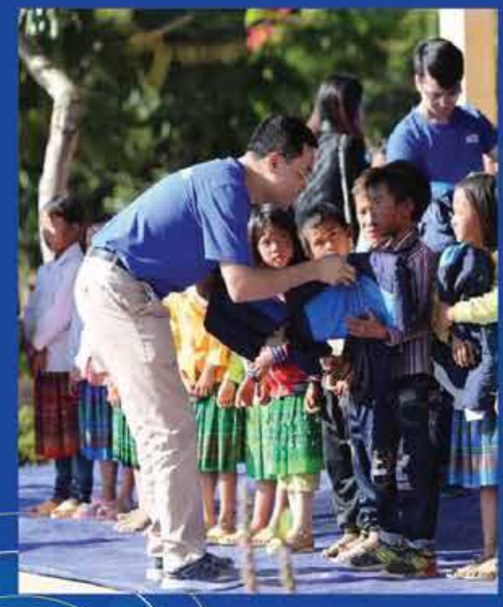
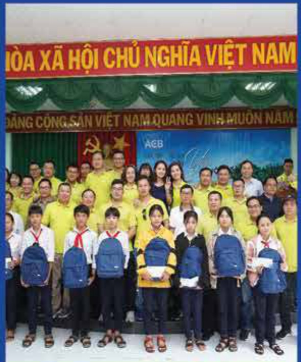
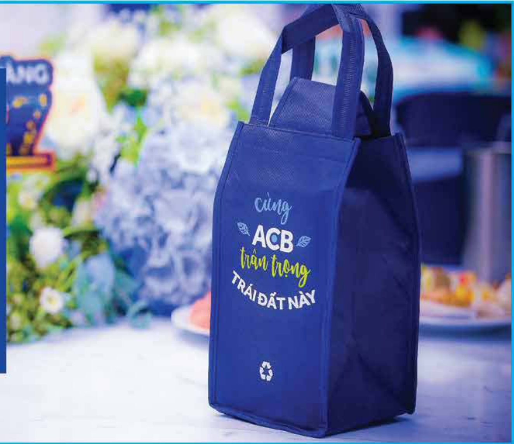
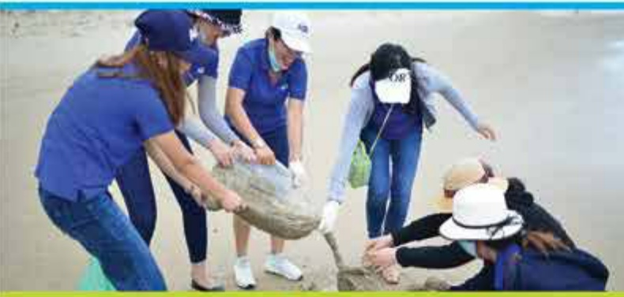
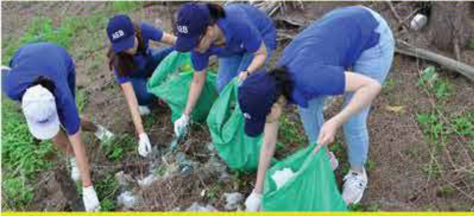
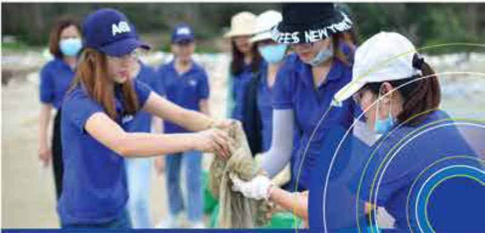

☐ ☐ ☐ 40

## 2.6 Báo cáo tác động liên quan đến môi trường và xã hội

2.6.1 Quản lý nguồn nguyên liệu

Không áp dụng.

2.6.2 Quản lý nguồn nguyên vật liệu

Không áp dụng.

2.6.3 Tiêu thụ năng lượng

Không áp dụng.

2.6.4 Tiêu thụ nước

Không áp dụng.

2.6.5 Tuân thủ pháp luật về bảo vệ môi trường

ACB không tài trợ các dự án vi phạm luật về bảo vệ

môi trường.

2.6.6 Chính sách liên quan đến người lao động

Xin xem mục 2.2.4 Chính sách đối với người lao động và các thay đổi trong chính sách.

#### 2.6.7 Báo cáo liên quan đến trách nhiệm đối với công đồng địa phương

Trong năm 2020, ngăn sách ACB dành để thực hiện trách nhiệm đối với cộng đồng là hạn 14 tỷ đồng; trong đó, ACB ủng hộ 10.5 tỷ đồng hỗ trợ Chính phủ phòng chống dịch COVID-19 (ngày 17 tháng 3 năm 2020). Ngoài ra, hai chương trình xã hội trọng yếu là "Hành trình tôi yêu cuộc sống" và "Gần lại O" tiếp tục được triển khai tại nhiều nơi trên cả nước.

##### Chương trình "Hành trình tôi yêu cuộc sống":

Là chương trình nhằm truyền tải thông điệp "Cùng ACB dành tăng món quà ý nghĩa cho công đồng," đa dạng về lĩnh vực hoạt động. Một số hoạt động được thực hiện trong năm 2020, gồm có:

• Về mặt giáo dục: Triển khai các chương trình The Next Banker, ACB Experience, nhằm mang đến trải nghiệm thực tế cho sinh viên các trường đại học kinh tế, giúp các em nâng cao kiến thức chuyên môn và kỹ năng, chuẩn bị tốt hơn cho quả trình làm việc sau tốt nghiệp. Tăng học bổng cho học sinh và sinh viên một số trường tại Tiến Giang, Phú Yên và Đà Nẵng.

Về mặt hỗ trợ chăm lo người có hoàn cảnh khổ khăn: Xây nhà cho một số gia đình chính sách gặp khổ khăn tại Long An, Khánh Hòa, và Hà Tĩnh. Tặng quà và ủng hộ quý vì người nghèo để góp phần chăm lo cho người có hoàn cảnh khổ khăn tại Bến Tre, Hội An, Bắc Giang, TP. Hồ Chí Minh, Phú Yên, Bình Định, Nghệ An, Bạc Liêu, Bắc Ninh, Quảng Ngãi và Trà Vinh.

Về mặt khác: Hỗ trợ lắp đặt camera an ninh công cộng tại huyện Diễn Châu, tỉnh Nghệ An.

##### Chương trình bảo vệ môi trường "Gần lại O":

Là chương trình đã thực hiện trong hơn bảy năm qua, nhằm xây dựng và năng cao ý thức bảo vệ môi trường ở nhân viên ACB.

- Các sự kiện trực tiếp về bảo vệ môi trường trong năm 2020 it được tổ chức hơn do ảnh hưởng từ dịch COVID-19, nhưng các hoạt động truyền thông vẫn được triển khai để khuyến khích nhân viên cùng gia đình tham gia.

- Một điểm mới là các hoạt động "Gần lại" nằm 2020 còn hướng đến khách hàng và đối tác thay vi chỉ trong nội bộ như các năm trước. Hàng nghìn bộ quả Gần lại Ô đã được gửi tăng đến khách hàng qua các chương trình khuyến mại. Mini game và hành động này nhận được sự hưởng ứng tích cực. Các hoạt động truyền thông không còn đơn thuần mang tính kêu gọi mà chuyển sang khuyến khích nhân viên ACB chủ động thực hiện những hoạt động vì mỗi trường.

#### 2.6.8 Báo cáo liên quan đến hoạt động thị trường vốn xanh

Không áp dụng.

