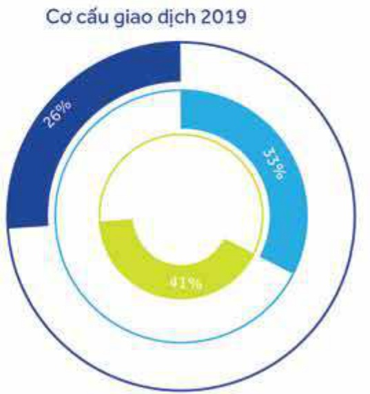
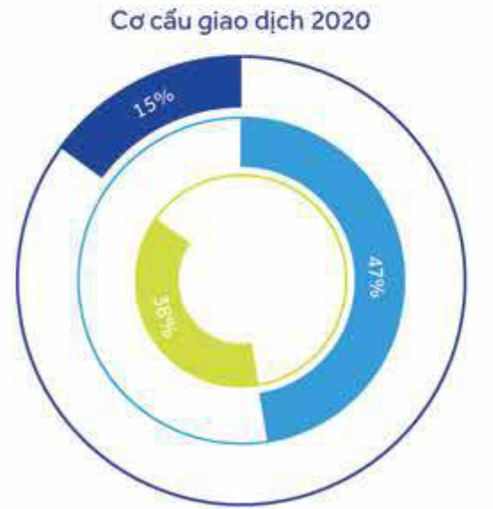
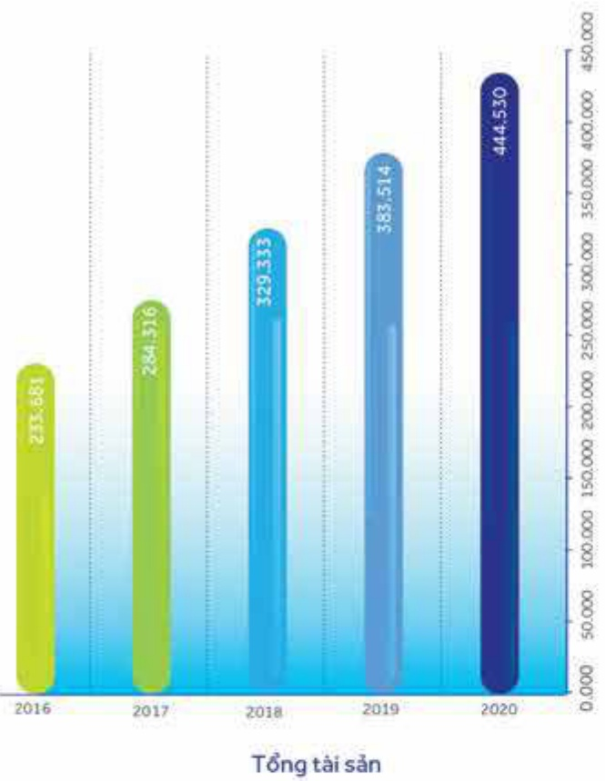
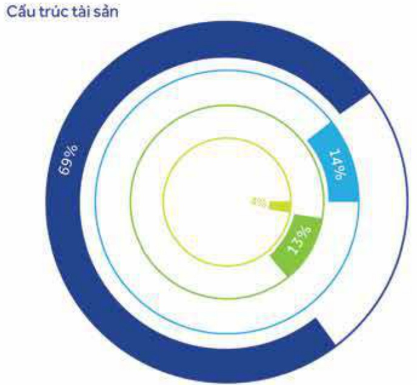
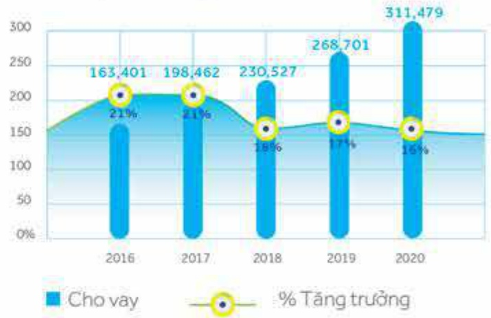
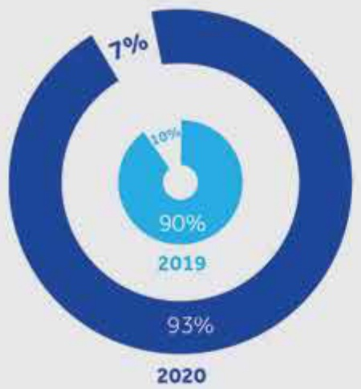

##### 图集44

##### GD tại quấy ■ GD e-banking ■ ATM, CDM, POS

Cùng với việc phát triển ngàn hàng số. ACB còn mở rộng mạng lưới ATM, CDM và POS. Tình đến ngày 31 tháng 12 năm 2020. ACB có 914 máy ATM và CDM và 8.102 máy POS đặt tại cửa hàng, nhà hàng, siêu thị, trung tâm thương mại, công ty du lịch, khách sạn, v.v. để phục vụ hoạt động thanh toán của khách hàng.

## 3.2 Tình hình tài chính

TÍNH ĐẾN 31/12/2020, ACB CÓ:

914 ATM VÀ CDM

8.102 POS

### 3.2.1 Phân tích tài sản có

##### Tổng tài sản

- Tổng tài sản (TTS) đạt 445 nghìn tỷ đồng, tăng 61 nghìn tỷ đồng (16%) so với cuối năm 2019, và đạt 103% kế hoạch. Tốc độ tăng trưởng hàng năm kép bình quân trong 5 năm liên tiếp (2016 - 2020) là 17%. Song song với việc tăng trưởng về quy mô, ACB vẫn luôn duy trì một bảng tổng kết tài sản vững mạnh với khả năng thanh khoản tốt.

- Cơ cấu tài sản tiếp tục được cấu trúc theo hướng gia tăng tỷ trọng tài sản sinh lời trong quy mô TTS, đặt đến 96% TTS vào cuối năm 2020, trong đó riêng nợ nhóm 1 chiếm đến -69% TTS, các tài sản không sinh lời và nợ xấu chiếm 4% TTS, đảm bảo tối đa hóa hiệu quả sử dụng vốn cho Ngân hàng.

Hoạt động cho vay của ACB tăng trưởng tốt và đảm bảo theo quy định trấn tín dụng của NHNNVN, tốc độ tăng trưởng kếp bình quân năm đạt 18% trong giai đoạn 2016 - 2020.

### 3.2.2 Hoạt động Tin dụng

Trong năm 2020, ACB tiếp tục tập trung tăng trưởng dư nợ phát triển kinh tế theo đúng định hướng của NHNNVN, tổng dư nợ cho vay khách hàng đạt 311 nghìn tỷ đồng, đạt 100% kế hoạch, tăng 43 nghìn tỷ (+16%) so với cuối năm 2019. Trong đó, cho vay khách hàng cả nhận đạt 188 nghìn tỷ đồng, tăng 19% so với năm 2019, tiếp tục đóng vai trò đấu tàu cho động lực tăng trưởng tín dụng toàn ngân hàng. Cho vay của nhóm khách hàng doanh nghiệp nhỏ và vừa đạt mức tăng trưởng 15%. Tổng danh mục cho vay nhóm khách hàng cá nhân và doanh nghiệp nhỏ và vừa chiếm 93% trên tỗng số dư nợ cho vay toàn Ngân hàng.

Cho vay khách hàng

Nợ xấu và tài sản không sinh lời

Tài sản sinh lời khác

TPCP

Nợ N1

Tỷ trọng cho vay mảng bán lẻ

Trong cơ cấu cho: vay theo ký hạn, ACB chủ yếu tập trung cho vay ngắn hạn với 58% tổng danh mục và theo đúng định hướng đảm bảo an toàn trong hoạt động tin dung. Cho vay dài hạn được kiểm soát ở mức dưới 40% tổng danh mục; chiếm 37% tại cuối năm 2020. Cho vay trung hạn chiếm tỷ lệ thấp trong danh mục cho vay khoảng 5%.

<table border=1 style='margin: auto; word-wrap: break-word;'><tr><td style='text-align: center; word-wrap: break-word;'></td><td style='text-align: center; word-wrap: break-word;'>Giá trị</td><td style='text-align: center; word-wrap: break-word;'>Tỷ trọng (%)</td><td style='text-align: center; word-wrap: break-word;'>Giá trị</td><td style='text-align: center; word-wrap: break-word;'>Tỷ trọng (%)</td></tr><tr><td style='text-align: center; word-wrap: break-word;'>Cho vay ngắn han</td><td style='text-align: center; word-wrap: break-word;'>144.795</td><td style='text-align: center; word-wrap: break-word;'>54</td><td style='text-align: center; word-wrap: break-word;'>180.504</td><td style='text-align: center; word-wrap: break-word;'>58</td></tr><tr><td style='text-align: center; word-wrap: break-word;'>Cho vay trung han</td><td style='text-align: center; word-wrap: break-word;'>18.458</td><td style='text-align: center; word-wrap: break-word;'>7</td><td style='text-align: center; word-wrap: break-word;'>15.850</td><td style='text-align: center; word-wrap: break-word;'>5</td></tr><tr><td style='text-align: center; word-wrap: break-word;'>Cho vay dài han</td><td style='text-align: center; word-wrap: break-word;'>105.448</td><td style='text-align: center; word-wrap: break-word;'>39</td><td style='text-align: center; word-wrap: break-word;'>115.125</td><td style='text-align: center; word-wrap: break-word;'>37</td></tr><tr><td style='text-align: center; word-wrap: break-word;'>Dùng cho vay khách hàng</td><td style='text-align: center; word-wrap: break-word;'>268.701</td><td style='text-align: center; word-wrap: break-word;'>100</td><td style='text-align: center; word-wrap: break-word;'>311.479</td><td style='text-align: center; word-wrap: break-word;'>100</td></tr></table>

