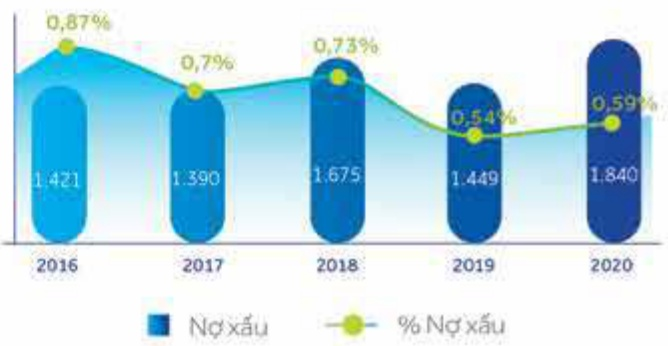
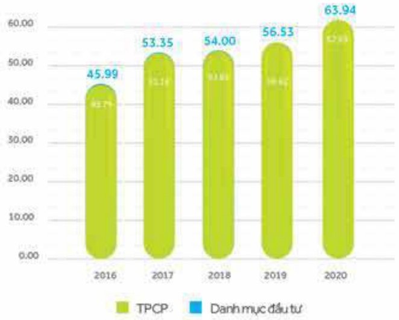
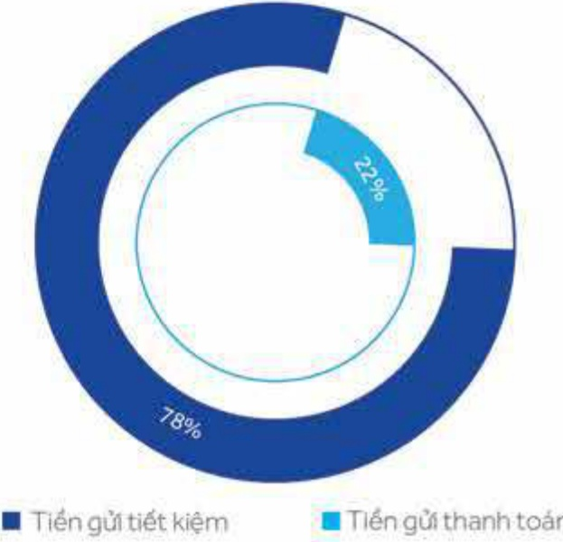
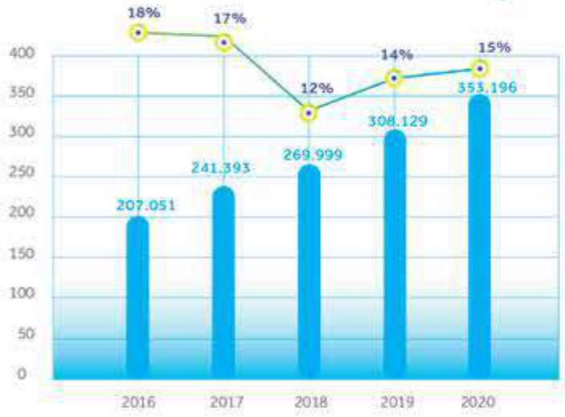

##### BÁO CÁO ĐÁNH GIÁ HOẠT ĐỘNG CỦA BAN ĐIỂU HÀNH

##### 问题 46

##### Chất lượng tài sản

Năm 2020, ACB tiếp tục làm sạch bảng tổng kết tài sản, tập trung giải quyết các khoản nợ xấu, cũng như các tài sản xấu không sinh lời bằng cách thu hối nợ và trích lập dự phỏng rủi ro. Đến cuối năm, tổng dư nợ xấu của ACB giảm còn 1.840 tỷ đồng, tương đương 0.59% tổng dư nợ cho vay, thấp hơn rất nhiều so với mức dưới 2% của toàn ngành và thuộc nhóm các ngân hàng có tỷ lệ nợ xấu thấp nhất. Tỷ lệ dự phỏng/tổng nợ xấu được duy trì ở mức cao trong toàn ngành với mức 160%.

<table border=1 style='margin: auto; word-wrap: break-word;'><tr><td style='text-align: center; word-wrap: break-word;'>Chỉ tiêu</td><td style='text-align: center; word-wrap: break-word;'>2016</td><td style='text-align: center; word-wrap: break-word;'>2017</td><td style='text-align: center; word-wrap: break-word;'>2018</td><td style='text-align: center; word-wrap: break-word;'>2019</td><td style='text-align: center; word-wrap: break-word;'>2020</td></tr><tr><td style='text-align: center; word-wrap: break-word;'>Số dưỡng nhóm 3-5 (tỷ đồng)</td><td style='text-align: center; word-wrap: break-word;'>1.421</td><td style='text-align: center; word-wrap: break-word;'>1.390</td><td style='text-align: center; word-wrap: break-word;'>1.675</td><td style='text-align: center; word-wrap: break-word;'>1.449</td><td style='text-align: center; word-wrap: break-word;'>1.840</td></tr><tr><td style='text-align: center; word-wrap: break-word;'>Tỷ lệ Nợ nhóm 3-5 / Tổng dưỡng (%)</td><td style='text-align: center; word-wrap: break-word;'>0,87</td><td style='text-align: center; word-wrap: break-word;'>0,70</td><td style='text-align: center; word-wrap: break-word;'>0,73</td><td style='text-align: center; word-wrap: break-word;'>0,54</td><td style='text-align: center; word-wrap: break-word;'>0,59</td></tr><tr><td style='text-align: center; word-wrap: break-word;'>Dụ phòng/Tổng nợ xấu (%)</td><td style='text-align: center; word-wrap: break-word;'>126</td><td style='text-align: center; word-wrap: break-word;'>133</td><td style='text-align: center; word-wrap: break-word;'>152</td><td style='text-align: center; word-wrap: break-word;'>175</td><td style='text-align: center; word-wrap: break-word;'>160</td></tr></table>

##### Tài sản có định

##### Hoạt động đấu tư

Danh mục đấu tư tiếp tục được tài cơ cấu bảng việc tiếp tục thoái vốn khỏi các khoản đấu tư không trọng yếu, và trích dữ phòng đấy đủ theo giá trị thị trường. Trái phiếu chính phủ (TPCP) tiếp tục là kênh đấu tư cần thiết với gần 63. nghìn tỷ đồng, chiếm xấp xỉ 98% danh mục đấu tư của ACB, tương đương 14% tổng tài sản của Ngân hàng.

<table border=1 style='margin: auto; word-wrap: break-word;'><tr><td style='text-align: center; word-wrap: break-word;'>Hoạt động điều tư (ĐVT: nghìn tỷ đồng)</td><td style='text-align: center; word-wrap: break-word;'>2016</td><td style='text-align: center; word-wrap: break-word;'>2017</td><td style='text-align: center; word-wrap: break-word;'>2018</td><td style='text-align: center; word-wrap: break-word;'>2019</td><td style='text-align: center; word-wrap: break-word;'>2020</td></tr><tr><td style='text-align: center; word-wrap: break-word;'>Danh mục đấu tư</td><td style='text-align: center; word-wrap: break-word;'>45,99</td><td style='text-align: center; word-wrap: break-word;'>53,35</td><td style='text-align: center; word-wrap: break-word;'>54,00</td><td style='text-align: center; word-wrap: break-word;'>56,53</td><td style='text-align: center; word-wrap: break-word;'>63,94</td></tr><tr><td style='text-align: center; word-wrap: break-word;'>TPCP</td><td style='text-align: center; word-wrap: break-word;'>45,79</td><td style='text-align: center; word-wrap: break-word;'>53,16</td><td style='text-align: center; word-wrap: break-word;'>53,84</td><td style='text-align: center; word-wrap: break-word;'>56,42</td><td style='text-align: center; word-wrap: break-word;'>62,69</td></tr></table>

Tài sản cố định chiếm tỷ trọng nhỏ trong tổng tài sản của Ngân hàng với 0.9%. đạt 3.8 nghìn tỷ đồng, trong đó giá trị còn lại của tài sản cố định hữu hình chiếm 72% tổng tài sản cố định. Trụ sở làm việc chiếm phần lớn tổng tài sản cố định với 54%. Với hệ thống chi nhánh và phòng giao dịch trải dài trên khắp 48 tỉnh thành và quá trình nhận diện thương hiệu mới gắn như hoàn thiện nên Ngân hàng không đầu tư mạnh vào tài sản cố định.

<table border=1 style='margin: auto; word-wrap: break-word;'><tr><td colspan="7"></td></tr><tr><td style='text-align: center; word-wrap: break-word;'>Chỉ tiêu</td><td style='text-align: center; word-wrap: break-word;'>Nguyễn giá</td><td style='text-align: center; word-wrap: break-word;'>Giá trị còn lại</td><td style='text-align: center; word-wrap: break-word;'>Giá trị còn lại/Nguyễn giá (%)</td><td style='text-align: center; word-wrap: break-word;'>Nguyễn giá</td><td style='text-align: center; word-wrap: break-word;'>Giá trị còn lại</td><td style='text-align: center; word-wrap: break-word;'>Giá trị còn lại/Nguyễn giá (%)</td></tr><tr><td style='text-align: center; word-wrap: break-word;'>Tài sản cổ định hữu hình</td><td style='text-align: center; word-wrap: break-word;'>4.737</td><td style='text-align: center; word-wrap: break-word;'>2.721</td><td style='text-align: center; word-wrap: break-word;'>57</td><td style='text-align: center; word-wrap: break-word;'>4.949</td><td style='text-align: center; word-wrap: break-word;'>2.717</td><td style='text-align: center; word-wrap: break-word;'>55</td></tr><tr><td style='text-align: center; word-wrap: break-word;'>Trụ sở làm việc</td><td style='text-align: center; word-wrap: break-word;'>2.556</td><td style='text-align: center; word-wrap: break-word;'>2.062</td><td style='text-align: center; word-wrap: break-word;'>81</td><td style='text-align: center; word-wrap: break-word;'>2.603</td><td style='text-align: center; word-wrap: break-word;'>2.041</td><td style='text-align: center; word-wrap: break-word;'>78</td></tr><tr><td style='text-align: center; word-wrap: break-word;'>Thiết bị văn phòng</td><td style='text-align: center; word-wrap: break-word;'>1.630</td><td style='text-align: center; word-wrap: break-word;'>497</td><td style='text-align: center; word-wrap: break-word;'>31</td><td style='text-align: center; word-wrap: break-word;'>1.763</td><td style='text-align: center; word-wrap: break-word;'>497</td><td style='text-align: center; word-wrap: break-word;'>28</td></tr><tr><td style='text-align: center; word-wrap: break-word;'>Phương tiện vận tải</td><td style='text-align: center; word-wrap: break-word;'>388</td><td style='text-align: center; word-wrap: break-word;'>150</td><td style='text-align: center; word-wrap: break-word;'>39</td><td style='text-align: center; word-wrap: break-word;'>425</td><td style='text-align: center; word-wrap: break-word;'>168</td><td style='text-align: center; word-wrap: break-word;'>39</td></tr><tr><td style='text-align: center; word-wrap: break-word;'>Tài sản cổ định khác</td><td style='text-align: center; word-wrap: break-word;'>163</td><td style='text-align: center; word-wrap: break-word;'>13</td><td style='text-align: center; word-wrap: break-word;'>8</td><td style='text-align: center; word-wrap: break-word;'>159</td><td style='text-align: center; word-wrap: break-word;'>11</td><td style='text-align: center; word-wrap: break-word;'>7</td></tr><tr><td style='text-align: center; word-wrap: break-word;'>Tài sản cổ định vô hình</td><td style='text-align: center; word-wrap: break-word;'>1.409</td><td style='text-align: center; word-wrap: break-word;'>1.049</td><td style='text-align: center; word-wrap: break-word;'>74</td><td style='text-align: center; word-wrap: break-word;'>1.496</td><td style='text-align: center; word-wrap: break-word;'>1.066</td><td style='text-align: center; word-wrap: break-word;'>71</td></tr><tr><td style='text-align: center; word-wrap: break-word;'>Quyền sử dụng đất</td><td style='text-align: center; word-wrap: break-word;'>817</td><td style='text-align: center; word-wrap: break-word;'>817</td><td style='text-align: center; word-wrap: break-word;'>100</td><td style='text-align: center; word-wrap: break-word;'>820</td><td style='text-align: center; word-wrap: break-word;'>820</td><td style='text-align: center; word-wrap: break-word;'>100</td></tr><tr><td style='text-align: center; word-wrap: break-word;'>Phần mềm</td><td style='text-align: center; word-wrap: break-word;'>593</td><td style='text-align: center; word-wrap: break-word;'>232</td><td style='text-align: center; word-wrap: break-word;'>39</td><td style='text-align: center; word-wrap: break-word;'>676</td><td style='text-align: center; word-wrap: break-word;'>246</td><td style='text-align: center; word-wrap: break-word;'>36</td></tr><tr><td style='text-align: center; word-wrap: break-word;'>Tổng cộng</td><td style='text-align: center; word-wrap: break-word;'>6.147</td><td style='text-align: center; word-wrap: break-word;'>3.770</td><td style='text-align: center; word-wrap: break-word;'>61</td><td style='text-align: center; word-wrap: break-word;'>6.445</td><td style='text-align: center; word-wrap: break-word;'>3.783</td><td style='text-align: center; word-wrap: break-word;'>59</td></tr></table>

#### 3.2.2 Phân tích tài sản nợ

##### Hoạt động huy động

Tiền gửi khách hàng tăng trưởng liên tục và ổn định đảm bảo nhu cầu vốn và thanh khoản cao cho Ngân hàng. Quy mô tiếng gửi khách hàng tại thời điểm cuối năm 2020 đạt 353 nghìn tỷ đồng, tăng 45 nghìn tỷ đồng, tương đương tăng 15% so với năm 2019, chiếm 80% tổng nguồn vốn của Ngân hàng, đạt 102% kế hoạch năm. Tốc độ tăng trưởng kế bình quản năm đạt 15% trong giai đoạn 2016 - 2020.

Biểu đồ huy động theo ký hạn

Tiến gửi khách hàng — % Tăng trưởng

ACB tiếp tục tận dụng lợi thế ngân hàng bán lẻ, tập trung vào khách hàng cả nhân, doanh nghiệp nhỏ và vừa, với tỷ trọng huy động từ khách hàng cả nhân lên đến 79% tổng huy động của Ngân hàng, Để đạt được kết quả tăng trưởng này, ACB liên tục đưa ra các sản phẩm đặc thú phú hợp với túng phân đoạn khách hàng với lãi suất cạnh trạnh, đồng thời liên tục mở rộng mạng lưới chi nhánh và phòng giao dịch, phát triển mạnh ngân hàng số. Trong năm 2020, huy động không kỳ hạn tăng trưởng ăn tượng với mức 30%, chiếm 22% trên tổng huy động, góp phần giảm chi phí sử dụng vốn và cải thiện biên sinh lời. Tỷ lệ này được kỳ vọng sẽ tiếp tục cải thiện mạnh mẽ trong những năm tối.

##### Quy mô vốn chủ sở hữu

Vốn chủ sở hữu tăng 28% so với năm 2019 và đặt 35 nghìn tỷ đồng, trong đó vốn điều lệ tăng 30% chủ yếu từ việc chi trả cổ túc bảng cổ phiếu 30% và bản (100) tỷ đồng cổ phiếu quỹ. Lợi nhuận chưa phân phối đặt 7.8 nghìn tỷ đồng, tăng 23% so với năm 2019 chủ yếu do kết quả kinh doanh của ACB tăng trưởng tốt. ACB liên tục tăng trưởng về quy mô nhưng không cần huy động vốn từ cổ đồng, tiếp tục chi trả cổ tức hàng năm, đồng thời xử lý dứt điểm các tài sản tốn động, do đó ACB có tỷ suất sinh lợi trên vốn chủ sở hữu đạt 24.3%, thuộc nhóm các ngân hàng dẫn đấu trong ngành.

<table border=1 style='margin: auto; word-wrap: break-word;'><tr><td style='text-align: center; word-wrap: break-word;'>Chỉ tiêu</td><td style='text-align: center; word-wrap: break-word;'>2019</td><td style='text-align: center; word-wrap: break-word;'>2020</td><td style='text-align: center; word-wrap: break-word;'>% tăng giảm</td></tr><tr><td style='text-align: center; word-wrap: break-word;'>Vốn điều lệ</td><td style='text-align: center; word-wrap: break-word;'>16.627</td><td style='text-align: center; word-wrap: break-word;'>21.616</td><td style='text-align: center; word-wrap: break-word;'>30</td></tr><tr><td style='text-align: center; word-wrap: break-word;'>Thắng dư vốn cổ phấn</td><td style='text-align: center; word-wrap: break-word;'>272</td><td style='text-align: center; word-wrap: break-word;'>272</td><td style='text-align: center; word-wrap: break-word;'>0</td></tr><tr><td style='text-align: center; word-wrap: break-word;'>Cổ phiếu quỹ</td><td style='text-align: center; word-wrap: break-word;'>(100)</td><td style='text-align: center; word-wrap: break-word;'>-</td><td style='text-align: center; word-wrap: break-word;'>-100</td></tr><tr><td style='text-align: center; word-wrap: break-word;'>Quỹ của tổ chức tin dụng</td><td style='text-align: center; word-wrap: break-word;'>4.596</td><td style='text-align: center; word-wrap: break-word;'>5.742</td><td style='text-align: center; word-wrap: break-word;'>25</td></tr><tr><td style='text-align: center; word-wrap: break-word;'>Chênh lệch tỷ giá</td><td style='text-align: center; word-wrap: break-word;'>0</td><td style='text-align: center; word-wrap: break-word;'>0</td><td style='text-align: center; word-wrap: break-word;'>0</td></tr><tr><td style='text-align: center; word-wrap: break-word;'>Lợi nhuận chưa phân phối</td><td style='text-align: center; word-wrap: break-word;'>6.370</td><td style='text-align: center; word-wrap: break-word;'>7.819</td><td style='text-align: center; word-wrap: break-word;'>23</td></tr><tr><td style='text-align: center; word-wrap: break-word;'>Tổng vốn chủ sở hữu</td><td style='text-align: center; word-wrap: break-word;'>27.765</td><td style='text-align: center; word-wrap: break-word;'>35.448</td><td style='text-align: center; word-wrap: break-word;'>28</td></tr></table>

Đơn vị tính: tỷ đồng.