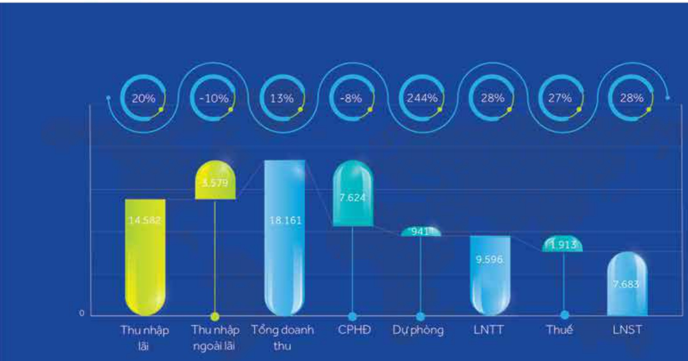
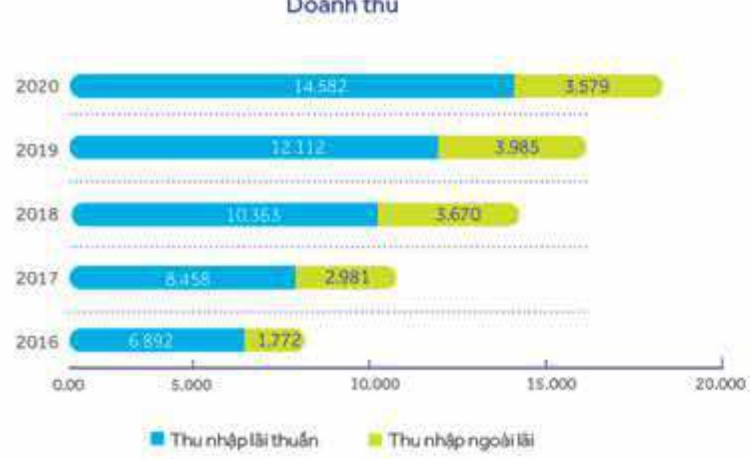

##### BÁO CÁO ĐÁNH GIÁ HOẠT ĐỘNG CỦA BAN ĐIỂU HÀNH

# 48

##### An toàn vốn

ACB luôn định hướng tăng quy mô, chất lượng vốn tự có, chủ động theo dõi, quản lý danh mục cho vay chặt chẽ từ kỳ hạn, ngành nghế, tài sản đảm bảo, mục đích vay, v.v. với mục tiêu cải thiện hệ số tài sản có rủi ro. Theo đó, đến hết năm 2020, tỷ lệ an toàn vốn hợp nhất và an toàn vốn cấp 1 đạt lấn lượt ở mức 11,06% và 10,37%, cao hơn nhiều mức 8% theo quy định của NHNNVN. Tài sản có rủi ro ở mức 338 nghìn tỷ đồng, tăng 19% so với năm 2019, chiếm 76% tổng tài sản. Tổng vốn tự có đạt hơn 37 nghìn tỷ đồng, tăng 21% so với năm 2019, đầy là bước đệm tốt đảm bảo an toàn cho hoạt động của Ngân hàng.

<table border=1 style='margin: auto; word-wrap: break-word;'><tr><td style='text-align: center; word-wrap: break-word;'>Chỉ tiêu</td><td style='text-align: center; word-wrap: break-word;'>2016</td><td style='text-align: center; word-wrap: break-word;'>2017</td><td style='text-align: center; word-wrap: break-word;'>2018</td><td style='text-align: center; word-wrap: break-word;'>2019</td><td style='text-align: center; word-wrap: break-word;'>2020</td></tr><tr><td style='text-align: center; word-wrap: break-word;'>An toàn vốn (%)</td><td style='text-align: center; word-wrap: break-word;'>13,19</td><td style='text-align: center; word-wrap: break-word;'>8,04</td><td style='text-align: center; word-wrap: break-word;'>10,05</td><td style='text-align: center; word-wrap: break-word;'>10,91</td><td style='text-align: center; word-wrap: break-word;'>11,06</td></tr><tr><td style='text-align: center; word-wrap: break-word;'>An toàn vốn cấp 1 (%)</td><td style='text-align: center; word-wrap: break-word;'>8,26</td><td style='text-align: center; word-wrap: break-word;'>6,71</td><td style='text-align: center; word-wrap: break-word;'>8,59</td><td style='text-align: center; word-wrap: break-word;'>9,66</td><td style='text-align: center; word-wrap: break-word;'>10,37</td></tr><tr><td style='text-align: center; word-wrap: break-word;'>Tổng tài sản có rủi ro</td><td style='text-align: center; word-wrap: break-word;'>120,898</td><td style='text-align: center; word-wrap: break-word;'>234,371</td><td style='text-align: center; word-wrap: break-word;'>240,968</td><td style='text-align: center; word-wrap: break-word;'>283,931</td><td style='text-align: center; word-wrap: break-word;'>338,337</td></tr><tr><td style='text-align: center; word-wrap: break-word;'>Vốn tự có</td><td style='text-align: center; word-wrap: break-word;'>15,947</td><td style='text-align: center; word-wrap: break-word;'>18,834</td><td style='text-align: center; word-wrap: break-word;'>24,226</td><td style='text-align: center; word-wrap: break-word;'>30,977</td><td style='text-align: center; word-wrap: break-word;'>37,414</td></tr></table>

##### Khả năng thanh khoản

Bên cạnh tăng trưởng bền vững, ACB luôn đảm bảo duy trí khả năng thanh khoản cao và linh hoạt trong chính sách điều hành hoạt động kinh doanh. Tỷ lệ dự trữ thanh khoản luôn ở mức cao hơn gấp đôi (23,58% vào cuối năm 2020) so với quy định tối thiểu (10%). Tỷ lệ nguồn vốn ngắn hạn cho vay trung dài hạn luôn ở mức 26,42% vào cuối năm 2020, thấp hơn nhiều so với mức quy định tối đa (40%). Về khả năng chỉ trả trọng vòng 30 ngày, đối với VND tỷ lệ này ở mức 87,06%, cao hơn nhiều quy định tối thiểu 50%; tỷ lệ này đối với ngoại tệ khác luôn ở mức cao.

<table border=1 style='margin: auto; word-wrap: break-word;'><tr><td style='text-align: center; word-wrap: break-word;'>Chỉ tiêu</td><td style='text-align: center; word-wrap: break-word;'>2019</td><td style='text-align: center; word-wrap: break-word;'>2020</td></tr><tr><td style='text-align: center; word-wrap: break-word;'>Tỷ lệ dự trữ thanh khoản (%)</td><td style='text-align: center; word-wrap: break-word;'>22,62</td><td style='text-align: center; word-wrap: break-word;'>23,58</td></tr><tr><td style='text-align: center; word-wrap: break-word;'>Khả năng chi trả trong vòng 30 ngày</td><td style='text-align: center; word-wrap: break-word;'></td><td style='text-align: center; word-wrap: break-word;'></td></tr><tr><td style='text-align: center; word-wrap: break-word;'>VND (%)</td><td style='text-align: center; word-wrap: break-word;'>79,59</td><td style='text-align: center; word-wrap: break-word;'>87,06</td></tr><tr><td style='text-align: center; word-wrap: break-word;'>Ngoại tệ khác (%)</td><td style='text-align: center; word-wrap: break-word;'>217,26</td><td style='text-align: center; word-wrap: break-word;'>435,85</td></tr><tr><td style='text-align: center; word-wrap: break-word;'>Tỷ lệ nguồn vốn ngắn hạn được sử dụng cho vay trung và dài hạn (%)</td><td style='text-align: center; word-wrap: break-word;'>26,57</td><td style='text-align: center; word-wrap: break-word;'>26,42</td></tr><tr><td style='text-align: center; word-wrap: break-word;'>Tổng dư nợ cho vay/Nguôn vốn huy động (theo NHNNVN) (%)</td><td style='text-align: center; word-wrap: break-word;'>77,55</td><td style='text-align: center; word-wrap: break-word;'>79,30</td></tr></table>

### 3.2.3 Phân tích kết quả kinh doanh

##### Thu nhập

Lợi nhuận trước thuế của Ngàn hàng trong năm 2020 là 9.596 tỷ đồng, tăng 28% so với năm 2019 và vượt 26% so với số kế hoạch là 7.636 tỷ đồng.

Tổng thu nhập trong năm đạt 18.161 tỷ đồng, tăng 13%, trong đó thu nhập lãi thuần tăng 20%, đạt 14.582 tỷ đồng. Biên sinh lời (NIM) tăng 12 điểm so với năm 2019 đạt 3.52% nhờ vào tiết kiệm chi phí vốn từ tăng trưởng tốt CASA và tin dụng tăng trưởng tốt.

Kết quả kinh doanh 2020

Kết quả kinh doanh 2020

Thu nhập ngoài lãi trong năm 2020 tiếp tục được tập trung đẩy mạnh nhằm nâng cao cơ cấu của mảng thu nhập này trên tổng doanh thu. Đến hết năm 2020, thu nhập ngoài lãi đạt 3.579 tỷ đồng, giảm 10%, đồng góp 20% trên tổng doanh thu. Thu nhập ngoài lãi giảm chủ yếu từ thu nhập phi dịch vụ giảm 11% so với cùng kỳ do chuyển hạch toán phi trả nợ trước hạn và phi thường niên thê tín dụng lên thu nhập lãi, nếu loại bỏ yếu tố trên thì thu nhập phí dịch vụ tăng 14% so với cùng kỳ. Một số mảng tăng trưởng tốt như hoạt động kinh doanh ngoại hối đạt 687 tỷ đồng, tăng 60%; thu nhập tử bản chứng khoản đấu tử đạt 732 tỷ đồng, tăng 13,5 lấn so với cùng kỳ; thu nhập tử bản chứng khoản kinh doanh tăng 121% đạt 166 tỷ đồng. Trong năm 2021, ACB tiếp tục tập trung nâng cao cơ cấu của mảng thu nhập này trên tổng doanh thu, giảm rủi ro tập trung vào hoạt động tín dụng. Thu nhập tử hoạt động dịch vụ được tập trung đẩy mạnh trong năm, nhất là bancassurance và thể ngân hàng. Bancassurance liên tục tăng trưởng tốt trong thời gian qua và ACB vươn lên là một những ngân hàng dẫn đấu về thị phần. Trong giai đoạn 2017 - 2020, ACB đã hợp tác với 5 công ty bảo hiểm nhân thọ, 10 công ty bảo hiểm

Doanh thu

phì nhàn thọ nhăm phối hợp cung cấp các sản phẩm bảo hiểm. Trong đó, sản phẩm tạo ra doanh số tốt nhất đến từ các sản phẩm bảo hiểm nhàn thọ hợp tác với công ty bảo hiểm AIA. Năm 2020, doanh số mảng bancassurance tại ACB đã tăng trưởng tới 33%, đứng vào tốp ba thi phần. Doanh thu phí bảo hiểm năm 2020 tăng 37% so với năm 2019, động góp 45% tổng phí dịch vụ. Đến cuối năm 2020, ACB đã ký kết thành công hợp đồng độc quyền bảo hiểm nhân thọ với Công ty TNHH Bảo hiểm Nhân thọ Sun Life Việt Nam như đã để cấp ở Mục 3.1.2 Những tiến bộ về hoạt động kinh doanh Ngân hàng đã đạt được. Hoạt động kinh doanh thể được tiếp tục đẩy mạnh.