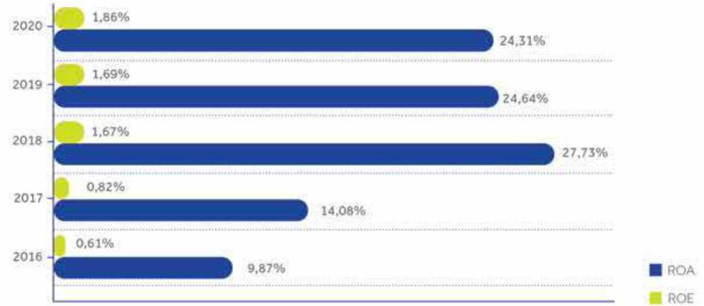
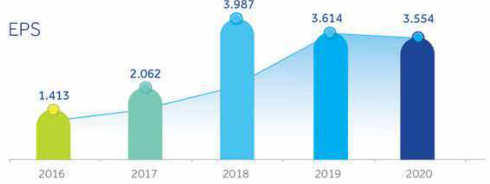

##### BÁO CÁO ĐÁNH GIÁ HOẠT ĐỘNG CỦA BAN ĐIỂU HÀNH

##### ☐ ☐ ☐ 50

Trong năm 2020, số lượng thẻ mở mới tăng 12% so với năm 2019, trong đó số lượng thẻ tín dụng mới tăng 38%, doanh số giao dịch tăng 16% so với năm 2019. Nhờ đó, lợi nhuận tử hoạt động thẻ tăng 46% so với năm 2019. Tổ chức thẻ quốc tế VISA, ghi nhận những nỗ lực và đổi mới của ACB trong hoạt động kinh doanh thẻ, đã trao cho ACB nhiều giải thường như Ngân hàng dẫn đầu tốc độ tăng trưởng doanh số thẻ doanh nghiệp, Ngân hàng dẫn đầu doanh số thanh toán qua thẻ trả trước, v.v.

##### Chỉ phí hoạt động

Trong năm 2020, ACB tiếp tục phân bổ ngân sách, đầu tư chiến lược cho các nhiệm vụ phát triển dài hạn của Ngân hàng như các dự án nâng cấp hạ tầng công nghệ thông tin, tầng chỉ phí nhân sự thu hút nhân tài và tổ chức hàng loạt các cuộc thi sáng tạo nhằm đưa Ngân hàng đến gần hơn với cuộc cách mạng fintech (cộng nghệ tài chính). Chi phương năm 2020 được kiểm soát chất chế dưới tác động của dịch COVID-19 với mức giảm 8% so với năm 2019, chủ yếu từ giảm chi phí đầu tư nhân diện thường hiệu, chi phí quảng cáo, đào tạo, hội nghị, công tác phí, giảm trích quỹ Khoa học và Công nghệ và tầng thu nhập từ các khoản phải thu. Chi phí nhân sự chiếm tỷ trọng lớn nhất với 57% tổng chi phí, tăng 15% so với năm 2019.

<table border=1 style='margin: auto; word-wrap: break-word;'><tr><td style='text-align: center; word-wrap: break-word;'>Chỉ tiêu</td><td style='text-align: center; word-wrap: break-word;'>2019</td><td style='text-align: center; word-wrap: break-word;'>2020</td><td style='text-align: center; word-wrap: break-word;'>% tăng giảm</td><td style='text-align: center; word-wrap: break-word;'>Tỷ trọng 2020 (%)</td></tr><tr><td style='text-align: center; word-wrap: break-word;'>Chi nộp thuế và các khoản phí, lệ phí</td><td style='text-align: center; word-wrap: break-word;'>13</td><td style='text-align: center; word-wrap: break-word;'>16</td><td style='text-align: center; word-wrap: break-word;'>18</td><td style='text-align: center; word-wrap: break-word;'>0</td></tr><tr><td style='text-align: center; word-wrap: break-word;'>Chi phí cho nhân viên</td><td style='text-align: center; word-wrap: break-word;'>3.763</td><td style='text-align: center; word-wrap: break-word;'>4.337</td><td style='text-align: center; word-wrap: break-word;'>15</td><td style='text-align: center; word-wrap: break-word;'>57</td></tr><tr><td style='text-align: center; word-wrap: break-word;'>Chi vế tài sản</td><td style='text-align: center; word-wrap: break-word;'>1.643</td><td style='text-align: center; word-wrap: break-word;'>1.750</td><td style='text-align: center; word-wrap: break-word;'>7</td><td style='text-align: center; word-wrap: break-word;'>23</td></tr><tr><td style='text-align: center; word-wrap: break-word;'>Chi cho hoạt động quản lý công vụ</td><td style='text-align: center; word-wrap: break-word;'>2.279</td><td style='text-align: center; word-wrap: break-word;'>1.793</td><td style='text-align: center; word-wrap: break-word;'>-21</td><td style='text-align: center; word-wrap: break-word;'>24</td></tr><tr><td style='text-align: center; word-wrap: break-word;'>Chi nộp phí bảo hiểm, bảo toàn tiến gửi của khách hàng</td><td style='text-align: center; word-wrap: break-word;'>330</td><td style='text-align: center; word-wrap: break-word;'>374</td><td style='text-align: center; word-wrap: break-word;'>13</td><td style='text-align: center; word-wrap: break-word;'>5</td></tr><tr><td style='text-align: center; word-wrap: break-word;'>Chi phí dự phòng giảm giá các khoản đấu tư dài hạn và dự phòng ngữ khó đòi</td><td style='text-align: center; word-wrap: break-word;'>279</td><td style='text-align: center; word-wrap: break-word;'>(647)</td><td style='text-align: center; word-wrap: break-word;'>-332</td><td style='text-align: center; word-wrap: break-word;'>-8</td></tr><tr><td style='text-align: center; word-wrap: break-word;'>Tổng cộng</td><td style='text-align: center; word-wrap: break-word;'>8.308</td><td style='text-align: center; word-wrap: break-word;'>7.624</td><td style='text-align: center; word-wrap: break-word;'>-8</td><td style='text-align: center; word-wrap: break-word;'>100</td></tr></table>

##### Chỉ phí dự phòng rủi ro tín dụng

Chi phí dự phòng rủi ro tín dụng (941) tỷ đồng, cao hơn (667) tỷ đồng so với cùng kỳ năm trước, trong đó chủ yếu trích dự phòng cho khoản tiến gửi tại Ngân hàng Xây dựng. Tỷ lệ chi phí dự phòng/Lợi nhuận trước dự phòng chỉ chiếm 9%, đây là mức thấp trong hệ thống các ngân hàng. Mặc dù bị ảnh hưởng bởi dịch COVID-19, nhưng chi phí dự phòng văn bám sát theo kế hoạch đã để ra, phù hợp với chính sách quản lý rủi ro đẩy mạnh xử lý triệt để các vấn đề tốn động của Ngân hàng.

Dù nền kinh tế bị tác động bởi dịch COVID-19, ACB vẫn duy trì được tỷ suất sinh lời cao trong ngành. Tỷ suất sinh lời trên vốn chủ sở hữu (ROE) của ACB đạt 24,3%, duy trì ở tốp ba ngân hàng dẫn đầu. Tỷ suất sinh lời trên tổng tài sản (ROA) tiếp tục tăng qua các năm, cuối năm 2020 đạt 1,9%, tăng 17 điểm so với năm 2019.

##### Tỷ suất sinh lời, thu nhập mỗi cổ phần

Lợi nhuận trên mỗi cổ phiếu (EPS) hiện đạt mức 3.554 đồng/cổ phiếu, giảm so với EPS 2019 (3.614 đồng/cổ phiếu) do thực hiện chia cổ tức bằng cổ phiếu 30% trong tháng 9 năm 2020.

##### Xếp hàng tin nhiệm

ACB luôn là một trong những ngàn hàng được các tổ chức xếp hàng tin nhiệm đánh giá ở mức cao so với mức trần xếp hàng quốc gia của Việt Nam. Theo công bố của tổ chức xếp hàng tin nhiệm Moody's Investor Service vào ngày 14 tháng 12 năm 2020, ACB được đánh giá như sau:

<table border=1 style='margin: auto; word-wrap: break-word;'><tr><td style='text-align: center; word-wrap: break-word;'>Hạng mục</td><td style='text-align: center; word-wrap: break-word;'>Xếp hạng của Moody’s</td></tr><tr><td style='text-align: center; word-wrap: break-word;'>Xếp hạng năng lực độc lập (BCA)</td><td style='text-align: center; word-wrap: break-word;'>Ba3</td></tr><tr><td style='text-align: center; word-wrap: break-word;'>Xếp hạng tiến gửi</td><td style='text-align: center; word-wrap: break-word;'>Ba3</td></tr><tr><td style='text-align: center; word-wrap: break-word;'>Xếp hạng đơn vị phát hành dài hạn</td><td style='text-align: center; word-wrap: break-word;'>Ba3</td></tr></table>

Mục xếp hàng tin nhiệm này của ACB là mục cao trong số các ngân hàng được Moody's xếp hàng tại Việt Nam.

