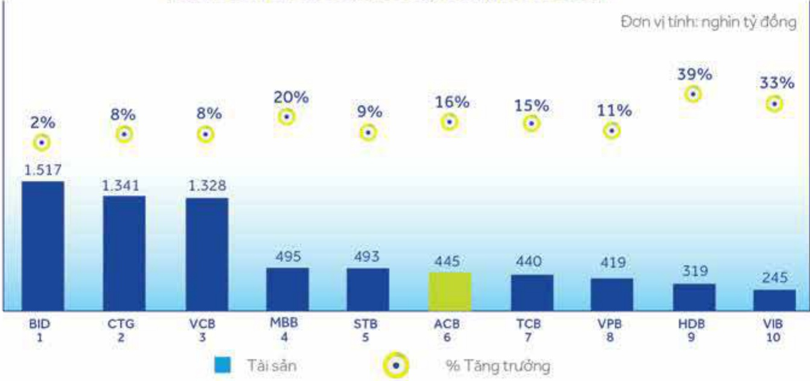
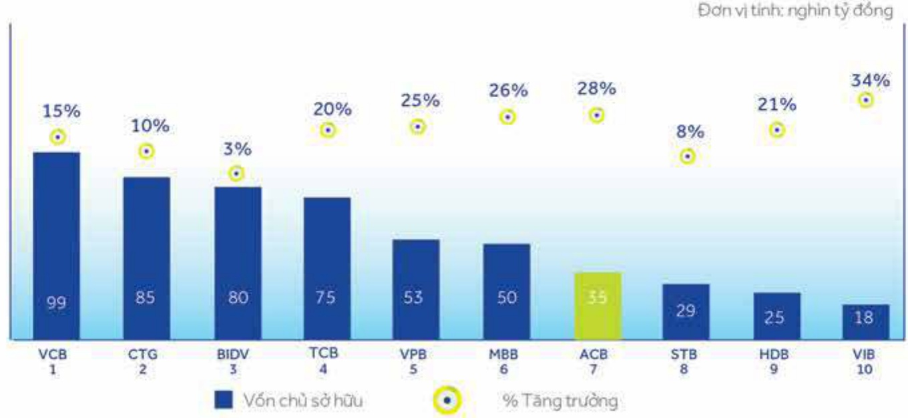
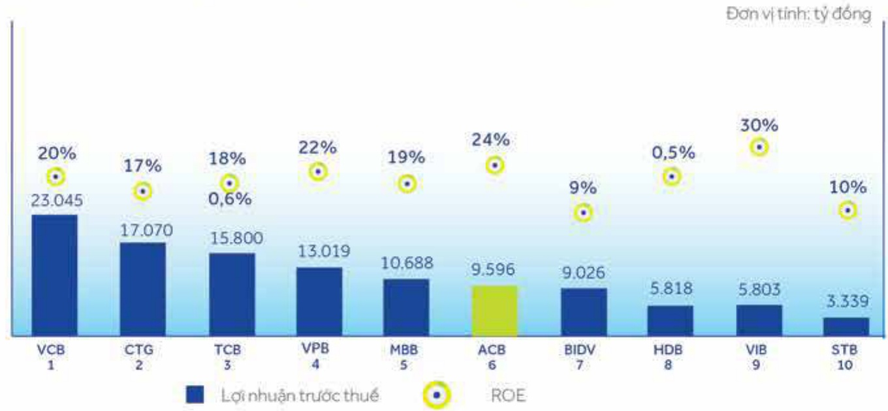

##### BÁO CÁO ĐÁNH GIÁ HOẠT ĐỘNG CỦA BAN ĐIỂU HÀNH

# 52

Ngoài ra, ACB luôn được nhận đánh giá cao từ tổ chức xếp hàng tin nhiệm Fitch Ratings với triển vọng ổn định. Cụ thể mục xếp hàng tin nhiệm tại ngày 29 tháng 01 năm 2021 là:

<table border=1 style='margin: auto; word-wrap: break-word;'><tr><td style='text-align: center; word-wrap: break-word;'>Hạng mục</td><td style='text-align: center; word-wrap: break-word;'>Xếp hạng của Fitch Ratings</td></tr><tr><td style='text-align: center; word-wrap: break-word;'>Xếp hạng phát hành nợ dài hạn</td><td style='text-align: center; word-wrap: break-word;'>B+</td></tr><tr><td style='text-align: center; word-wrap: break-word;'>Xếp hạng phát hành nợ ngắn hạn</td><td style='text-align: center; word-wrap: break-word;'>B</td></tr><tr><td style='text-align: center; word-wrap: break-word;'>Xếp hạng sức mạnh độc lập</td><td style='text-align: center; word-wrap: break-word;'>B+</td></tr><tr><td style='text-align: center; word-wrap: break-word;'>Xếp hạng mức sản vế khả năng được hỗ trợ</td><td style='text-align: center; word-wrap: break-word;'>B</td></tr><tr><td style='text-align: center; word-wrap: break-word;'>Xếp hạng mức hỗ trợ</td><td style='text-align: center; word-wrap: break-word;'>4</td></tr></table>

##### Vị thế của ACB trong ngành

Trải qua 27 năm hình thành và phát triển, ACB đã liên tục tăng trưởng để trở thành một trong các ngân hàng thương mại cổ phần hàng đầu. Điều này đã được minh chứng qua mức độ tăng trưởng hàng năm luôn cao hơn ngành, và thuộc nhóm dẫn đầu về hiệu quả kinh doanh.

##### ○○○

##### Quy mô tổng tài sản

ACB về cơ bản đã xử lý dút điểm các vấn đề tồn động tử sau sự cố năm 2012, và tài cấu trúc hoạt động kinh doanh thành công. Quy mô tài sản liên tục tăng trưởng với mức bình quân 15%/năm trong giai đoạn 2013 - 2020. Đến cuối năm 2020, tổng tài sản của ACB đạt 445 nghìn tỷ đồng, tăng gần 16% so với năm 2019, xếp vị trí thứ 6 trong tổng số 10 ngăn hàng niềm yết.

Quy mô tổng tài sản của một số ngân hàng (31/12/2020)

Nguồn: BCTC kiểm toán hợp nhất năm 2020 của các ngân hàng.

Bên cạnh tăng trưởng quy mô tài sản, quy mô vốn chủ sở hữu cùng tăng trưởng liên tục với mức bình quân 16%/năm trong giai đoạn 2016 - 2020 mà không cần huy động thêm vốn từ cổ đồng. Tình đến ngày 31 tháng 12 năm 2020, quy mô vốn chủ sở hữu đặt 35 nghìn tỷ đồng, tăng 28% so với cùng kỳ 2019, xếp thứ 7 trong tổng số 10 ngàn hàng niệm yết. Mặc dù với quy mô vốn chủ sở hữu thấp hơn các ngân hàng thương mại cổ phần khác nhưng quy mô tài sản tăng trưởng tương xứng với những ngân hàng có quy mô lớn, điều này chúng tồ ACB có khả năng sử dụng và huy động vốn hiệu quả.

Quy mô vốn chủ sở hữu của một số ngân hàng (31/12/2020)

Nguồn: BCTC kiểm toàn hợp nhất năm 2020 của các ngân hàng.

##### Hiệu quả hoạt động kinh doanh

Kết quả kinh doanh của ACB những năm qua có tăng trưởng ăn tượng và dẫn khảng định vị thế ngân hàng thương mại hàng đầu Việt Nam. Năm 2020, lợi nhuận trước thuế đạt 9.596 tỷ đồng, tăng 28% so với năm 2019, xếp thứ 6 trong 10 ngân hàng niệm yết. Tỷ suất lợi nhuận sau thuế trên vốn chủ sở hữu bình quân đạt 24.3%, thuộc nhóm các ngân hàng hàng đấu.

Kết quả hoạt động kinh doanh của một số ngân hàng (31/12/2020)

Nguồn: BCTC kiểm toán hợp nhất năm 2020 của các ngàn hàng.

