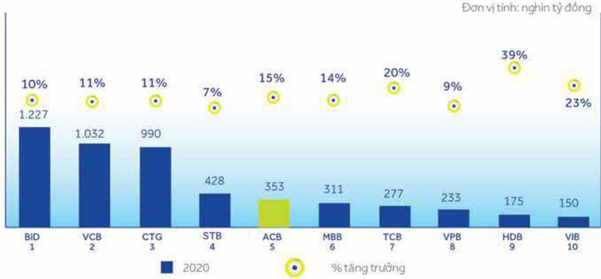
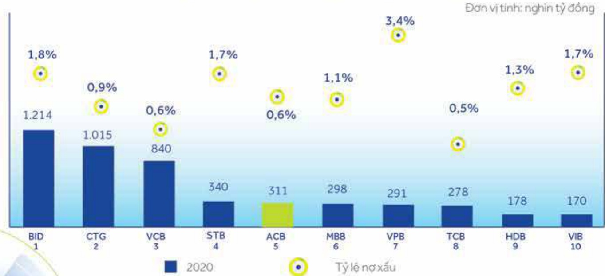

##### BÁO CÁO ĐÁNH GIÁ HOẠT ĐỘNG CỦA BAN ĐIỂU HÀNH 54

##### Tăng trưởng bến vững và an toàn

ACB luôn tăng trưởng bến vững và đảm bảo các quy định về an toàn trong hoạt động kinh doanh. Quy mô huy động vốn liên tục tăng trưởng tốt nhờ vào nền tăng khách hàng lớn và có tốc độ tăng trưởng bình quân 14%/năm trong giai đoạn 2013 - 2020. Đến cuối năm 2020, huy động từ khách hàng đạt 353 nghìn tỷ đồng, tăng 15% so với năm 2019, xếp vị trí thứ 5 trong tổng số 10 ngân hàng niệm yet.

Huy động vốn từ khách hàng của một số ngân hàng (31/12/2020)

Nguồn: BCTC kiểm toàn hợp nhất năm 2020 của các ngàn hàng.

Tin dụng tăng trưởng bến vững và luôn đảm bảo tuần thủ các quy định của NHNNVN với tốc độ tăng trưởng bình quân 16%/năm trong giai đoạn 2013 - 2020. Dự nợ cho vay tại ngày 31 tháng 12 năm 2020 đạt 311 nghìn tỷ đồng, tăng 16% so với năm 2019, xếp vị trí thứ 5 trong 10 ngần hàng niềm yết. ACB liên tục tăng trưởng mạnh mẽ tín dụng nhưng luôn đảm bảo quy định của NHNNVN và quản lý rủi ro tín dụng hiệu quả thông qua tỷ lệ nợ xấu luôn ở mức thấp nhất trong hệ thống ngân hàng Việt Nam, ở mức 0.6% vào cuối năm 2020.

Dự nợ cho vay khách hàng của một số ngân hàng (31/12/2020)

Nguồn: BCTC kiểm toán hợp nhất năm 2020 của các ngân hàng.

#### 3.3.1 Cải tiến về cơ cấu tổ chức

## 3.3 Những cải tiến về cơ cấu tổ chức, chính sách và quản lý

Trong năm 2020, ACB đã sửa đổi, bổ sung chức năng, nhiệm vụ và cơ cấu tổ chức của một số đơn vị tại Hội sở, gồm có: Khối Khách hàng doanh nghiệp. Khối Thị trường tài chính, Phòng Pháp chế. Khối Quản lý rủi ro, Khối Công nghệ thông tin và Phòng Tuân thủ, để đáp ứng yêu cầu tuân thủ và/hoặc như cấu nội tại.

#### 3.3.2 Thay đổi về chính sách niêm yết

Ngày 16 tháng 6 năm 2020 Đại hội đồng cổ đồng có nghị quyết về việc chuyển đăng ký niệm yet cổ phiếu của ACB sang HOSE với ký vọng cổ phiếu ACB sẽ được đưa vào các rỗ chỉ số tham chiếu quan trọng như VN-All-share hay VN30 và thu hút các quỹ ETF mua vào. Cổ phiếu ACB chính thức niệm yet trên HOSE ngày 20 tháng 11 năm 2020.

