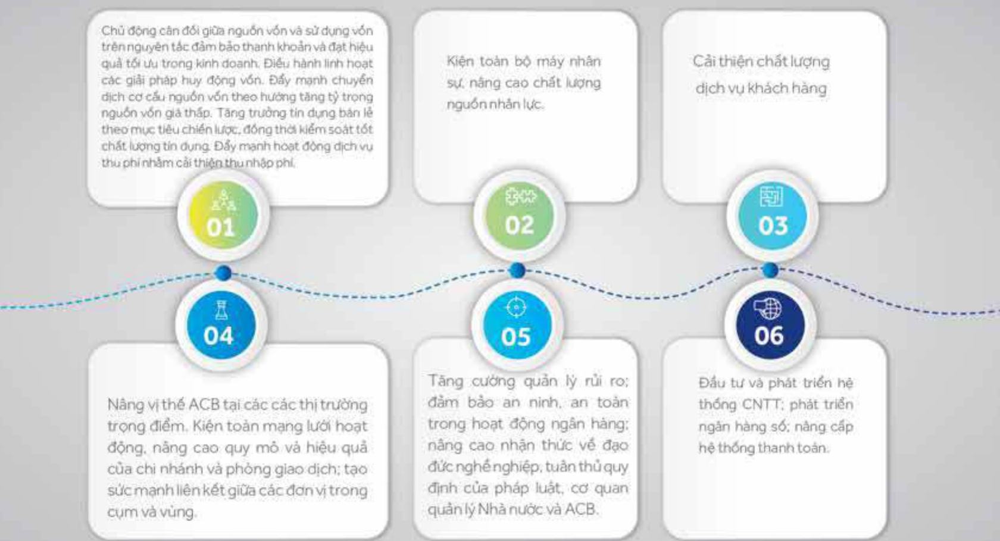

## 3.4 Kế hoạch phát triển trong tương lai

Trong giai đoạn 2019 - 2024, kế hoạch hoạt động của ACB đặt ra các mục tiêu tăng trưởng bình quân năm như sau: Tổng tài sản dự kiến tăng 15%; cho vay 15%; huy động 15%; lợi nhuận trước thuế khoảng 12%-20%; và tỷ lệ nợ xấu dưới 2%.

Trong bối cảnh thị trường ngân hàng đang canh tranh gay gắt và phải đáp ứng nhiều yêu cầu của cơ quan quản lý Nhà nước về mặt an toàn vốn, quản lý rủi ro, trách nhiệm xã hội, v.v. ACB kiên trị định hướng tăng trưởng cao và chất lượng, có hiệu quả cao và bến vững, đảm bảo tuân thủ, và đấu tư để duy trì khả năng cạnh tranh trong dãi hạn.

### 3.4.1 Các hành động chính

##### Các hành động chính ACB đã, đang và tiếp tục thực hiện gồm có:

Chủ động căn đối giữa nguồn vốn và sử dụng vốn trên nguyên tắc đảm bảo thanh khoản và đạt hiệu quả tối ưu trong kinh doanh. Điều hành linh hoạt các giải pháp huy động vốn. Đấy mạnh chuyển dịch cơ cấu nguồn vốn theo hướng tăng tỷ trong nguồn vốn giá thấp. Tăng trưởng tin dụng bản lẽ theo mục tiêu chiến lược, đồng thời kiểm soát tốt chất lượng tin dụng. Đấy mạnh hoạt động dịch vụ thu phí nhằm cải thiện thu nhập phí.

Nâng vị thế ACB tại các các thị trường trọng điểm. Kiện toàn mạng lưới hoạt động, nâng cao quy mô và hiệu quả của chi nhánh và phòng giao dịch; tạo sức mạnh liên kết giữa các đơn vị trong cụm và vùng.

Tăng cường quản lý rủi rơ; đảm bảo an ninh, an toàn trong hoạt động ngân hàng; nâng cao nhận thức về đạo đức nghề nghiệp, tuần thủ quy định của pháp luật, cơ quan quản lý Nhà nước và ACB.

### 3.4.2 Mở rộng mạng lưới chi nhánh và phòng giao dịch năm 2021

Trong năm 2021, ACB dự kiến mở mối 11 phòng giao dịch tại 10 tỉnh thành, trong đó có 1 đơn vị ở tỉnh Quảng Trị, đưa số tỉnh thành ACB hiện diện từ 48 lên 49 trong số 63 tỉnh thành.

## 3.5 Giải trình của Ban điều hành đối với ý kiến kiểm toán

Công ty Kiểm toàn PwC không có ý kiến không chấp thuận đối với Báo cáo tài chính ACB.

## 3.6 Báo cáo đánh giá liên quan đến trách nhiệm về môi trường và xã hội

3.6.1 Đánh giá liên quan đến các chỉ tiêu môi trường

Không áp dụng.

3.6.2 Đánh giá liên quan đến vấn đề người lao động (trách nhiệm của ACB đối với người lao động)

Trách nhiệm của ACB của đối với người lao động thế hiện qua các hành động sau:

• ACB luôn tuần thủ các quy định của pháp luật liên quan đến người lao động, thực hiện chính sách của Nhà nước về lao động, tôn trọng quyền và lợi ích hợp pháp của người lao động, xây dựng quan hệ lao động tiến bộ, hài hòa và ổn định.

- Thường xuyên phối hợp với Cổng đoàn ACB để giải quyết kịp thời những vấn đề liên quan đến quyền, nghĩa vụ và lợi ích hợp pháp của người lao động.

- Không ngừng cấp nhất, nâng cao kiến thức về nghiệp vụ chuyển môn cho người lao động trong lĩnh vực phụ trách, cũng như các kiến thức về nội quy, quy định phát sinh trong quan hệ lao động để người lao động tự tin trong công việc.

Tạo môi trường và điều kiện làm việc thuận lợi để người lao động có thể thực hiện công việc tốt nhất và phát triển năng lực bản thân.

Tổ chức các hoạt động xã hội và bảo vệ môi trường, tạo điều kiện và khuyến khích người lao động tham gia nhằm nâng cao tính thần trách nhiệm và chia sẻ với cộng đồng.

#### 3.6.3 Đánh giá liên quan đến trách nhiệm xã hội của ACB đối với cộng đồng địa phương

Xin xem mục 2.6.7 Báo cáo liên quan đến trách nhiệm đối với công động địa phương và mục 7.3. Công tác từ thiện xã hội và bảo vệ môi trường.

