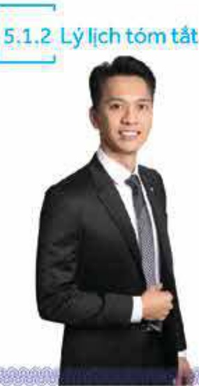
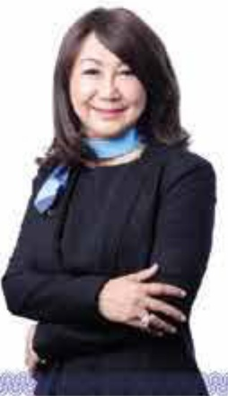
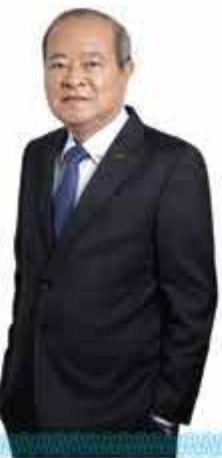
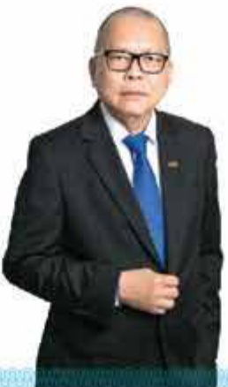
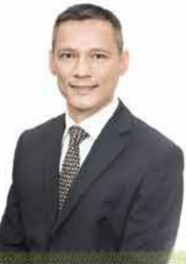
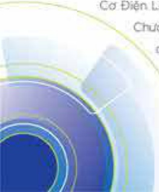
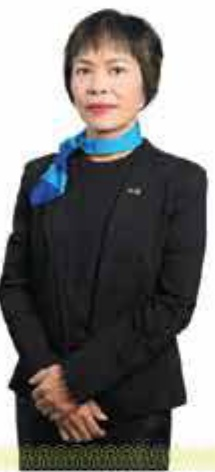

📱🔥🔥64

##### ÔNG TRẦN HÙNG HUY

Chủ tịch Hội đồng quản trị

Ông Trần Hùng Huy là thành viên Hội đồng quản trị ACB từ năm 2006 và giữ chức danh Chủ tịch từ năm 2012 đến nay. Hiện tại ông là Chủ nhiệm Ủy ban Nhân sự, Chủ nhiệm Ủy ban Chiến lược, thành viên Ủy ban Quản lý nội rõ và thành viên Ủy ban Đấu tư.

Ông gia nhập ACB từ năm 2002, được bổ nhiệm Phó Tổng giám đốc vào năm 2008. Ông tùng là Trợ lý giám đốc Nhóm tư vấn sáp nhập tổ chức tài chính của Tập đoàn Tài chính Rothschild (Anh Quốc) từ năm 2010 - 2011.

Ông tốt nghiệp cử nhân chuyên ngành quản trị kinh doanh, tài chính và kinh doanh quốc tế vào năm 2000, và thực sự quản trị kinh doanh vào năm 2002 tại Trường Đại học Chapman, Hoa Kỳ. Ông nhận học vị tiến sĩ quản trị kinh doanh của Trường Đại học Golden Gate, Hoa Kỳ năm 2010.

##### BÀ ĐẠNG THU THỦY Thành viên Hội đồng quản trị

Bà Đăng Thu Thủy là thành viên Hội đồng quản trị ACB từ năm 2011 đến nay, và hiện là Phó Chủ nhiệm Ủy ban Nhân sự.

Bà công tác tại ACB từ ngày thành lập, từng giữ các vị trí Chánh văn phòng và Giám đốc Khối Quản trị nguồn nhân lực.

Bà tốt nghiệp củ nhân kinh tế của Trường Đại học Kinh tế TP: Hồ Chí Minh và cử nhân ngoại ngữ của Trường Đại học Khoa học xã hội và Nhân văn TP: Hồ Chí Minh.

##### ÔNG NGUYỄN THÀNH LONG Phó Chủ tịch Hội đồng quản trị

##### ÔNG ĐÀM VĂN TUẤN Thành viên Hội đồng quản trị

Ông Nguyễn Thành Long là thành viên Hội đồng quản trị ACB từthàng 12 năm 2012. Ông giữ chức danh Phó Chủ tịch từ năm 2013 đến nay. Hiện tại ông là Chủ nhiệm Ủy ban Quản lý rủi ro, thành viên Ủy ban Nhân sự và thành viên Ủy ban Đầu tư.

Ông tốt nghiệp cử nhân thương mại học tại Viện Đại học Văn Hạnh (Sài Gòn) và tham gia lớp cao học ngành tiến tệ ngân hàng tại Viện này.

Ông tùng giữ nhiều vị trí lãnh đạo trong quả trình công tác tại Công ty Vàng bạc đã quý Sài Gòn (SJC), Ngân hàng TMCP. Xuất nhập khẩu Việt Nam (Eximbank). Công ty cổ phần chủng khoản Rống Việt. Ông hiện là Chủ tịch Hội đồng quản trị Tổng Công ty cổ phần bảo hiểm Bảo Long.

Ông Đàm Văn Tuấn là thành viên Hội đồng quản trị ACB từtháng 12 năm 2012 đến nay, và hiện là thành viên Ủy ban Nhân sự, Ủy ban Quản lý rủi ro và Ủy ban Chiến lược.

* Ông gia nhập ACB năm 1994, tùng kinh qua các vị trí phô giám độc chi nhánh, giám độc chỉnh hạnh. Trường phòng Quan hệ quốc tế, Trường Ban Chiến lược, Chủ tịch kiểm Tổng giám độc Công ty TNHH Quản lý ngữ và khai thác tài sản Ngân hàng Á Châu, Giám độc Khôi Quản trị nguồn nhân lực. Ông được bổ nhiệm làm Phó Tổng giám độc năm 2001. Trước khi tham gia ACB, ông là giảng viên ngọai ngữ.

Ông tốt nghiệp thực sĩ ngữ văn của Trường Đại học Khoa học xã hội và Nhân văn TP. Hồ Chí Minh, cụ nhân kinh tế của Trường Đại học Kinh tế TP. Hồ Chí Minh, và thực sĩ tài chính ngân hàng của Trường Đại học Khoa học ủng dụng Tây Bắc Thụy Sĩ.

# ÔNG DOMINIC TIMOTHY CHARLES SCRIVEN

Thành viên Hội đồng quản trị

Ông Dominic Timothy Charles Scriven là thành viên Hội đồng quản trị ACB từ năm 2008 đến năm 2011 và từ năm 2015 đến nay. Hiện tại ông là thành viên Ủy ban Quản lý rủi ro và Ủy ban Đầu tư.

Ông giữ vị trí lãnh đạo tại nhiều tổ chức tài chính tại Việt Nam và nước ngoài. Cố động sáng lập và Chủ tịch. Hội đồng quản trị Công ty Dragon Capital Group Ltd., Chủ tịch Hội đồng quản trị Viet Fund Management, thành viên Hội đồng quản trị Công ty cổ phấn Đấu tư hạ tầng kỹ thuật TP. Hồ Chí Minh, v.v. Ông được Nữ hoàng Anh trao tặng huấn chuộng OBE năm 2006 và hai lần được Ủy ban Nhân dân TP. Hồ Chí Minh trao tăng bằng khen vẻ việc đóng góp vào sự phát triển của thị trường chúng khoản vào năm 2008 và năm 2010. Năm 2014, ông được Chủ tịch nước Việt Nam trao tăng Huấn chuộng Lao động hàng ba.

Ông tốt nghiệp cửnhân luật và xã hội học. Trường Đại học Exeter, Anh Quốc.

##### ÔNG HIEP VAN VO

Thành viên độc lập Hội đồng quản trị

☐ ☐ ☐

* Ông Hiep Van Vo (Võ Văn Hiệp) là thành viên độc lập Hội đồng quản trí ACB từ năm 2018 đến nay, và hiện là Chủ nhiệm Lý ban Đầu tư, thành viên Lý ban Quản lý rủi ro và Lý ban Chiến lược.

Từ năm 2005 đến nay, ông là Giám đốc điều hành CVC Asia Pacific, Singapore. Ông từng là Giám đốc VIGroup, Deutsche Bank, Vietnam Partners LLC, Citigroup.

- Ông tốt nghiệp thác sĩ quản trị kinh doanh của Trường Đại học Kinh doanh Harvard, Hoa Kỳ.

##### BÀ ĐINH THỊ HOA

##### Thành viên Hội đồng quản trị

Bà Đinh Thị Hòa là thành viên Hội đồng quản trị ACB từ năm 2013 đến nay, và hiện là thành viên Ủy ban Chiến lược.

Bà từng là thành viên Ban kiếm soát ACB từ năm 1998 đến năm 2007. Bà còn là Chủ tịch Hội đồng quản trị Công ty cổ phấn phim Thiên Ngân từ năm 1994 đến nay. Phó Chủ tịch Hội đồng quản trị Công ty cổ phấn Chúng khoản Thiên Việt từ năm 2007. Chủ tịch Hội đồng quản trị Công ty cổ phấn Truyền thông và Giải trí Galaxy từ năm 2013. Chủ tịch Hội đồng quản trị Công ty cổ phấn Galaxy Play từ năm 2014, thành viên Hội đồng quản trị Công ty cổ phấn Cơ Điện Lanh (REE) từ năm 2015 đến năm 2019. Từ năm 1988 đến năm 1994, bà làm Chuyên viên dự án Chương trình Lượng thực thế giới, thực tập tại Công ty Procter và Gamble (P&G) - Thái Lan với vị trí Giám đốc chi nhánh. Bà từng là Chuyên viên và Điều phối viên Bộ Ngoại giao năm 1985 đến năm 1988.

Bà tốt nghiệp cử nhân khoa học chính trị và báo chí Trường Đại học Moscow State, Nga, và thực sự quản trị kinh doanh Trường Đại học Kinh doanh Harvard, Hoa Kỳ.

##### ÔNG HUANG YUAN CHIANG Thành viên độc lập Hội đồng quản trị

Ông Huang Yuan Chiang (Hoàng Viễn Tưởng) là thành viên độc lập Hội đồng quản trị ACB từ năm 2018 đến nay, và hiện là thành viên Ủy ban Nhân sự và Ủy ban Quản lý rủi ro

Ông tùng công tác tại Standard Chartered Merchant Bank Asia Limited, HSBC Investment Bank Asia Ltd., Samuel Montagu & Co. Ltd., Bankers Trust Company, Deutsche Bank AG.

Ông tốt nghiệp cử nhận kinh tế và luật của Trường Đại học Monash, Ức.

