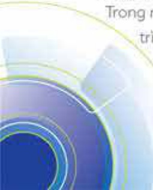

# 66

#### 5.1.3 Thay đổi thành viên Hội đồng quản trị

Trong năm 2020, không có thay đổi thành viên Hội đồng quản trị nhiệm kỳ 2018 - 2023.

### 5.1.4 Các ủy ban thuộc Hội đồng quản trị

Hiện nay, ACB có bốn ủy ban thuộc Hội đồng quản trí là ủy ban Quản lý rủi ro, ủy ban Nhân sự, ủy ban Chiến lược, và ủy ban Đầu tư.

### 5.1.5 Hoạt động của Hội đồng quản trị

Trong năm 2020, Hội đồng quản trị đã tổ chức hợp bảy lần (trong đó có hai lần hợp bất thường) và thực hiện lấy kiến bằng văn bản hai lần đối với các vấn đề phát sinh; và ban hành tổng cộng 45 quyết định liên quan đến chủ trương, chính sách đối với các hoạt động trọng yếu, tổ chức bộ máy và nhân sự cấp quản lý. Các quyết định của Hội đồng quản trị được bảo cáo định kỳ sâu thàng và cả năm cho cơ quan quản lý Nhà nước.

### 5.1.6 Hoạt động của Ủy ban Quản lý rủi ro

Ủy ban Quản lý rủi ro hiện nay có chin thành viên, trong đó có sáu thành viên Hội đồng quản trị. Chủ nhiệm là ông Nguyễn Thành Long, Phó Chủ tích Hội đồng quản trị. Trong năm 2020, Ủy ban Quản lý rủi ro đã tổ chức năm phiên hợp, tập trung thảo luận về công tác quản lý các rủi ro trọng yếu như tín dụng, thanh khoản, lãi suất và hoạt động. Cụ thể, Ủy ban Quản lý rủi ro tập trung theo dõi, cặp nhất ảnh hưởng tiêu cực của dịch COVID-19 đến hoạt động tín dụng của ACB, đồng thời giảm sát Ban điều hành trong việc đảm bảo tuần thủ quy định của pháp luật, Ngân hàng Nhà nước Việt Nam và ACB.

#### 5.1.7 Hoạt động của Ủy ban Nhân sự

Ủy ban Nhân sự hiện nay có bảy thành viên, trong đó có năm thành viên Hội đồng quản trị. Chủ nhiệm là ông Trấn Hùng Huy, Chủ tịch Hội đồng quản trị.

Trong năm 2020, Ủy ban Nhân sự đã phê duyệt hoặc trình Hội đồng quản trị phê duyệt một số vấn đề quan trọng thuộc các phạm vi sau: (i) Để xuất và điều chỉnh nhân sự các hội đồng, (ii) Bổ nhiệm và tài bổ nhiệm nhân sự cấp quản lý, (iii) Chính sách nhân sự; nguyên tắc phân bổ ngân sách nhân sự và điều chỉnh thu nhập năm 2021, nguyên tắc xây dựng định biên nhân sự năm 2021, (iv) Tổ chức bộ máy hoạt động, trong đó có vấn đề phòng giao dịch quy mô lớn giai đoạn giai đoạn 2020–2022.

#### 5.1.8 Hoạt động của Ủy ban Chiến lược

Ủy ban Chiến lược hiện tại gồm có sâu thành viên, trong đó có bốn thành viên Hội đồng quản trị. Chủ nhiệm là ông Trần Hùng Huy, Chủ tịch Hội đồng quản trị.

Trong năm 2020, Ủy ban Chiến lược tiếp tục chỉ đạo triển khai chiến lược 2019 - 2024 thông qua một số dự án chiến lược. Các dự án chiến lược này do Văn phòng Quân lý chuyển đổi chủ trì và được triển khai tương đối theo đùng tiến độ.

#### 5.1.9 Hoạt động của Ủy ban Đầu tư

Ủy ban Đấu tư hiện tại có năm thành viên, gồm có bốn thành viên Hội đồng quản trị và Tổng giảm đốc. Chủ nhiệm là ông Hiep Van Vo, thành viên Hội đồng quản trị độc lập.

Trong năm 2020, Ủy ban Đấu tư đã đưa ra định hướng và khung quản lý đấu tư cho công ty con, giám sát hiệu quả hoạt động đấu tư của Tập đoàn và tham gia giải quyết các vấn đề còn tồn động.

### 5.1.10 Hoạt động của thành viên độc lập Hội đồng quản trị

Hội đồng quản trị ACB có hai thành viên độc lập. Các thành viên độc lập tham gia vào nhiều ủy ban, gồm có ủy ban Quản lý rủi ro, ủy ban Nhân sự, ủy ban Chiến lược và ủy ban Đấu tư. Trong năm, các thành viên này tham dự đấy đủ và tích cực các phiên hợp của Hội đồng quản trị và các ủy ban có liên quan, và biểu quyết đấy đủ các vấn đề được lấy ý kiến.

5.1.11 Danh sách các thành viên Hội đồng quản trị có chủng chỉ đào tạo về quản trị công ty hoặc tham gia các chương trình về quản trị công ty trong năm

Các thành viên Hội đồng quản trị ACB có nhiều năm kinh nghiệm quản trị điều hành tổ chức tín dụng và hoặc các tổ chức kinh tế khác; và đã từng tham dự một số hội thảo về quản trị công ty.

* Ông Trấn Hùng Huy, Chủ tịch Hội đồng quản trị, tham dự Chương trình chủng nhận thành viên hội đồng quản trị (company directors course) của Australian Institute of Company Directors (AICD) năm 2019.

* Ông Nguyễn Thành Long, Phố Chủ tịch Hội đồng quản trị, tham dự Chương trình chủng nhận thành viên hội đồng quản trị của Viện Thành viên hội đồng quản trị Việt Nam (VIOD) năm 2020.

### 5.1.12 Người phụ trách quản trị công ty

- Ông Đàm Văn Tuấn tham dự Chương trình chủng nhận thành viên hội đồng quản trị của The Thai Institute of Directors Association (Thai IOD) năm 2015, và Chương trình International Directors Banking Programme của INSEAD năm 2019.

Hội đồng quản trị đã bổ nhiệm ông Đàm Văn Tuấn, thành viên Hội đồng quản trị, làm nhiệm vụ của Người phụ trách quản trị công ty (ngày 21 tháng 5 năm 2019).

## 5.2. Ban Kiểm soát

5.2.1 Thành viên và cơ cấu của Ban kiểm soát

Ban kiểm soát nhiệm kỳ 2018 - 2023 được Đại hội đồng cổ đồng bầu ra vào ngày 19 tháng 4 năm 2018. Các thành viên Ban kiểm soát cũng bầu chúc danh Trường ban cùng ngày.

<table border=1 style='margin: auto; word-wrap: break-word;'><tr><td style='text-align: center; word-wrap: break-word;'>Stt</td><td style='text-align: center; word-wrap: break-word;'>Thành viên</td><td style='text-align: center; word-wrap: break-word;'>Chức vụ</td><td style='text-align: center; word-wrap: break-word;'>Linh vực phản công</td><td style='text-align: center; word-wrap: break-word;'>Tỷ lệ số hầu cổ phản (%)</td></tr><tr><td style='text-align: center; word-wrap: break-word;'>1</td><td style='text-align: center; word-wrap: break-word;'>Huỳnh Nghĩa Hiệp</td><td style='text-align: center; word-wrap: break-word;'>Trưởng Ban</td><td style='text-align: center; word-wrap: break-word;'>Phụ trách chung vẻ việc tổ chức và triển khai thực hiện nhiệm vụ và quyền hạn của Ban kiểm soát. Trực tiếp chỉ đạo Ban Kiểm toàn nội bộ.</td><td style='text-align: center; word-wrap: break-word;'>0,02</td></tr><tr><td style='text-align: center; word-wrap: break-word;'>2</td><td style='text-align: center; word-wrap: break-word;'>Nguyễn Thị Minh Lan</td><td style='text-align: center; word-wrap: break-word;'>Thành viên chuyên trách</td><td style='text-align: center; word-wrap: break-word;'>Giám sát việc ban hành các văn bản nội bộ phù hợp với quy định của pháp luật. Giám sát hoạt động kinh doanh chủ yếu, các giới hạn, các tỷ lệ an toàn vốn. Cấp nhất danh sách cổ đồng lớn, thành viên Hội đồng quản trị, Ban kiểm soát. Ban điều hành và những người có liên quan. Giám sát việc thực hiện kiến nghị của thanh tra giám sát ngân hàng.</td><td style='text-align: center; word-wrap: break-word;'>Không sử hầu</td></tr><tr><td style='text-align: center; word-wrap: break-word;'>3</td><td style='text-align: center; word-wrap: break-word;'>Hoàng Ngân</td><td style='text-align: center; word-wrap: break-word;'>Thành viên chuyên trách</td><td style='text-align: center; word-wrap: break-word;'>Kiểm soát công tác hạch toán kế toán. Kiểm soát hoạt động tài chính và thẩm định bảo cáo tải chính của Ngân hàng.</td><td style='text-align: center; word-wrap: break-word;'>0,00 (*)</td></tr><tr><td style='text-align: center; word-wrap: break-word;'>4</td><td style='text-align: center; word-wrap: break-word;'>Phùng Thị Tốt</td><td style='text-align: center; word-wrap: break-word;'>Thành viên không chuyên trách</td><td style='text-align: center; word-wrap: break-word;'>Kiểm soát sổ sách kế toán và tài sản cổ định. Kiểm soát chi tiêu nội bộ của Ngân hàng.</td><td style='text-align: center; word-wrap: break-word;'>0,01</td></tr></table>

(6) Số liệu: Tính đến ngày 31 tháng 12 năm 2020.

(*) "0,00%": Số lượng cổ phiếu đã được làm tròn xuống (hai số thập phần.)