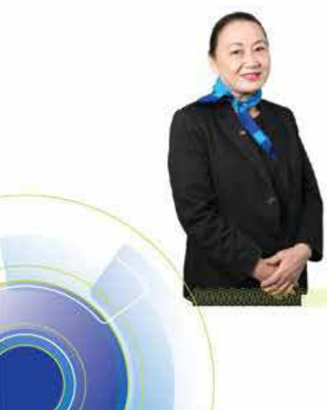

##### QUẬN TRỊ CÔNG TY

# 68

### 5.2.2 Lý lịch tóm tắt

##### ÔNG HUỒNH NGHĨA HIỆP Trường Ban kiểm soát

##### ☐ ☐ ☐

Ông Huỳnh Nghĩa Hiệp là Trường Ban kiểm soát ACB kế từ năm 2008.

- Ông công tác tại ACB từ ngày thành lập (1993), và đảm nhiệm chức vụ Kế toàn trường từ năm 1993 đến năm 1994, chức vụ Phó Tổng giảm độc từ năm 1994 đến năm 2008. Trước khi vào Ngăn hàng, ông giảng dạy tại Trường Đại học Kinh tế TP. Hồ Chí Minh từ năm 1978 đến năm 1993.

Từ năm 1971 - 1975, ông theo học chương trình cử nhân ngành thương mại tại Viện Đại học Văn Hạnh (Sài Gòn), và từ năm 1975 - 1978, ông học và tốt nghiệp tại Trường Đại học Kinh tế TP, Hồ Chí Minh chuyên ngành ngân hàng.

##### BÀ NGUYỄN THỊ MINH LAN Thành viên

Bà Nguyễn Thị Minh Lan là thành viên Ban kiếm soát ACB từ năm 2013 đến nay.

Bà từng làm việc tại Ngân hàng Nhà nước Chính hành TP. Hồ Chí Minh từ năm 1986 - 2009, kinh qua một số vị trí như Phó Phòng Kế toán, Trường Phòng Tiến tệ kho quý và Trường Phòng Quản lý ngoại hồi. Từ năm 2009 - 2013, bà là Trợ lý Tổng giảm độc và Phó Tổng giảm độc của một ngân hàng thường mại Việt Nam.

Bà tốt nghiệp cứ nhân ngành ngăn hàng của Trường Đại học Kinh tế TP. Hồ Chí Minh và cử nhân hành chính học của Học viện Hành chính quốc gia.

##### BÀ HOÀNG NGÂN Thành viên

##### ☐ ☐ ☐

Bà Hoàng Ngân là thành viên Ban kiểm soát ACB từ năm 1998 đến nay.

Bà tùng giảng dạy tại Trường Trung học Ngân hàng III Trung ương từ năm 1978 - 1988, giữ chức vụ Kế toàn trường và Trường Ban kiểm soát Công ty Vàng bạc đá quý Sài Gòn (SJC) từ năm 1988 - 2009.

Bà theo học chương trình cử nhân luật chuyên ngành tư pháp tại Đại học Luật khoa Sài Gòn và tốt nghiệp tại trường Đại học Kinh tế TP. Hồ Chí Minh chuyên ngành ngân hàng năm 1978.

##### BÀ PHỨNG THỊ TỐT

##### Thành viên

Bà Phùng Thị Tốt là thành viên Ban Kiểm soát ACB từ năm 2003 đến nay.

Bà vào công tác tại ACB từ ngày thành lập, đảm nhiệm chức vụ Kế toàn trường từ năm 1994 đến năm 2002 và Kiểm toàn trường từ năm 2002 đến năm 2004. Trước đó, bà giảng đày tại Trường Trung học Ngân hàng III Trung ương từ năm 1978 - 1993.

Bà tốt nghiệp trưởng Đại học Kinh tế TP. Hồ Chí Minh chuyên ngành hàng năm 1978.

#### 5.2.3 Hoạt động của Ban kiếm soát

Ban kiểm soát thực hiện chức năng nhiệm vụ thông qua các quyết nghị theo phiên hợp.

Trong năm 2020, Ban kiểm soát hợp năm phiến có quyết nghị, tham dự các phiến hợp của Hội đồng quản trị và Ủy ban Quản lý rủi rọ, và tham gia các hội nghị triển khai hoạt động kinh doanh của Ngân hàng.

Ban kiểm soát đã thực hiện chức năng nhiệm vụ như sau:

- Giám sát việc thực hiện các quy định của NHNNVN liên quan đến việc chấp hành tỷ lệ an toàn vốn, thực hiện phương án cơ cấu lại Ngân hàng gần với xử lý nợ xấu, thực hiện các kiến nghị của Cơ quan Thanh tra giám sát ngân hàng, thực hiện các chỉ thi của NHNNVN.

- Giảm sát việc thực hiện nghị quyết Đại hội cổ đồng thông qua việc thực hiện các chỉ tiêu chủ yếu như huy động vốn, sử dụng vốn, chất lượng tín dụng, chỉ phí điều hành, kết quả kinh doanh, phần phối lợi nhuận.

- Giám sát thực hiện chỉ phí điều hành thông qua kiểm tra việc chấp hành và tuần thủ quy chế chỉ tiêu nội bộ của Ngân hàng, kiểm tra việc thực hiện chỉ phí với kế hoạch chỉ phí được phê duyệt.

Thực hiện thẩm tra báo cáo tài chính của Ngân hàng và báo cáo tài chính hợp nhất với các công ty con sâu thắng đấu năm và cả năm 2020 trình Đại hội đồng cổ đồng.

#### 5.2.4 Hoạt động của Ban Kiểm toán nội bộ

Trong năm 2020 Ban Kiểm toàn nội bộ đã:

Kiem toán 100 chi nhánh và phòng giao dịch.

Kếm toàn 16 chuyên để bao gồm: (1) Quy trình quản lý sự thay đổi và triển khai hệ thống công nghệ thông tin; (2) Nhóm sản phẩm về tài trợ xuất khẩu; (3) Việc quản lý và triển khai các sản phẩm cho phân đoạn khách hàng u. tiến; (4) Hoạt động kinh doanh ngoại hối và vàng; (5) Hoạt động chuyển tiến nhanh; (6) Sản phẩm cho vay hỗ trợ vốn kinh doanh dành cho khách hàng cá nhân; (7) Hoạt động liên quan ngân hàng số; (8) Quy trình quản lý và lưu trữ hổ sơ tài liệu tại ACB; (9) Hoạt động phê duyệt tin dụng tập trung; (10) Xây dựng kế hoạch duy trì hoạt động liên tục; (11) Hoạt động quản lý ATM; (12) Quy trình đánh giá nội bộ về mức đủ vốn của ACB; (13) Quy trình quản lý định mức tốn quỹ cho chi nhánh và phòng giao dịch; (14) Quản lý tỷ lệ an toàn vốn theo Thông tư số 41/2016/TT-NHNN ngày 30 tháng 12 năm 2016; (15) Hoạt động quản trị dữ liệu và hệ thống thông tin quản lý; (16) Kiểm toán Công ty TNHH Chứng khoán ACB.

##### BẢO CẢO THƯỜNG NIỆN 2020

Thực hiện kiểm toán theo yêu cầu của Hội đồng quản trị, Ban kiểm soát, Ban điều hành, Cơ quan Thanh tra giám sát ngàn hàng.

Kiem quỹ đột xuất, kiểm tra an toàn kho quỹ tại một số đơn vị kinh doanh trong toàn hệ thống, kho quỹ Hội số tại TP. Hồ Chí Minh và Hà Nội.

Kết quả kiểm toán có các kiến nghị để xuất nhằm khác phục các sai sót, vi phạm; điều chỉnh, bổ sung quy định, quy trình nghiệp vụ; tăng cường hệ thống kiểm tra kiểm soát nội bộ; kiến nghị xử lý trách nhiệm cá nhân có sai phạm tại các đơn vị được kiểm toán.

Ban Kiểm toán nội bộ còn làm đầu mối hỗ trợ các đơn vị trong hệ thống có liên quan đến công tác thành tra giảm sát của NHNNVN, và đón đọc các đơn vị thực hiện khác phục kiến nghị sau thanh tra.

## 5.3 Các giao dịch, thù lao và các khoản lợi ích của Hội đồng quản trị, Ban kiểm soát và Ban điều hành

5.3.1 Thù lao và các khoản lợi ích

Xin xem Báo cáo tài chính hợp nhất năm 2020, phần Thuyết minh, mục 40 "Giao dịch với các bên liên quan,"

5.3.2 Giao dịch cổ phiếu ACB của người nội bộ

Trong năm 2020, thành viên Hội đồng quản trị, thành viên Ban kiếm soát không có giao dịch cổ phiếu ACB. Số lượt và khối lượng giao dịch cổ phiếu ACB của thành viên Ban điệu hành (02 người) và thư ký công ty (01 người) là:

<table border=1 style='margin: auto; word-wrap: break-word;'><tr><td style='text-align: center; word-wrap: break-word;'></td><td style='text-align: center; word-wrap: break-word;'>Số lượt</td><td style='text-align: center; word-wrap: break-word;'>Khối lượng cổ phiếu</td></tr><tr><td style='text-align: center; word-wrap: break-word;'>Mua</td><td style='text-align: center; word-wrap: break-word;'>15</td><td style='text-align: center; word-wrap: break-word;'>652.000</td></tr><tr><td style='text-align: center; word-wrap: break-word;'>Bản</td><td style='text-align: center; word-wrap: break-word;'>1</td><td style='text-align: center; word-wrap: break-word;'>2.000</td></tr><tr><td style='text-align: center; word-wrap: break-word;'>Cộng</td><td style='text-align: center; word-wrap: break-word;'>16</td><td style='text-align: center; word-wrap: break-word;'>654.000</td></tr></table>

5.3.3 Hợp đồng hoặc giao dịch với cổ đồng nội bộ

Không phát sinh.

5.3.4 Việc thực hiện các quy định về quản trị công ty

ACB bảo cáo quản tri công ty định kỳ sâu tháng (theo quy định tại Thông tư số 155/2015/TT-BTC ngày 6 tháng 10 năm 2015.)

