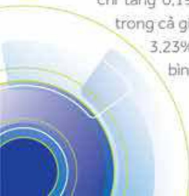
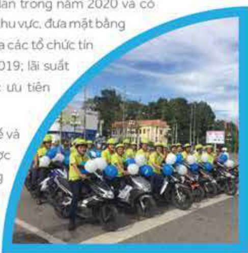
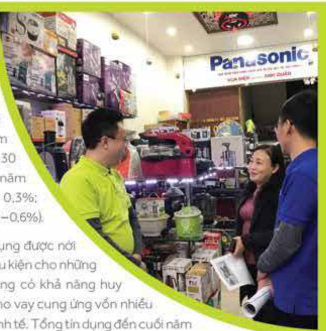
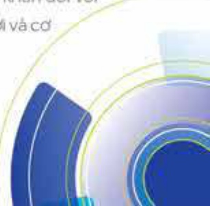

📱🔥🔥72

### 6.1.2 Kinh tế Việt Nam

Là một nền kinh tế mở vào mức độ hàng đấu thế giới, kinh tế Việt Nam chịu tác động tiêu cực là chính dưới sự khủng hoảng và suy thoái của kinh tế toàn cầu. Không những thế, dịch COVID-19 cũng lấy lan ở Việt Nam, bước Chính phủ và chính quyền các cấp phải áp đặt những biện pháp phòng chống quyết liệt, thực hiện giản cách xã hội ở những giai đoạn và trên những địa bản khác nhau. Sản xuất kinh doanh nhiều ngành, lĩnh vực. doanh nghiệp bị giảm sút, đinh đốn, nhất là lĩnh vực du lịch, thương mại dịch vụ. Bên cạnh đó, những tổn thất khác về thiên tai như xâm nhập mặn ở đồng bằng sông Cửu Long; hạn hán, lũ lụt nặng nề suốt các tỉnh miền Trung, v.v. gây ra nhiều tổn thất về người và của, hạn chế sản xuất kinh doanh. Đầy nhiều người vào một cuộc sống khó khăn.

Chính phủ đã kịp thời có những chính sách cứu trợ như trợ cấp cứu đói, giản hoàn thuế; giảm hoặc miễn một số loại phí và lệ phí; tăng chi tiêu đấu tư công; tăng chi các khoản vật tư phương tiện y tế và chi phí xét nghiệm, phong tỏa, cách ly người cũng như khu vực bị dịch COVID-19. (Ngân sách nhà nước chi 18.000 tỷ đồng cho mục tiêu phòng chống dịch, cứu trợ người dân). Ngân hàng Nhà nước Việt Nam đã liên tiếp hạ các loại lãi suất điều hành; giảm trấn lãi suất huy động tiến gửi dưới sâu thắng; chỉ đạo các ngân hàng thương mại khoanh, giản, giảm lãi suất các khoản nợ của những khách hàng bị ảnh hưởng bởi dịch bệnh và tiếp tục cho vay mối nhất là cho những lĩnh vực ưu tiên với lãi suất ưu đãi. v.v.

Cùng với sự nỗ lực vượt khó của doanh nghiệp và người dân; sự đồng lòng và quyết tâm của cả hệ thống chính trị với những biện pháp quyết liệt kịp thời nhưng thần trọng Việt Nam đã thực hiện được mục tiêu kế: hạn chế và đẩy lùi mức độ lây lan của dịch COVID-19, đồng thời nổ lực duy trì và phục hồi hoạt động sản xuất kinh doanh trong nước; khai thác các cơ hội mở ra trên thị trường ở nước ngoài; hạn chế những tác động xấu về kinh tế xã hội và đối sổng nhân dân; trở thành một điểm sáng được thế giới đánh giá cao cả về chống dịch lẫn tăng trường kinh tế năm 2020.

Tăng trưởng GDP đạt 2.91%, là một trong số ít nước có mức tăng trưởng dưỡng và thuộc hàng cao nhất thế giới. Kinh tế vì mô tiếp tục ổn định. Làm phát ở mức thấp và dưới mức tiêu đế ra. Chỉ số CPI đến cuối tháng 12/2020 chỉ tăng 0.19% so với cùng kỳ năm 2019 (thấp nhất trong cả giai đoạn 2011 - 2020). CPI bình quân tăng 3.23% (mục tiêu khoảng 4%): làm phát cơ bản bình quân tăng 2.31%.

## 6.2 Chính sách tiến tệ và hoạt động ngân hàng Việt Nam

Chính sách tiến tệ được hoạch định và thực thi theo hướng ổn định vị mô, kiểm soát làm phát, đảm bảo thanh khoản, giảm dần mặt bằng lãi suất, đáp ứng đầy đủ và kịp thời nhu cầu tin dụng nhằm vừa hạn chế khó khăn, tồn thất do dịch bệnh cho người vay vốn, vừa góp phần duy tri và phục hối sản xuất kinh doanh, thực đầy tăng trưởng.

Lải suất điều hành giảm ba lần trong năm 2020 và có mức giảm mạnh nhất trong khu vực, đưa mặt bằng lãi suất cho vay bình quân của các tổ chức tín dụng giảm 1% so với cuối 2019; lãi suất cho vay tối đa các lĩnh vực ưu tiên giảm 1.5% còn 4.5%.

Thanh khoản của nền kinh tế và của hệ thống ngân hàng được đảm bảo đối dào. Tổng phương diện thanh toán (M2) tăng 13,26% so với cuối năm 2019 (cùng ký tăng

Các tổ chức tin dụng đã cơ cấu lại thời gian trả nợ cho 267.380 khách hàng với tổng dư nợ cho vay 342.309 tỷ đồng, miễn, giảm, hạ lãi suất cho 611.682 khách hàng với tổng dư nợ cho vay 1.084.082 tỷ đồng. Riêng Ngân hàng Chính sách xã hội đã gia hạn nợ cho 168.121 khách hàng với dư nợ cho vay 4.188 tỷ đồng.

12.88%):

lãi suất liên

ngăn hàng

xuống mức

thắp chưa

từng có, thậm

chỉ gắn 0%/năm

(kỳ hạn qua đêm

(o/n) ngày 30

tháng 12 năm

2020 là 0.1 - 0.3%;

một tuần 0.12 - 0.6%).

Các tổ chức tín dụng, nhất là ngân hàng thương mại, đã nhanh chóng thích nghĩ và phần ứng khôn khéo, kịp thời với diễn biến thị trường tiến tệ tín dụng trong bối cảnh vừa ứng phó với dịch bệnh, vừa phải tiếp tục tài cơ cấu từng tổ chức theo chương trình đã định nhằm sớm đạt chuẩn Basel II; đối mới công nghệ và dịch vụ ngân hàng theo kịp yêu cầu cách mạng công nghệ 4.0: tận dụng các ưu thế của hoạt động thương mại điện tử, huy động vốn và cho vay trực tuyến, thanh toản điện tử và các dịch vụ ngân hàng số khác; đa dạng hóa lĩnh vực kinh doanh; tiết giảm các chi phí hoạt động bằng nhiều biện pháp, v.v. để đạt hiệu quả kinh doanh cao và an toàn.

Tuy còn một số it ngân hàng yếu kém hiện chưa có phương án xử lý về mặt kinh tế để chấm dút thua lỗ, hoạt động của hệ thống ngân hàng thương mại Việt Nam năm 2020 vẫn tiếp tục có những thành quả nổi bật: lành mạnh hơn, an toàn hơn, hiệu quả hơn. Nhiều ngân hàng đạt và vượt kế hoạch lợi nhuận để ra từ đầu năm. So với cuối năm 2016, đến ngày 30 tháng 9 năm 2020 tổng tài sản cả hệ thống đạt 13,19 triệu tỷ đồng, tăng 55,2%; vốn điều lệ đạt 637,34 nghìn tỷ đồng, tăng 30,5%; vốn chủ sở hữu đạt 1,021,790 tỷ đồng, tăng 71,77%, Đã có 75% ngân hàng thương mại cổ phấn niêm yet trên thị trường chúng khoản của Việt Nam. Có 77 tổ chức tin dụng đã đáp ứng được yêu cầu về tỷ lệ an toàn vốn theo Basel II. Bình quản cả hệ thống ROA đạt 0,66%; ROE đạt 11,93%.

Hạn mức tin dụng được nội lồng để tạo điều kiện cho những tổ chức tin dụng có khả năng huy động vốn và cho vay cung ứng vốn nhiều hơn cho nên kinh tế. Tổng tin dụng đến cuối năm tăng 12,13% so với đấu năm. Thời hạn áp dụng tỷ lệ huy động vốn ngắn hạn để cho vay dài hạn được gia hạn thêm một năm so với lộ trình. NHNNVN đã điều hòa tốt cung cấu ngoại tệ, can thiệp thị trường kịp thời giữ tỷ giá hối đoái ổn định trong cả năm 2020 và tiếp tục mua được ngoại tệ để tăng dự trữ ngoại hối lên trên 14 tuần nhập khẩu trong bối cảnh cản cản thanh toàn tổng thể tiếp tục thắng dư (trong đó cản cản văng lai thặng dư khoảng 5.0% GDP, và cản cản vốn thăng dư 2.6% GDP).

## 6.3 Một vài dự báo về kinh tế và hoạt động ngân hàng Việt Nam năm 2021

Kinh tế toàn cầu sẽ phục hồi trong năm 2021 ở mức 5.5% song không chắc chắn, tùy thuộc vào khả năng tiêm chủng rộng rãi vắc xin và không chế những bùng phát khó lường của dịch COVID-19. Thương mại toàn cầu tăng khoảng 8.1%. Du lịch và dịch vụ văn là lĩnh vực phục hồi chậm hơn lĩnh vực sản xuất ít nhất là cho đến nửa cưới 2021. Đồng USD vẫn tiếp tục giảm giá từ 5 - 10%. Lãi suất vẫn ở mức thấp và có thể giảm nhẹ. Giá dấu mở tăng 21.2%. Già cả hàng hóa ngoài dấu tăng 5.1%. Làm phát chưa tăng mạnh, song bóng bóng tải sản và khối nợ không lỗ là nguy cơ cho bắt ổn tài chính toàn cầu. Những chính sách điều hành của Tổng thống Mỹ Joe Biden, khác so với người tiến nhiệm, sẽ có nhiều ảnh hưởng sâu rộng đến chính trị và kinh tế toàn cầu từ năm 2021.

Kinh tế Việt Nam được nhiều tổ chức có uy tin dự bảo sẽ tăng trưởng mạnh trong năm 2021, ở mức từ 6.0–7,8%. Chính phủ đặt mục tiêu tăng trưởng 6.5%. Tuy vậy diễn biến phức tạp của dịch COVID-19 sẽ làm cho Việt Nam gặp không ít trở ngại cả trong và ngoài nước. Đã có một vài dự bảo đưa ra kịch bản tăng trưởng thấp hơn.

Làm phát sẽ kiểm soát được ở mức mục tiêu 4%. Mặt bằng lãi suất huy động và cho vây có thể giảm chút ít trong quý I nhưng sẽ tăng dẫn vào cuối năm do nhu cầu về vốn tin dụng ngày một tăng, trong khi nguồn vốn huy động bị han chế và cạnh tranh bởi nhiều kênh đấu tư khác (chứng khoản, trái phiếu doanh nghiệp, vàng, tiến kỹ thuật số, bất động sản, v.v.). Hạn mức tăng trưởng tin dụng bước đầu là 12% của NHNNVN sẽ còn được điều chỉnh theo hướng nội lồng.

Các ngàn hàng thương mại sẽ tiếp tục phải gánh chịu những yếu cầu cứu trợ doanh nghiệp và dân cư bị tác động tiêu cực của dịch COVID-19 trong năm 2021. Nợ xấu không bị chuyển nhóm sẽ làm tăng nợ xấu phải xử lý trong năm 2021. Trích lập dự phòng nội ro sẽ tăng cao, tuy có thể được rải ra trong ba năm nhưng vẫn làm cho lợi nhuận ngân hàng bị giảm sụt. Lộ trình tái cơ cấu để có một hệ thống ngân hàng lành mạnh, hiệu quả, phát triển bến vững sẽ bị kéo dài. Thách thức và khó khăn đối với hoạt động ngân hàng sẽ nhiều hơn thuận lợi và cơ hội, so với năm 2020.

