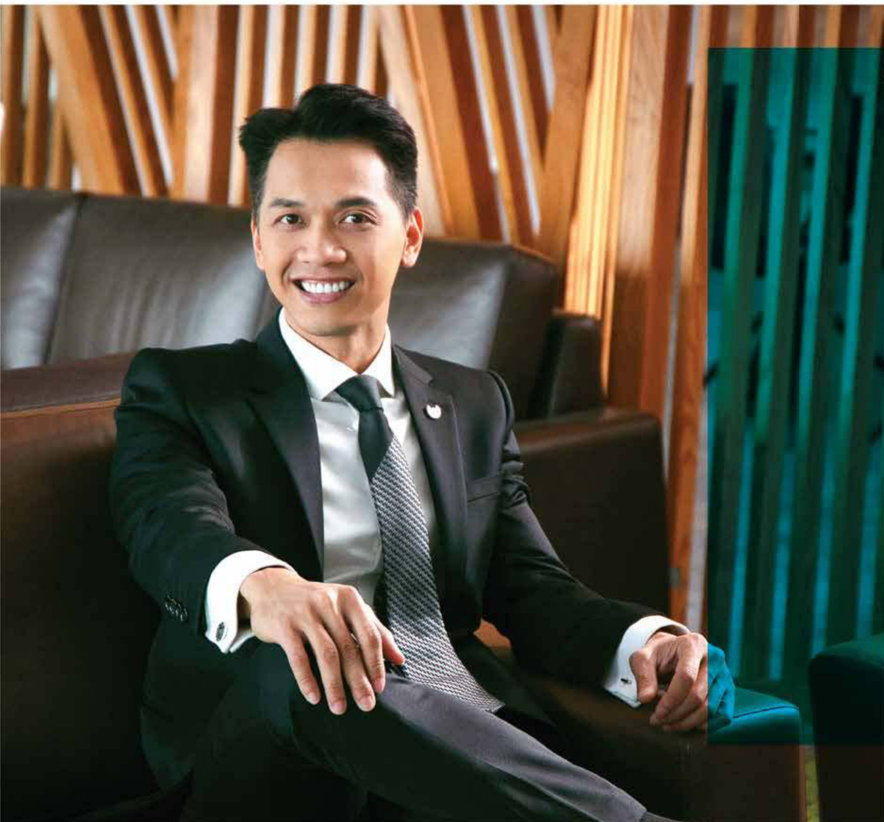

##### ○○○

Chủ thể của việc thực hiện chiến lược là con người phải được đổi mới và nâng tấm cho phù hợp với môi trường hoạt động mới mà thách thức nhiều hơn cơ hội và ngày càng có nhiều công nghệ xuất hiện tác động đến lối sống và phương thức hoạt động.

Thưa quý vi cổ đông.

Năm 2020 tiếp tục là một năm thành công của Tập đoàn ACB về mặt tăng trưởng tài sản và giá trị đem lại cho cổ đông.

Đến cuối năm 2020, tổng tài sản của ACB đạt 445 nghìn tỷ đồng, tăng 15,9% so với cuối năm 2019; vốn huy động 353 nghìn tỷ đồng, tăng 14,6%; dư nợ tin dụng 311 nghìn tỷ đồng, tăng 15,9%; nợ xấu trên tổng dư nợ tin dụng ổn định ở mức 0,59%. Tỷ lệ bao phù nợ xấu (LLR) ở mức cao.

Lợi nhuận trước thuế hợp nhất năm 2020 đặt 9.596 tỷ đồng, tăng 28% so với năm 2019 và hoàn thành 126% kế hoạch. Tỷ suất lợi nhuận sau thuế trên tổng tài sản bình quân (ROA) đặt 1.86%, cao hơn mức 1.69% của năm 2019. Tỷ suất lợi nhuận sau thuế trên vốn chủ sở hữu bình quản (ROE) đặt 24.31%, tương đương mức của năm 2019.

Các giới hạn và tỷ lệ bảo đảm an toàn trong hoạt động ngân hàng luôn được ACB giảm sát chặt chẽ, tuần thủ quy định của Ngăn hàng Nhà nước Việt Nam.

ACB cũng đã kỳ thỏa thuận hợp tác với Công ty TNHH Bảo hiểm Nhân thọ Sun Life Việt Nam độc quyền phân phối sản phẩm bảo hiểm nhân thọ kéo dài 15 năm vào ngày 18 tháng 11 năm 2020. Thương vụ này góp phần gia tăng đáng kể cho giá trị của Ngân hàng

Từ đầu tháng Hai năm 2020. ACB đã chủ động triển khai phòng chống dịch COVID-19. lập kế hoạch đảm bảo kinh doanh liên tục, chuẩn bị các biện pháp ứng xử cho các tinh hướng khác nhau. Tất cả nhân viên, đơn vị luôn tuân thủ thực hiện hướng dẫn của các cơ quan quản lý trong công tác này, và việc kinh doanh của toàn hệ thống đã không bị gián đoạn.