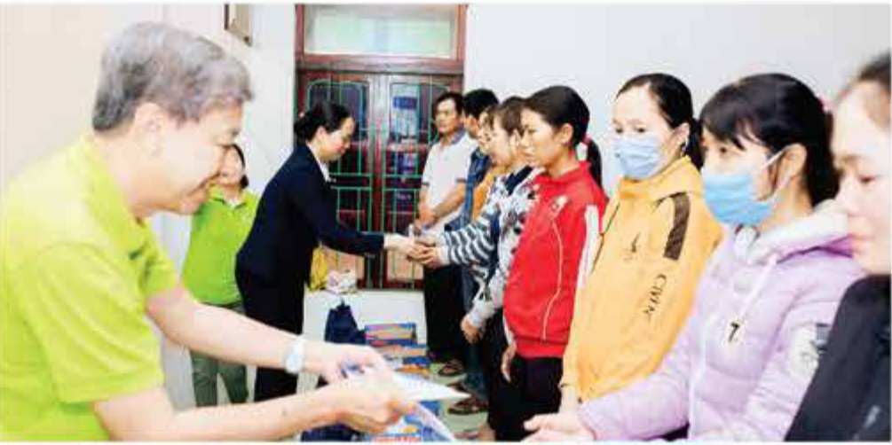
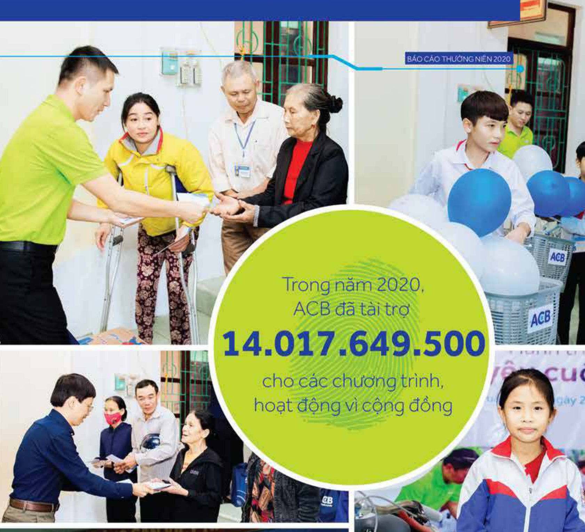
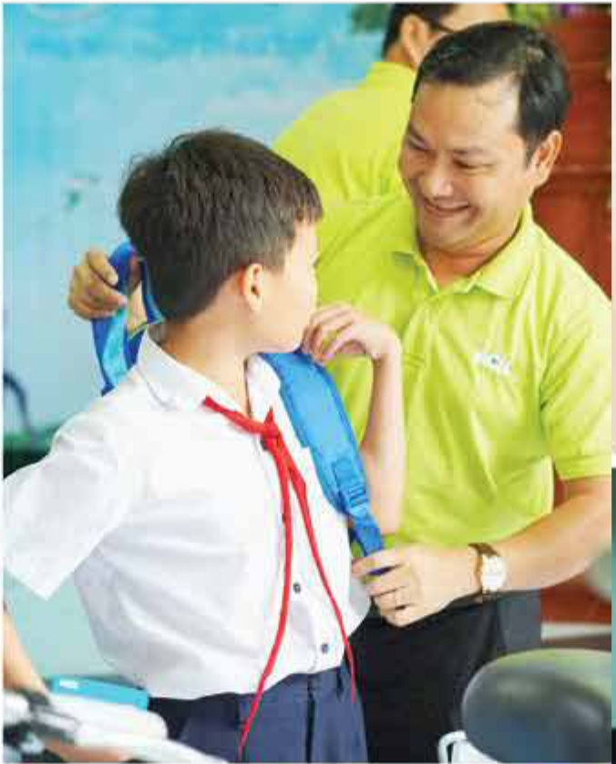
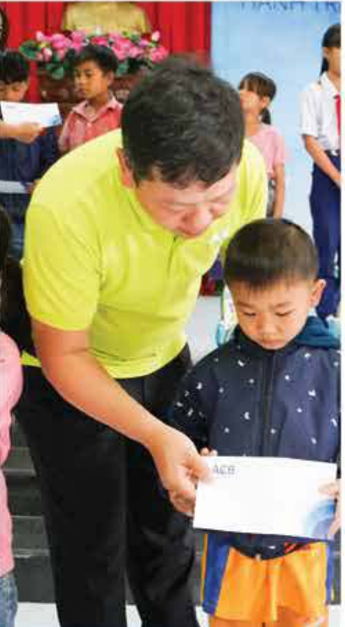
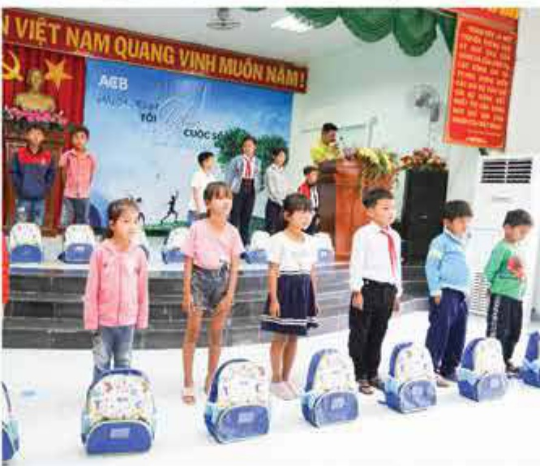
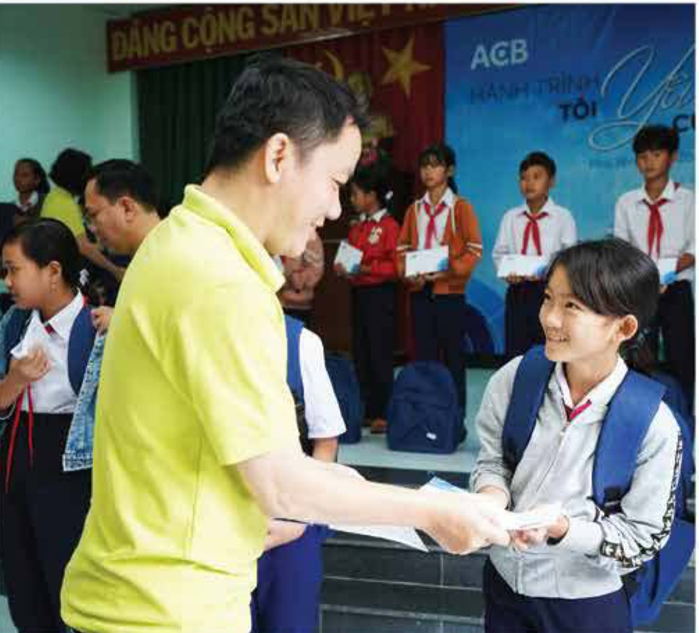
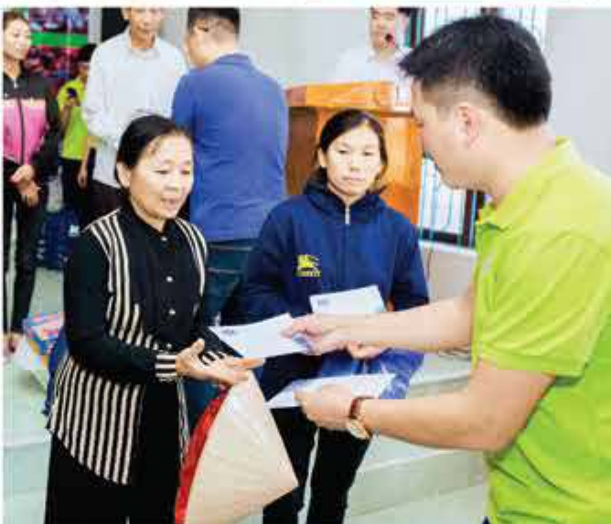

## 7.3 Công tác từ thiện xã hội và bảo vệ môi trường

<table border=1 style='margin: auto; word-wrap: break-word;'><tr><td style='text-align: center; word-wrap: break-word;'>STT</td><td style='text-align: center; word-wrap: break-word;'>Nội dung</td><td style='text-align: center; word-wrap: break-word;'>Số tiến (đóng)</td></tr><tr><td style='text-align: center; word-wrap: break-word;'>1</td><td style='text-align: center; word-wrap: break-word;'>Ứng hộ Chinh phủ Việt Nam trong công tác phòng chống dịch COVID-19</td><td style='text-align: center; word-wrap: break-word;'>10.500.000.000</td></tr><tr><td style='text-align: center; word-wrap: break-word;'>2</td><td style='text-align: center; word-wrap: break-word;'>Tài trợ cho hoạt động giáo dục, bao gồm tài trợ học bổng, đóng góp cho quỹ khuyến học và các chương trình liên quan đến học sinh sinh viên</td><td style='text-align: center; word-wrap: break-word;'>540.000.000</td></tr><tr><td style='text-align: center; word-wrap: break-word;'>3</td><td style='text-align: center; word-wrap: break-word;'>Tài trợ các chương trình an sinh xã hội; đối tượng bao gồm hộ nghèo, hộ chính sách, trẻ em khuyết tật, Quỹ vi người nghèo, v.v.</td><td style='text-align: center; word-wrap: break-word;'>1.910.149.500</td></tr><tr><td style='text-align: center; word-wrap: break-word;'>4</td><td style='text-align: center; word-wrap: break-word;'>Tài trợ xây dựng nhà tỉnh thương, cơ sở vật chất, trưởng học, v.v.</td><td style='text-align: center; word-wrap: break-word;'>1.003.500.000</td></tr><tr><td style='text-align: center; word-wrap: break-word;'>5</td><td style='text-align: center; word-wrap: break-word;'>Tài trợ khác</td><td style='text-align: center; word-wrap: break-word;'>64.000.000</td></tr><tr><td style='text-align: center; word-wrap: break-word;'></td><td style='text-align: center; word-wrap: break-word;'>Cộng</td><td style='text-align: center; word-wrap: break-word;'>14.017.649.500</td></tr></table>

