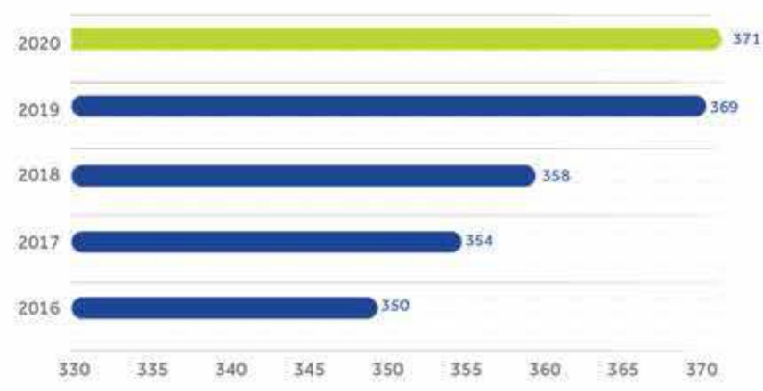
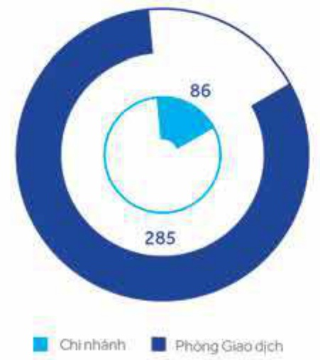
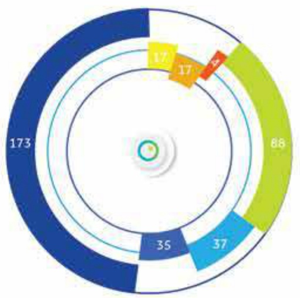

#### MẠNG LƯỚI CHI NHÁNH VÀ PHÒNG GIAO DỊCH

Tính đến ngày 31 tháng 12 năm 2020, ACB có 86 chi nhánh và 285 phòng giao dịch (tổng cộng 371 đơn vị) hiện diện trên 48 tỉnh thành trong số 63 tỉnh thành cả nước. Các chi nhánh và phòng giao dịch của ACB được phân bổ chủ yếu tại TP. Hồ Chí Minh và Hà Nội.

Số lượng chi nhánh và phòng giao dịch trong năm năm qua

Số lượng chi nhánh và phòng giao dịch năm 2020

Số lượng chi nhánh và phòng giao dịch chia theo vùng địa lý

##### Tây Bắc:

Chưa hiện diện: 7/7, gồm có Lào Cai, Yên Bái, Phú Thọ, Điện Biên, Lai Châu, Sơn La, Hòa Bình.

##### Động Bắc:

Thái Nguyên, Bắc Giang. Hiện diện: 2/7, Chưa hiện diện: Hà Giang, Cao Bằng, Bắc Kạn, Tuyên Quang, Lạng Sơn.

##### Động bảng sông Hồng:

Hà Nội, Vĩnh Phúc, Bắc Ninh, Quảng Ninh, Hải Dương, Hải Phòng, Hưng Yên, Hà Nam, Nam Định, Thái Bình, Hiện diện: 10/11. Chưa hiện diện: Ninh Bình.

##### Bắc Trung Bộ:

Thanh Hóa, Nghệ An, Hà Tĩnh, Quảng Bình. Hiện diện: 4/5. Chưa hiện diện: Quảng Trị.

##### Duyên hải Nam Trung Bộ:

Thừa Thiên - Huế, Đà Nẵng, Quảng Nam, Quảng Ngãi, Bình Định, Phú Yên, Khánh Hòa, Ninh Thuận, Bình Thuận. Hiện diện 9/9.

##### Tây Nguyên:

Kon Tum, Gia Lai, Đắk Lắk, Làm Đống. Hiện diện: 4/5. Chưa hiện diện: Đắk Nông.

##### Động Nam Bộ:

Bình Phước, Tây Ninh, Bình Dương, Đồng Nai, Bà Rịa - Vũng Tàu, T.P. Hồ Chí Minh, Hiện diện: 6/6.

##### Động bảng sổng Cửu Long:

Long An, Tiến Giang, Bến Tre, Trà Vĩnh, Vĩnh Long, Đồng Tháp, An Giang, Kiên Giang, Cần Thơ, Hậu Giang, Sốc Trăng, Bạc Liêu, Cà Mau, Hiện diện: 13/13.

