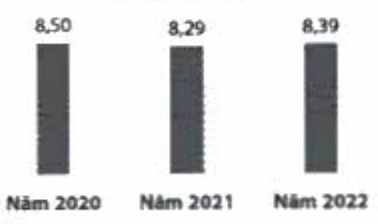
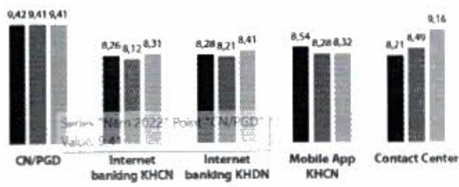
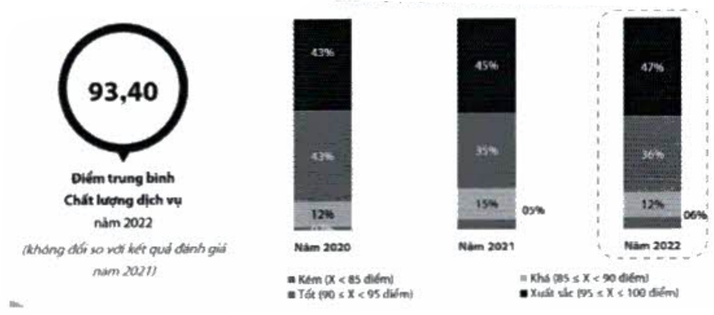

Trung bình mục độ hài lòng của KH

đối với ACB qua các năm (trên

thang điểm 10)

Trung bình mức độ hài lòng của KH đối với từng kênh giao dịch qua các năm (trên thang điểm 10)

Năm 2020 Nam 2021 Nam 2022

Mức độ hài lòng của khách hàng đối với ACB được ghi nhận qua hình thức email đến khách hàng vừa có giao dịch tại quầy.

Mức độ hài lòng của khách hàng đối với chi nhánh/phòng giao dịch được ghi nhận qua hệ thống QR-code đặt tại chi nhánh/phòng giao dịch.

Chất lượng dịch vụ đang được giám sát theo hành trình trải nghiệm khách hàng bao gồm không gian giao dịch, nhân viên bảo vệ, nhân viên các chức danh có tiếp xúc với khách hàng, v.v. Trong năm 2022, các đơn vị chi nhánh hay phòng giao dịch của ACB cũng đã nổ lực trong việc nâng cao chất lượng dịch vụ khách hàng với điểm trung bình là 93,40 điểm và đạt số điểm yêu cầu của ACB.

Biểu đồ tỷ lệ xếp loại chất lượng dịch vụ đơn vị qua các năm

Kết quả ghi nhận từ chương trình đánh giá mức độ tuân thủ chuẩn mực dịch vụ khách hàng thông qua Khách hàng bí mật.

(1) Giám sát thảo luận khách hàng trên trang mạng xã hội do Buzzmetrics thực hiện (tính đến 30/11/2022).