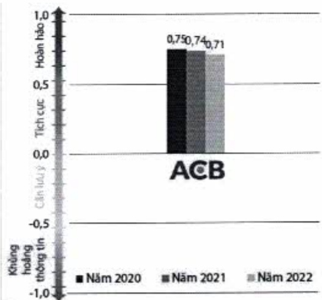

- Giám sát thảo luận khách hàng trên trang mạng xã hội do Buzzmetrics thực hiện (tính đến 30/11/2022).

### 3.4. Xã hội

ACB cam kết thực thi trách nhiệm xã hội doanh nghiệp đối với môi trường và công đồng địa phương cần hỗ trợ.

Các hoạt động tài trợ giáo dục, xây dựng nhà tình thương, cơ sở vật chất, trường học và hỗ trợ các đối tượng chính sách và người nghèo tiếp tục được ACB thực hiện trong khả năng tài chính của mình.

Trách nhiệm xã hội của ACB được ghi nhận qua giải thưởng Ngân hàng thực hiện trách nhiệm xã hội tốt nhất 2022 (Best CSR Bank Vietnam 2022) từ Global Banking & Finance Review.

Năm 2022, ACB đã dành ngân sách hơn 3 tỷ đồng cho các hoạt động cộng đồng xã hội. Ngân sách phần bổ cho các mảng hoạt động như sau:

- Tài trợ các hoạt động giáo dục (chiếm 50%),

Tài trợ các đối tượng chính sách và người nghèo (chiếm 30%),

Tài trợ xây dựng nhà tinh thưởng, cơ sở vật chất, trường học (chiếm 16%)

- Tài trợ khác (chiếm 5%).

Thống kê số liệu nổi bật:

<table border=1 style='margin: auto; word-wrap: break-word;'><tr><td style='text-align: center; word-wrap: break-word;'>1.582</td><td style='text-align: center; word-wrap: break-word;'>Suất học bổng và quà tặng hỗ trợ bao gồm 13.000 tập sách và 1.240 ba lỗ cho học sinh có hoàn cảnh khó khăn tương ứng với hơn 1,6 tỷ đồng.</td></tr><tr><td style='text-align: center; word-wrap: break-word;'>1.055</td><td style='text-align: center; word-wrap: break-word;'>Tài trợ cho người nghèo tại các tỉnh thành trên cả nước như Thành phố Hồ Chí</td></tr><tr><td style='text-align: center; word-wrap: break-word;'>(tỷ đồng)</td><td style='text-align: center; word-wrap: break-word;'>Minh, Bến Tre, Quảng Nam, Bắc Giang, Vĩnh Long, Nghệ An, Hải Dương, Thái Nguyên, Quảng Ngãi, v.v. Trong đó có 500 triệu đồng tài trợ cho quỹ “Vi người nghèo”.</td></tr><tr><td style='text-align: center; word-wrap: break-word;'>5</td><td style='text-align: center; word-wrap: break-word;'>Căn nhà được hỗ trợ kinh phí xây dựng cho các gia đình chính sách gặp khó khăn.</td></tr><tr><td style='text-align: center; word-wrap: break-word;'>1</td><td style='text-align: center; word-wrap: break-word;'>Ki-lô-mét đường được hỗ trợ kinh phí thắp sáng.</td></tr></table>